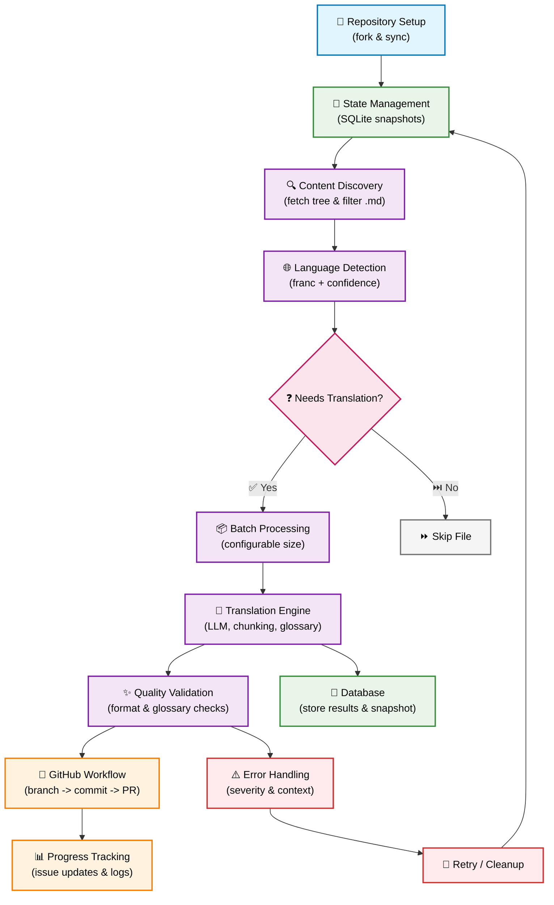

# translate-react

A CLI tool to automate the translation of React documentation from English to any target language using Large Language Models (LLMs). The tool intelligently processes markdown files, preserves formatting and code blocks, and creates pull requests with high-quality translations.

## Table of Contents

- [translate-react](#translate-react)
  - [Table of Contents](#table-of-contents)
  - [Overview](#overview)
    - [Key Workflow](#key-workflow)
    - [Project workflow diagram](#project-workflow-diagram)
    - [Target Use Cases](#target-use-cases)
  - [Prerequisites](#prerequisites)
    - [Required Software](#required-software)
    - [Required API Access](#required-api-access)
    - [Repository Setup](#repository-setup)
    - [Supported Repositories](#supported-repositories)
  - [Setup](#setup)
    - [1. Clone the repository](#1-clone-the-repository)
    - [2. Install dependencies](#2-install-dependencies)
    - [3. Create a `.env` file with the necessary variables](#3-create-a-env-file-with-the-necessary-variables)
      - [Environment Configuration **(required)**](#environment-configuration-required)
      - [Language Model Configuration **(required)**](#language-model-configuration-required)
      - [GitHub Configuration **(required)**](#github-configuration-required)
      - [Repository Configuration **(required)**](#repository-configuration-required)
      - [Progress Tracking **(optional)**](#progress-tracking-optional)
      - [Development Options **(optional)**](#development-options-optional)
      - [API Headers **(optional)**](#api-headers-optional)
  - [Usage](#usage)
    - [Development](#development)
    - [Production](#production)
    - [Command Line Arguments](#command-line-arguments)
      - [Translate to Portuguese (default)](#translate-to-portuguese-default)
      - [Translate to Spanish with custom batch size](#translate-to-spanish-with-custom-batch-size)
      - [Translate from Portuguese to English](#translate-from-portuguese-to-english)
  - [How It Works](#how-it-works)
    - [File Discovery \& Filtering](#file-discovery--filtering)
    - [Translation Process](#translation-process)
    - [GitHub Workflow](#github-workflow)
  - [Project Structure](#project-structure)
  - [Architecture](#architecture)
    - [Core Services](#core-services)
      - [1. **Runner Service** (`services/runner/`)](#1-runner-service-servicesrunner)
      - [2. **GitHub Service** (`services/github/`)](#2-github-service-servicesgithub)
      - [3. **Translator Service** (`services/translator.service.ts`)](#3-translator-service-servicestranslatorservicets)
      - [4. **Language Detector** (`utils/language-detector.util.ts`)](#4-language-detector-utilslanguage-detectorutilts)
      - [5. **Database Service** (`services/database.service.ts`)](#5-database-service-servicesdatabaseservicets)
    - [Error Handling System](#error-handling-system)
  - [Features](#features)
    - [🎯 Translation Quality](#-translation-quality)
    - [💾 State Management](#-state-management)
    - [⚡ Process Management](#-process-management)
    - [🔄 GitHub Integration](#-github-integration)
    - [🛡️ Error Handling \& Recovery](#️-error-handling--recovery)
  - [Contributing](#contributing)
    - [Getting Started](#getting-started)
    - [Development Guidelines](#development-guidelines)
    - [Project-Specific Patterns](#project-specific-patterns)
    - [Testing Translations](#testing-translations)
  - [Troubleshooting](#troubleshooting)
    - [Common Issues](#common-issues)
      - [Environment Validation Errors](#environment-validation-errors)
    - [Debug Mode](#debug-mode)
    - [Getting Help](#getting-help)

## Overview

This project automates the translation process of React's documentation to any target language. It intelligently identifies files that need translation, processes them using language models, and seamlessly integrates with GitHub workflows.

### Key Workflow

1. **Repository Setup**: Verifies GitHub token permissions and synchronizes fork with upstream
2. **State Management**: Uses SQLite snapshots for interruption recovery and progress tracking
3. **Content Discovery**: Fetches repository tree and identifies markdown files requiring translation
4. **Language Detection**: Analyzes content to determine if translation is needed using language confidence scoring
5. **Batch Processing**: Processes files in configurable batches with real-time progress tracking
6. **Translation**: Uses OpenAI-compatible models with strict glossary rules and formatting preservation
7. **GitHub Integration**: Creates individual branches and pull requests for each translated file
8. **Progress Tracking**: Updates GitHub issues with translation results and links to created PRs
9. **Error Recovery**: Comprehensive error handling with cleanup and recovery mechanisms

### Project workflow diagram

Below is a high-level Mermaid flowchart that visualizes the core pipeline used by the project.



### Target Use Cases

- **React Documentation Teams**: Automate translation of official React documentation
- **Open Source Projects**: Translate React-based project documentation for international audiences
- **Educational Content**: Convert React tutorials and guides to multiple languages
- **Technical Writers**: Batch process large documentation repositories

## Prerequisites

### Required Software

- **[Bun](https://bun.sh)** runtime (v1.0.0+) - Primary JavaScript runtime and package manager
- **Node.js** (v20+) - Required for some dependencies
- **SQLite3** - For state persistence and recovery (usually pre-installed on most systems)
- **Git** - For repository operations

### Required API Access

- **GitHub Personal Access Token** - With `repo` permissions for the target repositories
- **OpenAI API Key** - Or compatible API (OpenRouter, Azure OpenAI, etc.) for language model access

### Repository Setup

You'll need:

- A **fork** of the target React documentation repository
- **Write access** to your fork for creating branches and PRs
- Optionally, a **tracking issue** in your fork for progress updates

### Supported Repositories

The tool is designed to work with React documentation repositories but can be adapted for any markdown-based documentation:

- **React.dev** (official React documentation)
- **React Native documentation**
- **Next.js documentation**
- **Any repository** with markdown files in a `src/` directory structure

## Setup

### 1. Clone the repository

```bash
git clone https://github.com/NivaldoFarias/translate-react.git
```

Then, navigate into it:

```bash
cd translate-react
```

### 2. Install dependencies

```bash
bun install
```

### 3. Create a `.env` file with the necessary variables

#### Environment Configuration **(required)**

| Variable   | Example Value                   | Description              |
| ---------- | ------------------------------- | ------------------------ |
| `NODE_ENV` | `development\|production\|test` | Runtime environment      |
| `BUN_ENV`  | `development\|production\|test` | Bun-specific environment |

#### Language Model Configuration **(required)**

| Variable            | Example Value               | Description                                     |
| ------------------- | --------------------------- | ----------------------------------------------- |
| `LLM_MODEL`         | `gpt-4o`                    | Model to use for translation                    |
| `OPENAI_API_KEY`    | `your_openai_api_key`       | **Required** - API key for the language model   |
| `OPENAI_BASE_URL`   | `https://api.openai.com/v1` | API endpoint (supports OpenRouter, Azure, etc.) |
| `OPENAI_PROJECT_ID` | `your_openai_project_id`    | *Optional* - Project ID for usage tracking      |

#### GitHub Configuration **(required)**

| Variable       | Example Value       | Description                                                |
| -------------- | ------------------- | ---------------------------------------------------------- |
| `GITHUB_TOKEN` | `your_github_token` | **Required** - Personal access token with repo permissions |

#### Repository Configuration **(required)**

| Variable              | Example Value   | Description                                   |
| --------------------- | --------------- | --------------------------------------------- |
| `REPO_FORK_OWNER`     | `your_username` | **Required** - Owner of your fork             |
| `REPO_FORK_NAME`      | `react.dev`     | **Required** - Name of your forked repository |
| `REPO_UPSTREAM_OWNER` | `reactjs`       | **Required** - Original repository owner      |
| `REPO_UPSTREAM_NAME`  | `react.dev`     | **Required** - Original repository name       |

#### Progress Tracking **(optional)**

| Variable                | Example Value | Description                                    |
| ----------------------- | ------------- | ---------------------------------------------- |
| `PROGRESS_ISSUE_NUMBER` | `123`         | *Optional* - Issue number for progress updates |

#### Development Options **(optional)**

| Variable               | Example Value | Description                                        |
| ---------------------- | ------------- | -------------------------------------------------- |
| `FORCE_SNAPSHOT_CLEAR` | `false`       | *Optional* - Clear snapshots on startup (dev only) |

#### API Headers **(optional)**

| Variable           | Example Value                                      | Description                                    |
| ------------------ | -------------------------------------------------- | ---------------------------------------------- |
| `HEADER_APP_URL`   | `https://github.com/your-username/translate-react` | *Optional* - Application URL for API headers   |
| `HEADER_APP_TITLE` | `translate-react v0.1.5`                           | *Optional* - Application title for API headers |

> [!IMPORTANT]
> **Environment Validation**: All variables are validated at runtime using Zod schemas. Check `src/utils/env.util.ts` for detailed validation rules.

> [!TIP] 
> **Development Setup**: Use `.env.dev` for development-specific configurations. The tool automatically loads the appropriate file based on the `NODE_ENV`.

## Usage

### Development

Development mode with watch:

```bash
bun run dev
```

### Production

```bash
bun start
```

Or run the script directly:

```bash
bun run src/index.ts
```

### Command Line Arguments

The tool supports the following command line arguments:

| Argument       | Description                      | Default | Example Values                     |
| -------------- | -------------------------------- | ------- | ---------------------------------- |
| `--target`     | Target language code (ISO 639-1) | `"pt"`  | `pt`, `es`, `fr`, `de`, `ja`, `ko` |
| `--source`     | Source language code (ISO 639-1) | `"en"`  | `en`, `pt`, `es`, `fr`             |
| `--batch-size` | Files to process per batch       | `10`    | `5`, `15`, `20`                    |

#### Translate to Portuguese (default)

```bash
bun run start
```

#### Translate to Spanish with custom batch size

```bash
bun run start --target=es --batch-size=5
```

#### Translate from Portuguese to English

```bash
bun run start --source=pt --target=en
```

> [!NOTE] 
> **Language Detection**: The tool automatically detects the language of each file and skips files already in the target language, making it safe to run multiple times.

## How It Works

### File Discovery & Filtering

1. **Repository Scanning**: Fetches the complete repository tree from GitHub
2. **Markdown Filtering**: Identifies all `.md` files within the `src/` directory structure
3. **Language Analysis**: Uses statistical language detection to determine each file's current language
4. **Translation Check**: Skips files that are already in the target language or have low confidence scores

### Translation Process

1. **Content Parsing**: Extracts translatable text while preserving code blocks, links, and formatting
2. **LLM Processing**: Sends content to the configured language model with strict translation rules
3. **Quality Validation**: Checks translated content for format preservation and completeness
4. **Content Assembly**: Reconstructs the file with translated text and original formatting

### GitHub Workflow

1. **Branch Creation**: Creates a unique branch for each file (e.g., `translate/src/content/homepage.md`)
2. **File Commit**: Commits the translated content with descriptive commit messages
3. **Pull Request**: Creates PR with translated content and detailed description
4. **Progress Tracking**: Updates the tracking issue with links to created PRs

## Project Structure

```
src/
├── errors/                              # Error handling system
│   ├── base.error.ts                    # Base error classes and types
│   ├── error.handler.ts                 # Error handler implementation
│   ├── proxy.handler.ts                 # Error handling proxy
│   └── specific.error.ts                # Specific error implementations
├── services/
│   ├── github/                          # GitHub API services
│   │   ├── base.service.ts              # Base GitHub service
│   │   ├── branch.service.ts            # Branch management
│   │   ├── content.service.ts           # Content and PR management
│   │   ├── github.service.ts            # Main GitHub service
│   │   └── repository.service.ts        # Repository operations
│   ├── runner/                          # Workflow orchestration
│   │   ├── base.service.ts              # Base runner implementation
│   │   └── runner.service.ts            # Main workflow orchestrator
│   ├── database.service.ts              # Database service
│   ├── snapshot.service.ts              # Snapshot service
│   └── translator.service.ts            # Translation service
├── utils/
│   ├── constants.util.ts                # Application constants
│   ├── env.util.ts                      # Environment validation
│   ├── language-detector.util.ts        # Language detection utility
│   ├── parse-command-args.util.ts       # Command line argument parser
│   ├── setup-signal-handlers.util.ts    # Process signal handlers
│   └── translation-file.util.ts         # Translation file utility
├── index.ts                             # Main entry point
├── types.d.ts                           # Type definitions
│
logs/                                    # Error logs directory
snapshots.sqlite                         # SQLite database for state persistence
```

## Architecture

The tool follows a modular, service-oriented architecture with clear separation of concerns and comprehensive error handling.

### Core Services

#### 1. **Runner Service** (`services/runner/`)

The main orchestrator that manages the complete translation workflow:

- **Workflow Management**: Coordinates all services and manages execution flow
- **Batch Processing**: Processes files in configurable batches to optimize API usage
- **Progress Tracking**: Real-time CLI feedback with spinners and progress indicators
- **State Persistence**: Manages SQLite snapshots for interruption recovery
- **Environment Handling**: Different behaviors for development vs production modes

#### 2. **GitHub Service** (`services/github/`)

Modular GitHub integration with specialized sub-services:

- **Base Service**: Common GitHub functionality, authentication, and error handling
- **Branch Service**: Branch lifecycle management and cleanup operations
- **Content Service**: File operations, content filtering, and PR management
- **Repository Service**: Fork synchronization and repository tree operations
- **Design Pattern**: Inheritance-based architecture with protected access modifiers

#### 3. **Translator Service** (`services/translator.service.ts`)

Core translation engine with advanced content handling:

- **LLM Integration**: Interfaces with OpenAI-compatible APIs (OpenAI, OpenRouter, Azure)
- **Content Parsing**: Intelligent markdown parsing that preserves code blocks and formatting
- **Glossary Management**: Maintains technical term consistency across translations
- **Chunking Strategy**: Handles large files by breaking them into manageable segments
- **Quality Assurance**: Validates translation output and ensures formatting integrity

#### 4. **Language Detector** (`utils/language-detector.util.ts`)

Intelligent content analysis for translation decisions:

- **Detection Engine**: Uses `franc` library for statistical language detection
- **Confidence Scoring**: Calculates reliability scores for language predictions
- **Translation Logic**: Determines if content requires translation based on confidence thresholds
- **Language Mapping**: Converts between ISO 639-1 and ISO 639-3 codes for compatibility

#### 5. **Database Service** (`services/database.service.ts`)

Persistent state management with SQLite:

- **Snapshot System**: Stores workflow state for interruption recovery
- **Transaction Management**: Ensures data consistency across operations
- **Progress Tracking**: Records processed files and translation results
- **Development Support**: Provides snapshot clearing and debugging capabilities

### Error Handling System

1. **Error Handler** (`errors/error.handler.ts`)

- Centralized error management
- Severity-based filtering
- File logging capabilities
- Custom error reporting

2. **Error Proxy** (`errors/proxy.handler.ts`)

- Automatic error wrapping for services
- Context enrichment for debugging
- Method-specific error handling
- Error transformation and mapping

## Features

### 🎯 Translation Quality

- **Glossary Enforcement**: Maintains consistent technical terminology across all translations
- **Formatting Preservation**: Keeps all markdown structure, code blocks, and special syntax intact
- **Content Intelligence**: Distinguishes between translatable text and code/technical references
- **Language Standards**: Supports any target language with proper localization conventions
- **Quality Validation**: Post-translation checks to ensure content integrity

### 💾 State Management

- **SQLite Persistence**: Robust database for storing workflow state and progress
- **Interruption Recovery**: Resume translations from any point if the process is interrupted
- **Progress Tracking**: Detailed logging of processed files and translation status
- **Development Mode**: Snapshot management with clearing capabilities for testing
- **Batch State**: Tracks individual file processing within batches

### ⚡ Process Management

- **Configurable Batching**: Process multiple files simultaneously with customizable batch sizes
- **Real-time Feedback**: CLI spinners with detailed progress indicators and percentage completion
- **Performance Metrics**: Tracks processing time, API usage, and throughput statistics
- **Memory Optimization**: Efficient handling of large documentation repositories
- **Concurrent Processing**: Parallel file fetching and processing where possible

### 🔄 GitHub Integration

- **Individual Branches**: Creates separate branches for each translated file for better review process
- **Automated PRs**: Generates pull requests with descriptive titles and detailed descriptions
- **Progress Issues**: Updates tracking issues with links to created PRs and translation status
- **Branch Management**: Automatic cleanup of completed or failed translation branches
- **Fork Synchronization**: Keeps fork updated with upstream changes before processing

### 🛡️ Error Handling & Recovery

- **Hierarchical Errors**: Custom error types for different failure scenarios (API, Git, Translation)
- **Graceful Degradation**: Continues processing other files when individual translations fail
- **Detailed Context**: Rich error messages with operation context and debugging information
- **Automatic Cleanup**: Removes incomplete branches and files on critical failures
- **Retry Mechanisms**: Smart retry logic for transient API and network failures
- **Logging System**: Comprehensive error logs with timestamps and structured data

## Contributing

We welcome contributions! Whether you're fixing bugs, adding features, or improving documentation, your help is appreciated.

### Getting Started

1. **Fork the repository** and create your feature branch
2. **Set up your development environment** with the prerequisites
3. **Create a `.env.dev` file** for development-specific configuration
4. **Run tests** to ensure everything works: `bun test`

### Development Guidelines

1. **TypeScript First**: All code must be written in TypeScript with proper type definitions
2. **Bun Runtime**: Use Bun for development, testing, and package management
3. **Error Handling**: Follow the established error handling patterns using the custom error system
4. **Documentation**: Maintain comprehensive JSDoc comments following the project's documentation standards
5. **Conventional Commits**: Use conventional commit messages for automated changelog generation
6. **Testing**: Add tests for new features and ensure existing tests pass
7. **Code Style**: Follow the ESLint and Prettier configurations defined in the project

### Project-Specific Patterns

- **Service Architecture**: New services should extend appropriate base classes
- **Error Types**: Create specific error types for new failure scenarios
- **Environment Variables**: Add new config to the Zod schema in `env.util.ts`
- **Database Operations**: Use the existing database service for any persistence needs

### Testing Translations

When testing translation functionality:

- Use development mode with `FORCE_SNAPSHOT_CLEAR=true`
- Test with small batch sizes to avoid excessive API usage
- Verify both the translation quality and GitHub integration

## Troubleshooting

### Common Issues

#### Environment Validation Errors

```bash
❌ Invalid environment variables:
- GITHUB_TOKEN: String must contain at least 1 character(s)
```

**Solution**: Ensure all required environment variables are set in your `.env` file.

**GitHub API Rate Limiting**

```bash
API rate limit exceeded
```

**Solution**: The tool will automatically retry with exponential backoff. For heavy usage, consider using a GitHub App token instead of a personal token.

**Translation API Errors**

```bash
OpenAI API error: insufficient_quota
```

**Solution**: Check your API key has sufficient credits. You can also switch to alternative providers by changing `OPENAI_BASE_URL`.

**SQLite Database Lock**

```bash
Database is locked
```

**Solution**: Ensure no other instances are running. In development, use `FORCE_SNAPSHOT_CLEAR=true` to reset the database.

### Debug Mode

Enable verbose logging by setting the environment to development:

```bash
NODE_ENV=development bun run start
```

### Getting Help

- **Issues**: Report bugs or request features on [GitHub Issues](https://github.com/NivaldoFarias/translate-react/issues)
- **Discussions**: Ask questions in [GitHub Discussions](https://github.com/NivaldoFarias/translate-react/discussions)
- **Documentation**: Check the inline code documentation for detailed API information
