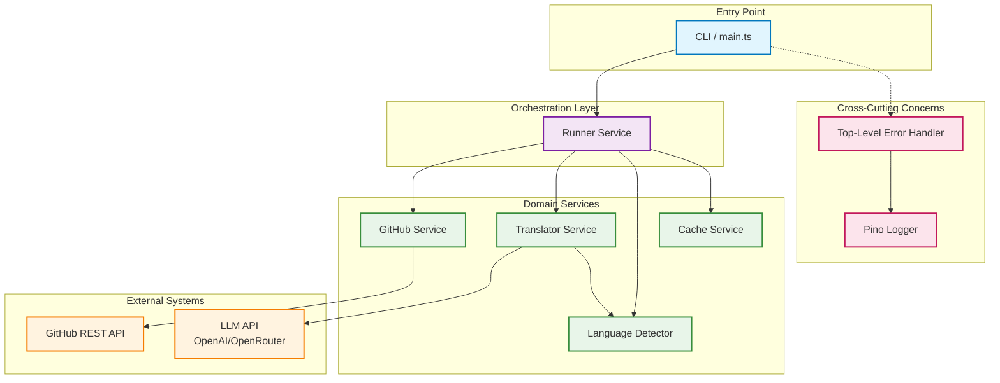
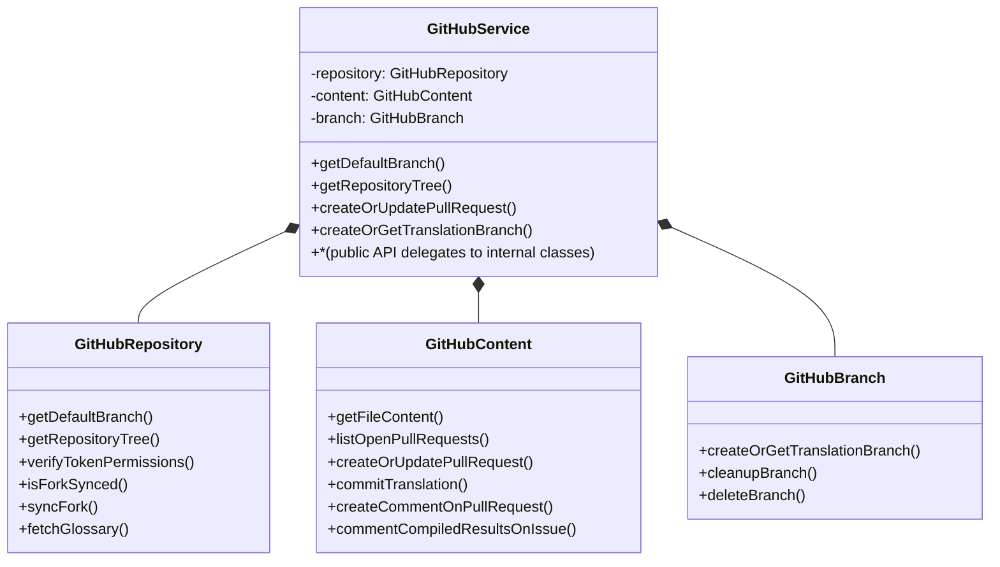
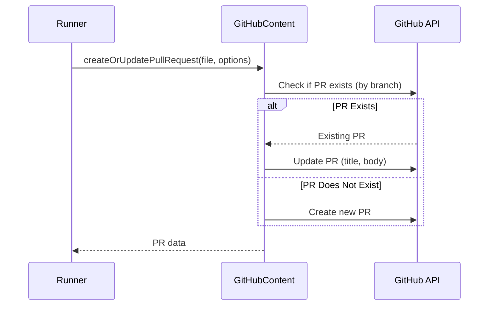
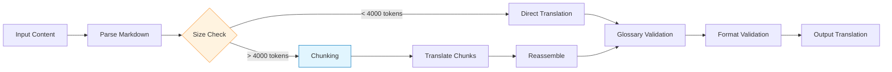
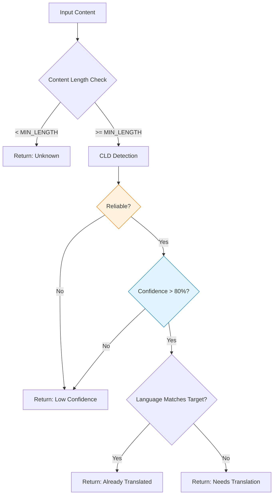
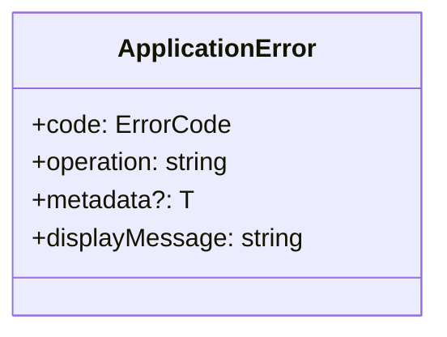
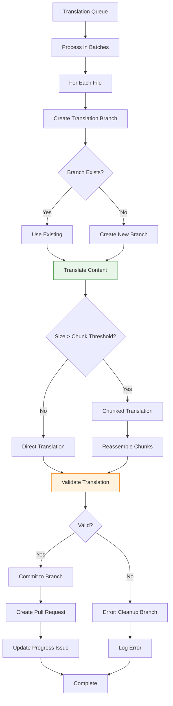

# Architecture Documentation

Overview of the `translate-react` CLI: service design, data flow, and error handling.

## Table of Contents

- [Table of Contents](#table-of-contents)
- [System Overview](#system-overview)
- [Service-Oriented Architecture](#service-oriented-architecture)
  - [GitHub Service Structure](#github-service-structure)
- [Core Services](#core-services)
  - [Runner Service (`services/runner/`)](#runner-service-servicesrunner)
    - [Responsibilities](#responsibilities)
    - [Key Methods](#key-methods)
    - [State Management](#state-management)
  - [GitHub Service (`services/github/`)](#github-service-servicesgithub)
    - [Unified API and Internal Composition](#unified-api-and-internal-composition)
    - [Repository Operations](#repository-operations)
    - [Content Operations](#content-operations)
    - [Branch Operations](#branch-operations)
  - [Translator Service (`services/translator.service.ts`)](#translator-service-servicestranslatorservicets)
    - [Translation Pipeline](#translation-pipeline)
    - [Content Chunking Strategy](#content-chunking-strategy)
    - [Glossary Management](#glossary-management)
  - [Language Detector Service (`services/language-detector.service.ts`)](#language-detector-service-serviceslanguage-detectorservicets)
    - [Detection Strategy](#detection-strategy)
    - [Confidence Scoring](#confidence-scoring)
  - [Cache Service (`services/cache/`)](#cache-service-servicescache)
    - [Components](#components)
- [Error Handling](#error-handling)
  - [Domain Errors](#domain-errors)
  - [Top-Level Handler](#top-level-handler)
- [Data Flow Architecture](#data-flow-architecture)
  - [Discovery Phase Data Flow](#discovery-phase-data-flow)
  - [Translation Phase Data Flow](#translation-phase-data-flow)
- [Design Patterns](#design-patterns)
- [Dependency Injection](#dependency-injection)
- [Performance Considerations](#performance-considerations)
  - [Batch Processing](#batch-processing)
  - [Concurrent Operations](#concurrent-operations)
  - [Memory Management](#memory-management)
- [References](#references)

## System Overview

The system follows a **modular, service-oriented architecture** with clear separation of concerns. Each service handles a specific domain (GitHub operations, translation, language detection, etc.) and communicates through well-defined interfaces.



## Service-Oriented Architecture

### GitHub Service Structure

A single **GitHubService** exposes all GitHub operations. Internally it composes three implementation classes (no shared base class):



## Core Services

### Runner Service (`services/runner/`)

The Runner Service acts as the **workflow orchestrator**, coordinating all other services to execute the complete translation pipeline.

#### Responsibilities

- Workflow state management and orchestration
- Batch processing coordination
- Progress tracking and logging
- Error recovery and cleanup

#### Key Methods

```typescript
class RunnerService extends BaseRunnerService {
	// Main workflow execution
	async run(): Promise<void>;

	// Workflow stages
	protected async verifyPermissions(): Promise<void>;
	protected async syncFork(): Promise<boolean>;
	protected async fetchRepositoryTree(): Promise<void>;
	protected async fetchFilesToTranslate(): Promise<void>;
	protected async processInBatches(files, batchSize): Promise<void>;

	// File processing
	private async processFile(file, progress): Promise<void>;
	private async fetchBatch(batch, updateFn): Promise<TranslationFile[]>;

	// State management
	protected async updateIssueWithResults(): Promise<void>;

	// Cleanup and reporting
	private async cleanupFailedTranslation(metadata): Promise<void>;
	protected printFinalStatistics(): Promise<void>;
}
```

#### State Management

The Runner maintains workflow state in a `RunnerState` object:

```typescript
interface RunnerState {
	repositoryTree: GitHubTreeItem[];
	filesToTranslate: TranslationFile[];
	processedResults: ProcessedFileResult[];
	timestamp: number;
}
```

This state is held in memory during workflow execution.

### GitHub Service (`services/github/`)

Single public API for all GitHub operations. Internally composes **GitHubRepository**, **GitHubContent**, and **GitHubBranch** (implementation classes, not separate services).

#### Unified API and Internal Composition

`GitHubService` takes optional dependencies (Octokit, repositories config, comment builder) and instantiates the three internal classes. Public methods delegate to them:

```typescript
class GitHubService {
	private readonly repository: GitHubRepository;
	private readonly content: GitHubContent;
	private readonly branch: GitHubBranch;

	// Public API delegates to internal classes
	public getDefaultBranch(target) { return this.repository.getDefaultBranch(target); }
	public getRepositoryTree(...) { return this.repository.getRepositoryTree(...); }
	public createOrUpdatePullRequest(...) { return this.content.createOrUpdatePullRequest(...); }
	public createOrGetTranslationBranch(...) { return this.branch.createOrGetTranslationBranch(...); }
	// ... other methods
}
```

#### Repository Operations

Handled by **GitHubRepository** (internal):

- Fork synchronization detection and execution
- Repository tree fetching (recursive), filtered for `.md` in `src/`
- Token permission verification
- Default branch detection
- Glossary file retrieval

#### Content Operations

Handled by **GitHubContent** (internal):

- File content retrieval via blob SHA
- Open PR listing and filtering
- PR create/update (by branch)
- Commit translation, comments on PR/issue

<details>
<summary>PR create/update flow</summary>



</details>

#### Branch Operations

Handled by **GitHubBranch** (internal):

- Create or get translation branch (`translate/{file-path}`)
- Cleanup failed translation branches
- Delete branch

### Translator Service (`services/translator.service.ts`)

Core translation engine interfacing with LLM APIs.

#### Translation Pipeline



#### Content Chunking Strategy

For files exceeding `MAX_CHUNK_TOKENS` (default: 4000):

1. **Text Splitting**: Uses `RecursiveCharacterTextSplitter` from LangChain
2. **Context Preservation**: Maintains overlap between chunks to preserve context
3. **Sequential Translation**: Translates chunks in order, passing previous context
4. **Reassembly**: Combines translated chunks with original formatting

```typescript
async translateLargeContent(content: string): Promise<string> {
  const splitter = new RecursiveCharacterTextSplitter({
    chunkSize: MAX_CHUNK_TOKENS,
    chunkOverlap: 200, // Preserve context
  });

  const chunks = await splitter.splitText(content);
  const translations: string[] = [];

  for (const [index, chunk] of chunks.entries()) {
    const context = index > 0 ? translations[index - 1].slice(-500) : '';
    const translated = await this.translateChunk(chunk, context);
    translations.push(translated);
  }

  return translations.join('\n\n');
}
```

#### Glossary Management

The glossary enforces consistent translation of technical terms:

- Loaded from `GLOSSARY.md` in upstream repository
- Passed as system instruction to LLM
- Validated post-translation for adherence

### Language Detector Service (`services/language-detector.service.ts`)

Statistical language detection using Compact Language Detector (CLD).

#### Detection Strategy



#### Confidence Scoring

```typescript
interface LanguageAnalysis {
	languageScore: {
		target: number; // Percentage of target language
		source: number; // Percentage of source language
	};
	ratio: number; // Target / Source ratio
	isTranslated: boolean; // ratio > TRANSLATION_THRESHOLD (0.5)
	detectedLanguage: string | undefined;
	rawResult: cld.DetectLanguage;
}
```

The detector calculates a **translation ratio**:

- `ratio = targetScore / (targetScore + sourceScore)`
- `isTranslated = ratio > 0.5`

This approach handles mixed-language content (code examples, technical terms) better than binary detection.

### Cache Service (`services/cache/`)

In-memory caching for runtime-scoped data.

#### Components

- **CacheService**: Generic cache with TTL support
  - O(1) lookups using Map
  - Automatic expiration handling
  - Batch operations for efficiency

- **LanguageCacheService**: Specialized cache for language detection
  - Composite keys: `filename:contentHash`
  - 1-hour TTL (sufficient for workflow runs)
  - Content-based invalidation

**Key operations**:

- `set(key, value, ttl)`: Store with expiration
- `get(key)`: Retrieve if not expired
- `getMany(keys)`: Batch retrieval
- `clear()`: Remove all entries

## Error Handling

### Domain Errors

**ApplicationError** is used only for domain workflow failures (e.g. no files to translate, below minimum success rate). It carries a **ErrorCode** enum, operation name, and optional metadata.



**ErrorCode** values are domain-focused (e.g. `TranslationFailed`, `ChunkProcessingFailed`, `NoFilesToTranslate`, `BelowMinimumSuccessRate`, `FormatValidationFailed`, `LanguageCodeNotSupported`, `InsufficientPermissions`, `InitializationError`, `ResourceLoadError`, `OpenAIApiError`, `OctokitRequestError`, `UnknownError`). Library errors are not wrapped in per-method try/catch; they bubble up.

### Top-Level Handler

Errors are handled at the process boundary in **main.ts**:

1. **main** runs the workflow and catches any thrown error.
2. **handleTopLevelError(error, logger)** logs the error and exits:
   - **ApplicationError**: logs code, operation, message, optional statusCode/metadata.
   - **RequestError** (Octokit): logs as GitHub API error with status, request ID, URL.
   - **APIError** (OpenAI): logs as LLM API error with status, type, request ID.
   - **Error** / unknown: logs message and stack or string representation.
3. **process.exit(1)** is called after logging.

## Data Flow Architecture

### Discovery Phase Data Flow

```mermaid
flowchart TD
    A[Start Discovery] --> B[Fetch Repository Tree]
    B --> C[GET /git/trees/{sha}]

    C --> D[Filter .md in src/]

    D --> E[Batch Files by 10]
    E --> F[Fetch File Content]

    F --> G{Has Open PR?}
    G -->|Yes| H[Skip File]
    G -->|No| I{Size > MAX?}

    I -->|Yes| J[Skip File - Too Large]
    I -->|No| K[Language Detection]

    K --> L{Already Translated?}
    L -->|Yes| M[Skip File]
    L -->|No| N[Add to Translation Queue]

    N --> O[Discovery Complete]
    H --> O
    J --> O
    M --> O

    style F fill:#e1f5fe,stroke:#0277bd
    style M fill:#f3e5f5,stroke:#7b1fa2
```

### Translation Phase Data Flow



## Design Patterns

- **Runner**: **BaseRunnerService** holds shared workflow state and manager instances; **RunnerService** extends it and implements `run()`. Dependencies are injected via **RunnerServiceDependencies**.
- **GitHub**: No shared base class. **GitHubService** composes **GitHubRepository**, **GitHubContent**, and **GitHubBranch**; each receives shared Octokit and repository config.

## Dependency Injection

Services are instantiated at module level. **main.ts** imports **runnerService** from `./services`; that singleton is built with **githubService**, **translatorService**, **languageCacheService**, **localeService**, and **languageDetectorService** (also module-level). Dependencies are passed via typed constructor arguments (e.g. **RunnerServiceDependencies**, **GitHubServiceDependencies**). See [src/services/](../src/services/) for interface definitions.

Tests inject mocks via constructors:

```typescript
const service = new RunnerService({
	github: createMockGitHubService(),
	translator: createMockTranslatorService(),
	// ...other mocks
});
```

Mock factories live in `tests/mocks/` for consistent test setup.

## Performance Considerations

### Batch Processing

Files are processed in configurable batches to balance:

- **Throughput**: Parallel processing of multiple files
- **Resource Usage**: Controlled memory and API consumption
- **Error Isolation**: Failed file doesn't block entire batch

```typescript
const batches = this.createBatches(files, batchSize);

for (const batch of batches) {
	await Promise.all(batch.map((file) => this.processFile(file, progress)));
}
```

### Concurrent Operations

**Parallelization strategy**:

- File content fetching: Batch of 10 concurrent requests
- Language detection: Sequential (CPU-bound)
- Translation: Sequential (API rate-limited)
- PR creation: Sequential (to avoid conflicts)

### Memory Management

**Key optimizations**:

- Streaming content processing (no full repository in memory)
- Garbage collection after each batch
- Lazy loading of translation glossary

## References

- [Workflow Documentation](./WORKFLOW.md) - Detailed execution flow
- [Project README](../README.md) - High-level overview
