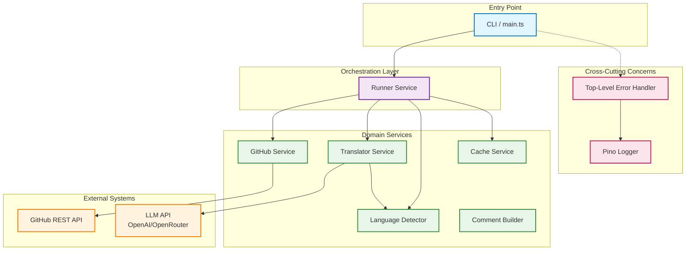
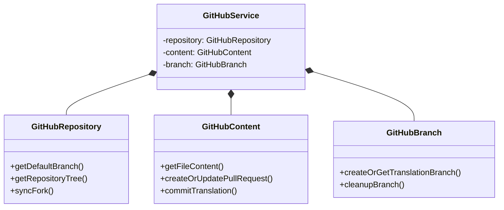
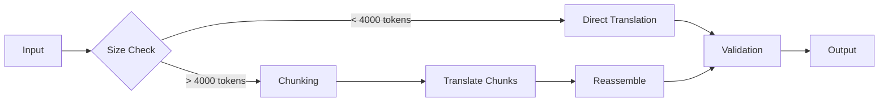

# Architecture Documentation

Overview of the `translate-react` CLI: service design, data flow, and error handling.

## Table of Contents

- [System Overview](#system-overview)
- [Service Architecture](#service-architecture)
- [Core Services](#core-services)
  - [Runner Service](#runner-service)
  - [GitHub Service](#github-service)
  - [Translator Service](#translator-service)
  - [Language Detector Service](#language-detector-service)
  - [Cache Service](#cache-service)
- [Error Handling](#error-handling)
- [Design Patterns](#design-patterns)
- [Dependency Injection](#dependency-injection)
- [Performance Considerations](#performance-considerations)
- [References](#references)

## System Overview

The system follows a **modular, service-oriented architecture** with clear separation of concerns. Each service handles a specific domain (GitHub operations, translation, language detection, etc.) and communicates through well-defined interfaces.



## Service Architecture

A single **GitHubService** exposes all GitHub operations, internally composing three implementation classes:



## Core Services

### Runner Service

The Runner Service (`services/runner/`) acts as the **workflow orchestrator**, coordinating all other services to execute the translation pipeline.

**Responsibilities:**

- Workflow state management and orchestration
- Batch processing coordination
- Progress tracking and logging
- Error recovery and cleanup

The Runner maintains workflow state (`RunnerState`) in memory during execution, tracking repository tree, files to translate, and processed results.

### GitHub Service

Single public API (`services/github/`) for all GitHub operations. Internally composes three classes:

- **GitHubRepository**: Fork sync, tree fetching (`.md` in `src/`), token verification, translation guidelines retrieval
- **GitHubContent**: File content retrieval, PR listing/create/update, commits, comments
- **GitHubBranch**: Translation branch creation (`translate/{file-path}`), cleanup, deletion

Public methods delegate to the appropriate internal class.

### Translator Service

Core translation engine (`services/translator/translator.service.ts`) interfacing with LLM APIs.



**Content Chunking** (files > `MAX_CHUNK_TOKENS`):

1. Split using `RecursiveCharacterTextSplitter` (LangChain) with 200-token overlap
2. Translate sequentially, passing previous context
3. Reassemble with original formatting

**Translation guidelines**: Loaded from upstream `GLOSSARY.md`, passed to LLM as system instruction.

### Language Detector Service

Statistical language detection (`services/language-detector/language-detector.service.ts`) using Compact Language Detector (CLD).

**Detection Flow:**

1. Check content length (skip if below minimum)
2. Run CLD detection
3. Verify reliability and confidence (> 80%)
4. Calculate translation ratio: `targetScore / (targetScore + sourceScore)`
5. Mark as translated if `ratio > 0.5`

This ratio-based approach handles mixed-language content (code examples, technical terms) better than binary detection.

### Cache Service

In-memory caching (`services/cache/`) for runtime-scoped data.

- **CacheService**: Generic TTL cache with O(1) lookups, batch operations, composite key support (`filename:contentHash`)

## Error Handling

**ApplicationError** is used for domain workflow failures (e.g. no files to translate, below success rate). Carries `ErrorCode`, operation name, and optional metadata. Library errors (`RequestError`, `APIError`) bubble up unmodified.

**Top-Level Handler** (`main.ts`) catches all errors at the process boundary:

- **ApplicationError**: logs code, operation, message, metadata
- **RequestError** (Octokit): logs as GitHub API error with status, request ID
- **APIError** (OpenAI): logs as LLM API error with status, type
- Other errors: logs message and stack

All errors result in `process.exit(1)`.

## Design Patterns

- **Runner**: `BaseRunnerService` holds shared state and managers; `RunnerService` extends it with `run()` implementation
- **GitHub**: Composition pattern — `GitHubService` composes three internal classes with shared Octokit/config

## Dependency Injection

Services are instantiated at module level. `main.ts` imports `runnerService` built with other services. Dependencies are passed via typed constructor arguments. Tests inject mocks via constructors:

```typescript
const service = new RunnerService({
	github: createMockGitHubService(),
	translator: createMockTranslatorService(),
});
```

Mock factories live in `tests/mocks/`.

## Performance Considerations

**Batch Processing**: Configurable batch size balances throughput, resource usage, and error isolation.

**Parallelization Strategy**:

| Operation             | Strategy                     |
| --------------------- | ---------------------------- |
| File content fetching | Batch of 10 concurrent       |
| Language detection    | Sequential (CPU-bound)       |
| Translation           | Sequential (rate-limited)    |
| PR creation           | Sequential (avoid conflicts) |

**Memory**: Streaming content processing, GC after each batch, lazy translation guidelines loading.

## References

- [Workflow Documentation](./WORKFLOW.md) — Detailed execution flow and data flow diagrams
- [Project README](../README.md) — High-level overview
