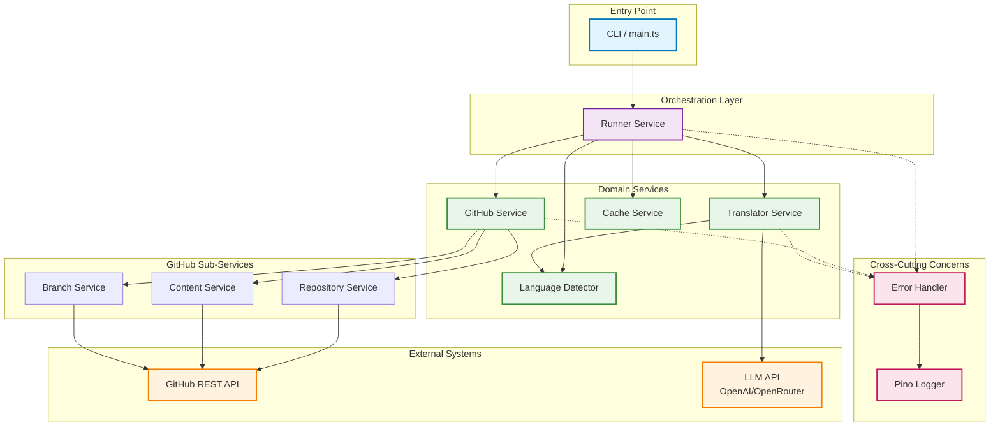
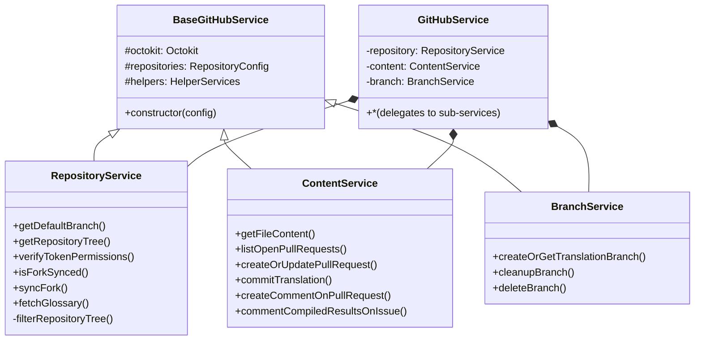
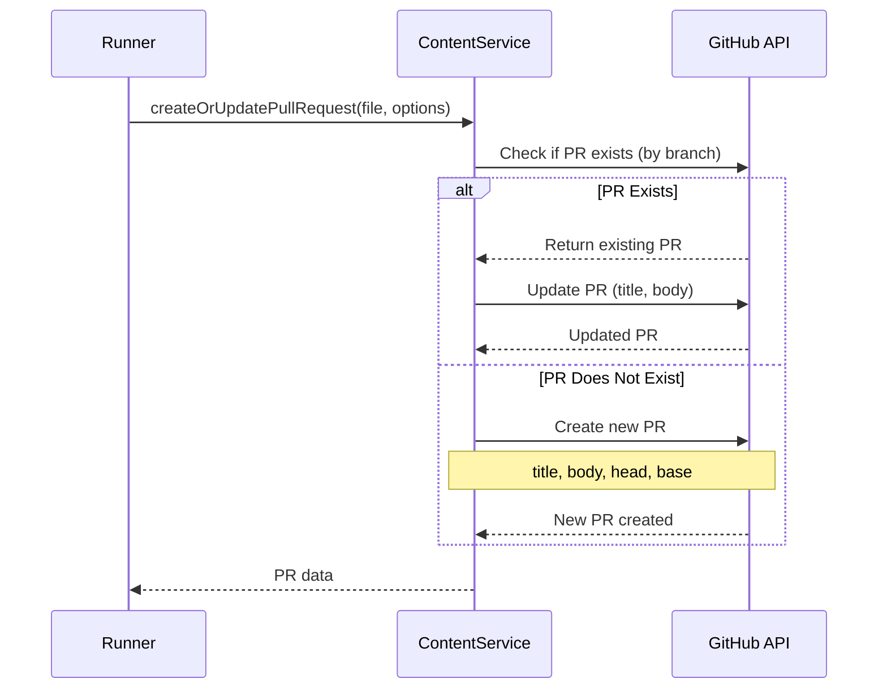
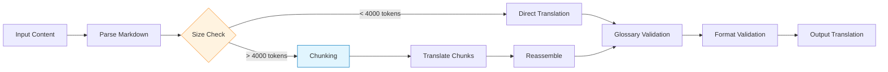
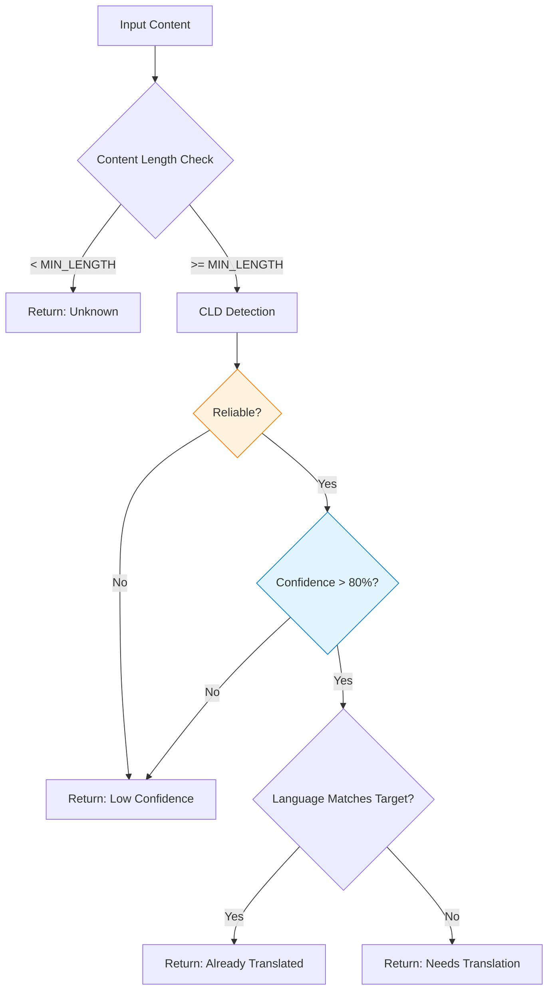
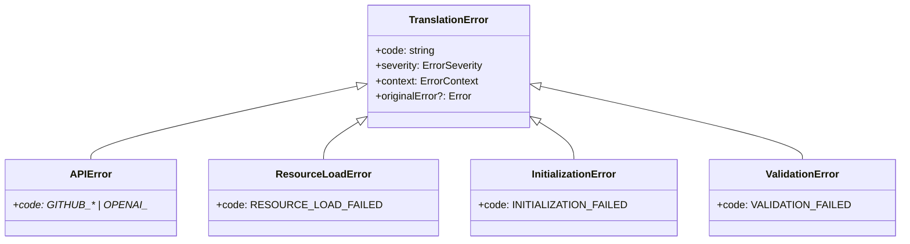
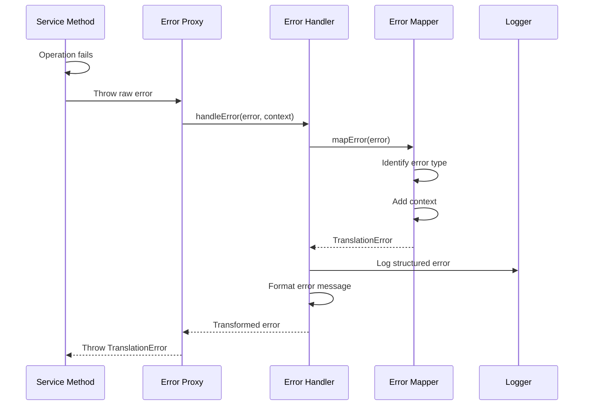
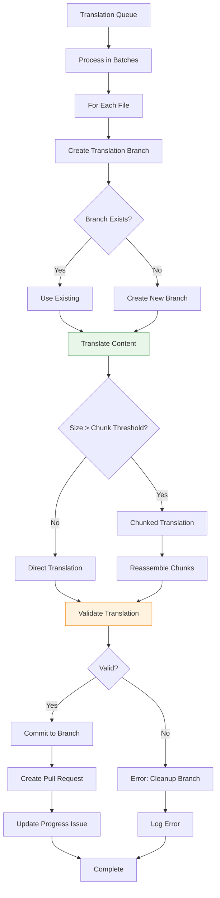

# Architecture Documentation

This document provides a comprehensive overview of the `translate-react` system architecture, including service design, data flow, and error handling mechanisms.

## Table of Contents

- [Architecture Documentation](#architecture-documentation)
  - [Table of Contents](#table-of-contents)
  - [System Overview](#system-overview)
  - [Service-Oriented Architecture](#service-oriented-architecture)
    - [Service Hierarchy](#service-hierarchy)
  - [Core Services](#core-services)
    - [Runner Service (`services/runner/`)](#runner-service-servicesrunner)
    - [GitHub Service (`services/github/`)](#github-service-servicesgithub)
    - [Translator Service (`services/translator.service.ts`)](#translator-service-servicestranslatorservicets)
    - [Language Detector Service (`services/language-detector.service.ts`)](#language-detector-service-serviceslanguage-detectorservicets)
    - [Cache Service (`services/cache/`)](#cache-service-servicescache)
  - [Error Handling Architecture](#error-handling-architecture)
    - [Error Hierarchy](#error-hierarchy)
    - [Error Transformation Pipeline](#error-transformation-pipeline)
    - [GitHub API Error Mapping](#github-api-error-mapping)
  - [Data Flow Architecture](#data-flow-architecture)
    - [Discovery Phase Data Flow](#discovery-phase-data-flow)
    - [Translation Phase Data Flow](#translation-phase-data-flow)
  - [Design Patterns](#design-patterns)
    - [Inheritance-Based Service Design](#inheritance-based-service-design)
    - [Proxy Pattern for Error Handling](#proxy-pattern-for-error-handling)
  - [Dependency Injection Architecture](#dependency-injection-architecture)
    - [ServiceFactory Pattern](#servicefactory-pattern)
    - [Key Components](#key-components)
    - [Dependency Interfaces](#dependency-interfaces)
    - [Testing with DI](#testing-with-di)
    - [Composition Root](#composition-root)
  - [Performance Considerations](#performance-considerations)
    - [Batch Processing](#batch-processing)
    - [Concurrent Operations](#concurrent-operations)
    - [Memory Management](#memory-management)
  - [References](#references)

## System Overview

The system follows a **modular, service-oriented architecture** with clear separation of concerns. Each service handles a specific domain (GitHub operations, translation, language detection, etc.) and communicates through well-defined interfaces.



## Service-Oriented Architecture

### Service Hierarchy



## Core Services

### Runner Service (`services/runner/`)

The Runner Service acts as the **workflow orchestrator**, coordinating all other services to execute the complete translation pipeline.

#### Responsibilities

- Workflow state management and orchestration
- Batch processing coordination
- Progress tracking and logging
- Error recovery and cleanup

#### Key Methods

```typescript
class RunnerService extends BaseRunnerService {
	// Main workflow execution
	async run(): Promise<void>;

	// Workflow stages
	protected async verifyPermissions(): Promise<void>;
	protected async syncFork(): Promise<boolean>;
	protected async fetchRepositoryTree(): Promise<void>;
	protected async fetchFilesToTranslate(): Promise<void>;
	protected async processInBatches(files, batchSize): Promise<void>;

	// File processing
	private async processFile(file, progress): Promise<void>;
	private async fetchBatch(batch, updateFn): Promise<TranslationFile[]>;

	// State management
	protected async updateIssueWithResults(): Promise<void>;

	// Cleanup and reporting
	private async cleanupFailedTranslation(metadata): Promise<void>;
	protected printFinalStatistics(): Promise<void>;
}
```

#### State Management

The Runner maintains workflow state in a `RunnerState` object:

```typescript
interface RunnerState {
	repositoryTree: GitHubTreeItem[];
	filesToTranslate: TranslationFile[];
	processedResults: ProcessedFileResult[];
	timestamp: number;
}
```

This state is held in memory during workflow execution.

### GitHub Service (`services/github/`)

Modular composition of specialized GitHub operation services.

#### Service Composition

The main `GitHubService` delegates to three specialized sub-services:

```typescript
class GitHubService {
	private repository: RepositoryService;
	private content: ContentService;
	private branch: BranchService;

	// Delegation methods expose sub-service functionality
	public getRepositoryTree = (...args) => this.repository.getRepositoryTree(...args);
	public createOrUpdatePullRequest = (...args) => this.content.createOrUpdatePullRequest(...args);
	public createOrGetTranslationBranch = (...args) =>
		this.branch.createOrGetTranslationBranch(...args);
}
```

#### Repository Service

Manages repository-level operations:

- Fork synchronization detection and execution
- Repository tree fetching with recursive option
- Token permission verification
- Default branch detection (dynamic, not hardcoded)
- Glossary file retrieval

<details>
<summary>Implementation Details</summary>

```typescript
class RepositoryService extends BaseGitHubService {
	async getRepositoryTree(baseBranch?: string, filterIgnored = true) {
		const branchName = baseBranch || (await this.getDefaultBranch("fork"));
		const response = await this.octokit.git.getTree({
			...this.repositories.fork,
			tree_sha: branchName,
			recursive: "true",
		});

		return filterIgnored ? this.filterRepositoryTree(response.data.tree) : response.data.tree;
	}

	// Filters for .md files in src/ directory
	protected filterRepositoryTree(tree) {
		return tree.filter(
			(item) =>
				item.path &&
				item.path.endsWith(".md") &&
				item.path.includes("/") &&
				item.path.includes("src/"),
		);
	}
}
```

</details>

#### Content Service

Handles file content and pull request operations:

- File content retrieval via blob SHA
- Open PR listing and filtering
- PR creation with detailed descriptions
- Commit operations with proper messages
- Issue commenting for progress tracking

<details>
<summary>PR Creation Flow</summary>



</details>

#### Branch Service

Manages translation branch lifecycle:

- Branch creation with naming convention (`translate/{file-path}`)
- Branch existence checking
- Failed translation branch cleanup
- Reference resolution and validation

### Translator Service (`services/translator.service.ts`)

Core translation engine interfacing with LLM APIs.

#### Translation Pipeline



#### Content Chunking Strategy

For files exceeding `MAX_CHUNK_TOKENS` (default: 4000):

1. **Text Splitting**: Uses `RecursiveCharacterTextSplitter` from LangChain
2. **Context Preservation**: Maintains overlap between chunks to preserve context
3. **Sequential Translation**: Translates chunks in order, passing previous context
4. **Reassembly**: Combines translated chunks with original formatting

```typescript
async translateLargeContent(content: string): Promise<string> {
  const splitter = new RecursiveCharacterTextSplitter({
    chunkSize: MAX_CHUNK_TOKENS,
    chunkOverlap: 200, // Preserve context
  });

  const chunks = await splitter.splitText(content);
  const translations: string[] = [];

  for (const [index, chunk] of chunks.entries()) {
    const context = index > 0 ? translations[index - 1].slice(-500) : '';
    const translated = await this.translateChunk(chunk, context);
    translations.push(translated);
  }

  return translations.join('\n\n');
}
```

#### Glossary Management

The glossary enforces consistent translation of technical terms:

- Loaded from `GLOSSARY.md` in upstream repository
- Passed as system instruction to LLM
- Validated post-translation for adherence

### Language Detector Service (`services/language-detector.service.ts`)

Statistical language detection using Compact Language Detector (CLD).

#### Detection Strategy



#### Confidence Scoring

```typescript
interface LanguageAnalysis {
	languageScore: {
		target: number; // Percentage of target language
		source: number; // Percentage of source language
	};
	ratio: number; // Target / Source ratio
	isTranslated: boolean; // ratio > TRANSLATION_THRESHOLD (0.5)
	detectedLanguage: string | undefined;
	rawResult: cld.DetectLanguage;
}
```

The detector calculates a **translation ratio**:

- `ratio = targetScore / (targetScore + sourceScore)`
- `isTranslated = ratio > 0.5`

This approach handles mixed-language content (code examples, technical terms) better than binary detection.

### Cache Service (`services/cache/`)

In-memory caching for runtime-scoped data.

#### Components

- **CacheService**: Generic cache with TTL support
  - O(1) lookups using Map
  - Automatic expiration handling
  - Batch operations for efficiency

- **LanguageCacheService**: Specialized cache for language detection
  - Composite keys: `filename:contentHash`
  - 1-hour TTL (sufficient for workflow runs)
  - Content-based invalidation

**Key operations**:

- `set(key, value, ttl)`: Store with expiration
- `get(key)`: Retrieve if not expired
- `getMany(keys)`: Batch retrieval
- `clear()`: Remove all entries

## Error Handling Architecture

### Error Hierarchy



### Error Transformation Pipeline



### GitHub API Error Mapping

Specific error codes for different GitHub API failures:

| HTTP Status      | Error Code                | Description               |
| ---------------- | ------------------------- | ------------------------- |
| 404              | `GITHUB_NOT_FOUND`        | Resource does not exist   |
| 401              | `GITHUB_UNAUTHORIZED`     | Invalid or missing token  |
| 403              | `GITHUB_FORBIDDEN`        | Insufficient permissions  |
| 403 (rate limit) | `GITHUB_RATE_LIMITED`     | API rate limit exceeded   |
| 422              | `GITHUB_VALIDATION_ERROR` | Request validation failed |
| 500-599          | `GITHUB_SERVER_ERROR`     | GitHub server error       |

## Data Flow Architecture

### Discovery Phase Data Flow

```mermaid
flowchart TD
    A[Start Discovery] --> B[Fetch Repository Tree]
    B --> C[GET /git/trees/{sha}]

    C --> D[Filter .md in src/]

    D --> E[Batch Files by 10]
    E --> F[Fetch File Content]

    F --> G{Has Open PR?}
    G -->|Yes| H[Skip File]
    G -->|No| I{Size > MAX?}

    I -->|Yes| J[Skip File - Too Large]
    I -->|No| K[Language Detection]

    K --> L{Already Translated?}
    L -->|Yes| M[Skip File]
    L -->|No| N[Add to Translation Queue]

    N --> O[Discovery Complete]
    H --> O
    J --> O
    M --> O

    style F fill:#e1f5fe,stroke:#0277bd
    style M fill:#f3e5f5,stroke:#7b1fa2
```

### Translation Phase Data Flow



## Design Patterns

### Inheritance-Based Service Design

All GitHub services extend `BaseGitHubService`:

```typescript
abstract class BaseGitHubService {
  protected readonly octokit: Octokit;
  protected readonly repositories: RepositoryConfig;
  protected readonly helpers: HelperServices;

  constructor(config?: GitHubServiceConfig) {
    this.octokit = new Octokit({ auth: env.GH_TOKEN });
    this.repositories = { fork: {...}, upstream: {...} };
    this.helpers = { github: new GitHubErrorHelper(), ... };
  }
}
```

**Benefits**:

- Shared authentication and configuration
- Consistent error handling via helpers
- Protected access to common utilities

### Proxy Pattern for Error Handling

Services are wrapped in error handling proxies:

```typescript
export function createErrorHandlingProxy<T extends object>(target: T, context: string): T {
	return new Proxy(target, {
		get(target, prop) {
			const original = target[prop];

			if (typeof original === "function") {
				return async function (...args: unknown[]) {
					try {
						return await original.apply(target, args);
					} catch (error) {
						throw handleError(error, { operation: `${context}.${String(prop)}` });
					}
				};
			}

			return original;
		},
	});
}
```

## Dependency Injection Architecture

The project uses **constructor-based dependency injection** via `ServiceFactory` for testability and SOLID compliance.

### ServiceFactory (Composition Root)

`ServiceFactory` centralizes service instantiation in `main.ts`:

- **Singletons**: `getOctokit()`, `getOpenAI()`, `getLLMRateLimiter()`
- **Service factories**: `createBranchService()`, `createContentService()`, `createRepositoryService()`, `createTranslatorService()`, `createRunnerService()`

Each service declares dependencies via typed interfaces (e.g., `BranchServiceDependencies`, `TranslatorServiceDependencies`). See [src/services/](../src/services/) for interface definitions.

### Testing with DI

Tests inject mocks directly via constructor instead of using `mock.module()`:

```typescript
const service = new BranchService({
	octokit: createMockOctokit(),
	repositories: testRepositories,
	contentService: createMockContentService(),
});
```

Mock factories are centralized in `tests/mocks/` for consistent test setup.

### Benefits

| Aspect       | Before DI                    | After DI                 |
| ------------ | ---------------------------- | ------------------------ |
| Test setup   | `mock.module()` interception | Constructor injection    |
| Dependencies | Hidden in class bodies       | Explicit in interfaces   |
| Coupling     | Services create services     | Factory creates all      |
| Testability  | Module interception needed   | Type-safe mocks injected |

## Performance Considerations

### Batch Processing

Files are processed in configurable batches to balance:

- **Throughput**: Parallel processing of multiple files
- **Resource Usage**: Controlled memory and API consumption
- **Error Isolation**: Failed file doesn't block entire batch

```typescript
const batches = this.createBatches(files, batchSize);

for (const batch of batches) {
	await Promise.all(batch.map((file) => this.processFile(file, progress)));
}
```

### Concurrent Operations

**Parallelization strategy**:

- File content fetching: Batch of 10 concurrent requests
- Language detection: Sequential (CPU-bound)
- Translation: Sequential (API rate-limited)
- PR creation: Sequential (to avoid conflicts)

### Memory Management

**Key optimizations**:

- Streaming content processing (no full repository in memory)
- Garbage collection after each batch
- Lazy loading of translation glossary

## References

- [Workflow Documentation](./WORKFLOW.md) - Detailed execution flow
- [Error Handling Documentation](./ERROR_HANDLING.md) - Error taxonomy
- [Project README](../README.md) - High-level overview
