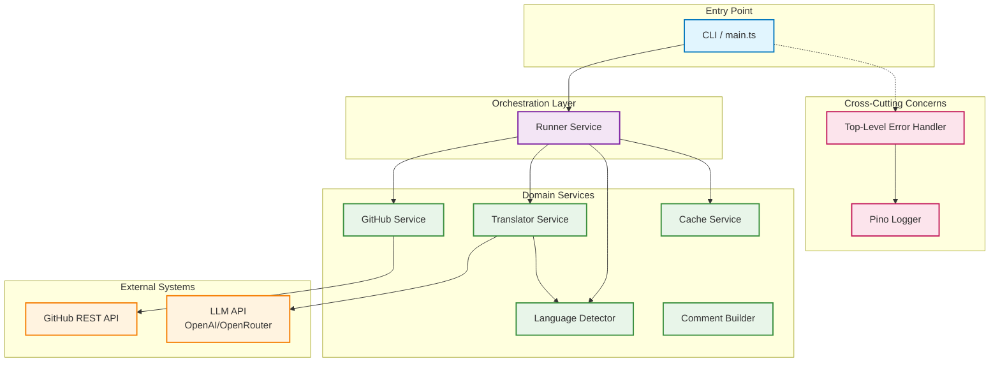
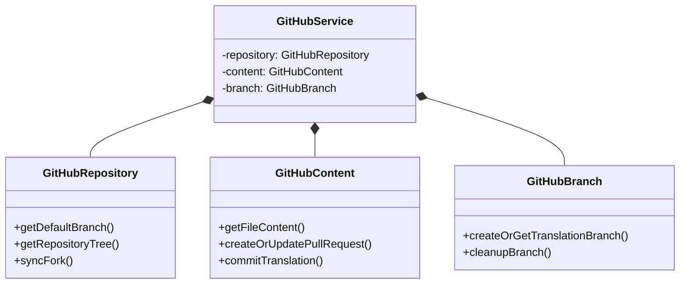
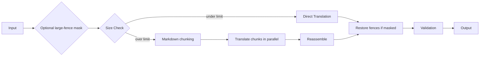

# Architecture Documentation

Overview of the `translate-react` CLI: service design, data flow, and error handling.

## Table of Contents

- [Table of Contents](#table-of-contents)
- [System Overview](#system-overview)
- [Service Architecture](#service-architecture)
- [Core Services](#core-services)
  - [Runner Service](#runner-service)
  - [GitHub Service](#github-service)
  - [Translator Service](#translator-service)
  - [Language Detector Service](#language-detector-service)
  - [Cache Service](#cache-service)
- [Error Handling](#error-handling)
- [Design Patterns](#design-patterns)
- [Dependency Injection](#dependency-injection)
- [Performance Considerations](#performance-considerations)
- [References](#references)

## System Overview

`main.ts` runs the CLI. **RunnerService** calls GitHub, translator, language detector, and cache in sequence (see [WORKFLOW.md](./WORKFLOW.md)). **GitHubService** and **TranslatorService** talk to the GitHub REST API and the configured LLM endpoint. Errors surface at the top level in `main.ts` with structured logging (Pino).


```mermaid
graph TB
    subgraph "Entry Point"
        CLI[CLI / main.ts]
    end

    subgraph "Orchestration Layer"
        Runner[Runner Service]
    end

    subgraph "Domain Services"
        GitHub[GitHub Service]
        Translator[Translator Service]
        LangDetector[Language Detector]
        Cache[Cache Service]
        CommentBuilder[Comment Builder]
    end

    subgraph "Cross-Cutting Concerns"
        ErrorHandler[Top-Level Error Handler]
        Logger[Pino Logger]
    end

    subgraph "External Systems"
        GitHubAPI[GitHub REST API]
        LLMAPI[LLM API<br/>OpenAI/OpenRouter]
    end

    CLI --> Runner
    Runner --> GitHub
    Runner --> Translator
    Runner --> LangDetector
    Runner --> Cache

    GitHub --> GitHubAPI
    Translator --> LLMAPI
    Translator --> LangDetector

    CLI -.-> ErrorHandler
    ErrorHandler --> Logger

    classDef entryPoint fill:#e1f5fe,stroke:#0277bd,stroke-width:2px
    classDef orchestration fill:#f3e5f5,stroke:#7b1fa2,stroke-width:2px
    classDef domain fill:#e8f5e9,stroke:#388e3c,stroke-width:2px
    classDef external fill:#fff3e0,stroke:#f57c00,stroke-width:2px
    classDef crossCutting fill:#fce4ec,stroke:#c2185b,stroke-width:2px

    class CLI entryPoint
    class Runner orchestration
    class GitHub,Translator,LangDetector,Cache,CommentBuilder domain
    class GitHubAPI,LLMAPI external
    class ErrorHandler,Logger crossCutting
```

## Service Architecture

A single **GitHubService** exposes all GitHub operations, internally composing three implementation classes:


```mermaid
classDiagram
    class GitHubService {
        -repository: GitHubRepository
        -content: GitHubContent
        -branch: GitHubBranch
    }
    class GitHubRepository {
        +getDefaultBranch()
        +getRepositoryTree()
        +syncFork()
    }
    class GitHubContent {
        +getFileContent()
        +createOrUpdatePullRequest()
        +commitTranslation()
    }
    class GitHubBranch {
        +createOrGetTranslationBranch()
        +cleanupBranch()
    }
    GitHubService *-- GitHubRepository
    GitHubService *-- GitHubContent
    GitHubService *-- GitHubBranch
```

## Core Services

### Runner Service

Code under `src/services/runner/`. Runs the pipeline in [`RunnerService.run()`](../src/services/runner/runner.service.ts): keeps `RunnerState` in memory (tree, queue, results) and delegates batch work to managers. Details: [WORKFLOW.md](./WORKFLOW.md).

### GitHub Service

Single public API (`services/github/`) for all GitHub operations. Internally composes three classes:

- **GitHubRepository**: Fork sync, tree fetching (`.md` in `src/`), token verification, translation guidelines retrieval
- **GitHubContent**: File content retrieval, PR listing/create/update, commits (branch-tip `sha` before contents API writes), progress-issue comments
- **GitHubBranch**: Translation branch creation (`translate/{file-path}`), cleanup, deletion

Public methods delegate to the appropriate internal class.

### Translator Service

Core translation engine (`services/translator/translator.service.ts`) interfacing with LLM APIs.


```mermaid
graph LR
    A[Input] --> B{Optional large-fence mask}
    B --> C{Size Check}
    C -->|under limit| D[Direct Translation]
    C -->|over limit| E[Markdown chunking]
    E --> F[Translate chunks in parallel]
    F --> G[Reassemble]
    D --> H[Restore fences if masked]
    G --> H
    H --> I[Validation]
    I --> J[Output]
```

**Large-fence masking (optional, env-driven):** Fenced blocks whose tiktoken estimate meets `MASK_VERBATIM_LARGE_FENCES_MIN_TOKENS` can be replaced by short HTML comment placeholders before any LLM call, then restored from the original source so structure and validators still see real fences. Disabled by default; see [`markdown-verbatim-fences.util.ts`](../src/utils/markdown-verbatim-fences.util.ts).

**Content chunking** (when estimated input tokens exceed the safe budget in [`ChunksManager`](../src/services/translator/managers/chunks.manager.ts)):

1. Split with LangChain `MarkdownTextSplitter` using the same token estimator and overlap from `CHUNKS` in [`managers.constants.ts`](../src/services/translator/managers/managers.constants.ts)
2. Translate chunks concurrently (`Promise.all`), then reassemble with captured separators

**Translation guidelines**: Loaded from upstream `GLOSSARY.md`, passed to LLM as system instruction.

### Language Detector Service

Statistical language detection (`services/language-detector/language-detector.service.ts`) using Compact Language Detector (CLD).

**Detection Flow:**

1. Check content length (skip if below minimum)
2. Run CLD detection
3. Verify reliability and confidence (> 80%)
4. Calculate translation ratio: `targetScore / (targetScore + sourceScore)`
5. Mark as translated if `ratio > 0.5`

This ratio-based approach handles mixed-language content (code examples, technical terms) better than binary detection.

### Cache Service

In-memory caching (`services/cache/`) for runtime-scoped data.

- **CacheService**: Generic TTL cache with O(1) lookups, batch operations, composite key support (`filename:contentHash`)

## Error Handling

**ApplicationError** is used for domain workflow failures (e.g. no files to translate). Carries `ErrorCode`, operation name, and optional metadata. Library errors (`RequestError`, `APIError`) bubble up unmodified.

**Top-Level Handler** (`main.ts`) catches all errors at the process boundary:

- **ApplicationError**: logs code, operation, message, metadata
- **RequestError** (Octokit): logs as GitHub API error with status, request ID
- **APIError** (OpenAI): logs as LLM API error with status, type
- Other errors: logs message and stack

All errors result in `process.exit(1)`.

## Design Patterns

- **Runner**: `BaseRunnerService` holds shared state and managers; `RunnerService` extends it with `run()` implementation
- **GitHub**: Composition pattern — `GitHubService` composes three internal classes with shared Octokit/config

## Dependency Injection

Services are instantiated at module level. `main.ts` imports `runnerService` built with other services. Dependencies are passed via typed constructor arguments. Tests inject mocks via constructors:

```typescript
const service = new RunnerService({
	github: createMockGitHubService(),
	translator: createMockTranslatorService(),
});
```

Mock factories live in `tests/mocks/`.

## Performance Considerations

**Batch Processing**: Configurable batch size balances throughput, resource usage, and error isolation.

**Parallelization Strategy**:

| Operation             | Strategy                     |
| --------------------- | ---------------------------- |
| File content fetching | Batch of 10 concurrent       |
| Language detection    | Sequential (CPU-bound)       |
| Translation           | Sequential (rate-limited)    |
| PR creation           | Sequential (avoid conflicts) |

**Memory**: Streaming content processing, GC after each batch, lazy translation guidelines loading.

## References

- [WORKFLOW.md](./WORKFLOW.md) — Call order, stages, forks, releases
- [README.md](../README.md) — Install, env tables, troubleshooting
