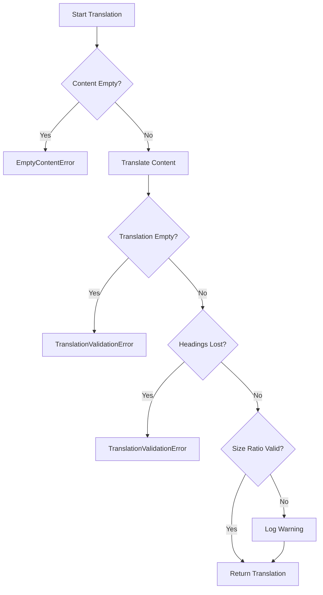
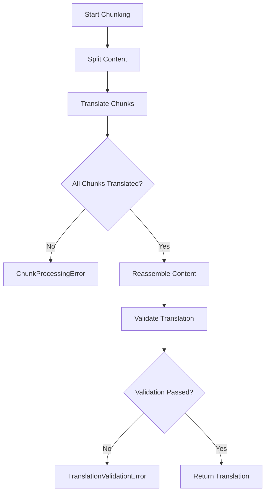

# Error Handling Architecture

## Table of Contents

- [Table of Contents](#table-of-contents)
- [Overview](#overview)
- [Error Structure](#error-structure)
  - [Factory Functions](#factory-functions)
- [Error Codes](#error-codes)
  - [Content-Related Codes](#content-related-codes)
  - [Process-Related Codes](#process-related-codes)
  - [API-Related Codes](#api-related-codes)
- [Error Factory Functions](#error-factory-functions)
  - [createEmptyContentError](#createemptycontenterror)
  - [createTranslationValidationError](#createtranslationvalidationerror)
  - [createChunkProcessingError](#createchunkprocessingerror)
- [ApplicationError Class](#applicationerror-class)
- [Error Mapping Function](#error-mapping-function)
  - [Examples](#examples)
    - [Github's API Error](#githubs-api-error)
    - [OpenAI/LLM API Error](#openaillm-api-error)
- [Error Handling Patterns](#error-handling-patterns)
  - [Service-Level Error Handling](#service-level-error-handling)
  - [Validation Error Flow](#validation-error-flow)
  - [Chunk Processing Error Flow](#chunk-processing-error-flow)
- [Best Practices](#best-practices)
  - [1. Always Provide Operation Context](#1-always-provide-operation-context)
  - [2. Include Relevant Metadata](#2-include-relevant-metadata)
  - [3. Use Appropriate Factory Functions](#3-use-appropriate-factory-functions)
  - [4. Use Pure Function Error Mapper](#4-use-pure-function-error-mapper)
- [Testing Error Handling](#testing-error-handling)
  - [Unit Tests](#unit-tests)
  - [Integration Tests](#integration-tests)
- [Related Documentation](#related-documentation)
  - [Source Files](#source-files)

---

## Overview

The translation workflow uses a simplified error handling system with a single `ApplicationError` class and factory functions for common error scenarios. Each error provides context through optional `operation` and `metadata` properties for debugging.

## Error Structure

```
Error (Native)
└── ApplicationError (single class with error codes)
```

### Factory Functions

- `createInitializationError()` - Service initialization failures
- `createResourceLoadError()` - Resource loading failures
- `createEmptyContentError()` - Empty file content
- `createTranslationValidationError()` - Translation output validation
- `createChunkProcessingError()` - Chunk workflow issues

## Error Codes

### Content-Related Codes

| Code                     | Description                                |
| ------------------------ | ------------------------------------------ |
| `NoContent`              | File content is empty or missing           |
| `InvalidContent`         | Content format or structure is invalid     |
| `ContentTooLong`         | Content exceeds maximum allowed length     |
| `FormatValidationFailed` | Translation format validation failed       |
| `ChunkProcessingFailed`  | Chunk processing failed during translation |

### Process-Related Codes

| Code                  | Description                   |
| --------------------- | ----------------------------- |
| `TranslationFailed`   | Translation process failed    |
| `InitializationError` | Service initialization failed |

### API-Related Codes

| Code                 | Description                  |
| -------------------- | ---------------------------- |
| `LLMApiError`        | LLM API request failed       |
| `GithubApiError`     | GitHub API request failed    |
| `RateLimitExceeded`  | API rate limit exceeded      |
| `GithubNotFound`     | GitHub resource not found    |
| `GithubUnauthorized` | GitHub authentication failed |
| `GithubForbidden`    | GitHub access forbidden      |
| `GithubServerError`  | GitHub server error          |

## Error Factory Functions

### createEmptyContentError

- **Purpose**: Creates an error when file content is empty or missing before processing.
- **Usage**:

```typescript
import { createEmptyContentError } from "@/errors";

throw createEmptyContentError(filename, "TranslatorService.translateContent", { filename, path });
```

- **When Thrown**:
  - `TranslatorService.translateContent()`: Before attempting translation
  - `TranslatorService.getLanguageAnalysis()`: Before language detection
- **Error Code**: `NoContent`

### createTranslationValidationError

- **Purpose**: Creates an error when translated output fails validation checks.
- **Usage**:

```typescript
import { createTranslationValidationError } from "@/errors";

throw createTranslationValidationError(
	"Translation produced empty content",
	filename,
	"TranslatorService.validateTranslation",
	{
		filename,
		path,
		originalLength,
		translatedLength,
	},
);
```

- **When Thrown**:
  - Empty translation output
  - Complete loss of markdown headings
- **Error Code**: `FormatValidationFailed`

### createChunkProcessingError

- **Purpose**: Creates an error when chunk processing fails during translation (critical workflow error).
- **Usage**:

```typescript
import { createChunkProcessingError } from "@/errors";

throw createChunkProcessingError(
	`Chunk count mismatch: expected ${expected} chunks, but only ${actual} were translated`,
	"TranslatorService.translateWithChunking",
	{
		expectedChunks,
		actualChunks,
		missingChunks,
		contentLength,
		chunkSizes,
	},
);
```

- **When Thrown**:
  - Chunk count mismatch after translation
  - Missing chunks before reassembly
  - Chunk array corruption
- **Error Code**: `ChunkProcessingFailed`

## ApplicationError Class

All errors are instances of `ApplicationError` with standardized properties:

```typescript
class ApplicationError extends Error {
	readonly code: ErrorCode; // Standardized error code
	readonly operation: string; // Operation that failed (defaults to "UnknownOperation")
	readonly metadata?: Record<string, unknown>; // Additional context

	constructor(
		message: string,
		code: ErrorCode,
		operation?: string,
		metadata?: Record<string, unknown>,
	);
}
```

## Error Mapping Function

This helper's implementation provides an error-type agnostic mapping mechanism. It translates third-party errors into `ApplicationError` instances with relevant context. This ensures consistent error handling across different services.

The main errors thrown in the workflow relate to octokit's `RequestError` and OpenAI's `APIError` (or `OpenAIError`), which are specifically handled by the `mapError` function.

### Examples

#### Github's API Error

```typescript
import { mapError } from "@/errors/";

try {
  await octokit.rest.repos.getContent({ ... });
} catch (error) {
  throw mapError(error, "ContentService.getFileContent", { path, owner, repo });
}
```

#### OpenAI/LLM API Error

```typescript
import { mapError } from "@/errors/";

try {
  await openai.chat.completions.create({ ... });
} catch (error) {
  throw mapError(error, "TranslatorService.callLanguageModel", { model, chunkIndex, chunkSize });
}
```

## Error Handling Patterns

### Service-Level Error Handling

Services throw typed errors with context using factory functions:

```typescript
import { createEmptyContentError } from "@/errors";

// Factory function with context
if (!file.content?.length) {
	throw createEmptyContentError(file.filename, "TranslatorService.translateContent", {
		filename: file.filename,
		path: file.path,
	});
}
```

### Validation Error Flow



### Chunk Processing Error Flow



## Best Practices

### 1. Always Provide Operation Context

```typescript
throw createEmptyContentError(
	filename,
	"ServiceName.methodName", // Always include calling context
	relevantData,
);
```

### 2. Include Relevant Metadata

```typescript
metadata: {
  filename,              // File being processed
  path,                  // File path
  originalLength,        // Original content size
  translatedLength,      // Translated content size
  chunkIndex,            // Current chunk (if chunking)
  estimatedTokens,       // Token estimates (if relevant)
}
```

### 3. Use Appropriate Factory Functions

- **createEmptyContentError**: Content validation before processing
- **createTranslationValidationError**: Translation output validation
- **createChunkProcessingError**: Chunk workflow issues (critical)
- **createInitializationError**: Service initialization failures
- **createResourceLoadError**: Resource loading failures

### 4. Use Pure Function Error Mapper

```typescript
import { mapError } from "@/errors/";

// In catch blocks
catch (error) {
  throw mapError(error, operation, metadata);
}
```

## Testing Error Handling

### Unit Tests

```typescript
import { expect, test } from "bun:test";

import { ApplicationError, ErrorCode } from "@/errors";

test("throws error for empty content", () => {
	const file = new TranslationFile("", "test.md", "path/test.md", "sha123");

	expect(() => translator.translateContent(file)).toThrow(ApplicationError);
});
```

### Integration Tests

```typescript
test("handles chunk count mismatch", async () => {
	const largeContent = generateLargeContent();

	try {
		await translator.translateContent(file);
	} catch (error) {
		expect(error).toBeInstanceOf(ApplicationError);
		expect(error.code).toBe(ErrorCode.ChunkProcessingFailed);
		expect(error.metadata).toHaveProperty("expectedChunks");
	}
});
```

## Related Documentation

| Document                             | Description                                     |
| ------------------------------------ | ----------------------------------------------- |
| [DEBUGGING.md](./DEBUGGING.md)       | Troubleshooting guide and diagnostic procedures |
| [ARCHITECTURE.md](./ARCHITECTURE.md) | System architecture and service design          |

### Source Files

| File                                                                            | Description                            |
| ------------------------------------------------------------------------------- | -------------------------------------- |
| [`src/errors/base.error.ts`](../src/errors/base.error.ts)                       | Base error class and error codes       |
| [`src/errors/errors.ts`](../src/errors/errors.ts)                               | Error factory function implementations |
| [`src/errors/error.helper`](../src/errors/error.helper.ts)                      | Agnostic error mapping function        |
| [`src/services/translator.service.ts`](../src/services/translator.service.ts)   | Primary error usage                    |
| [`src/services/runner/base.service.ts`](../src/services/runner/base.service.ts) | Error handling in workflow             |
