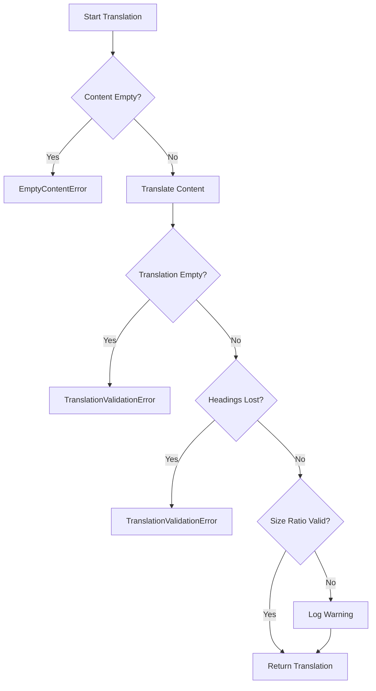
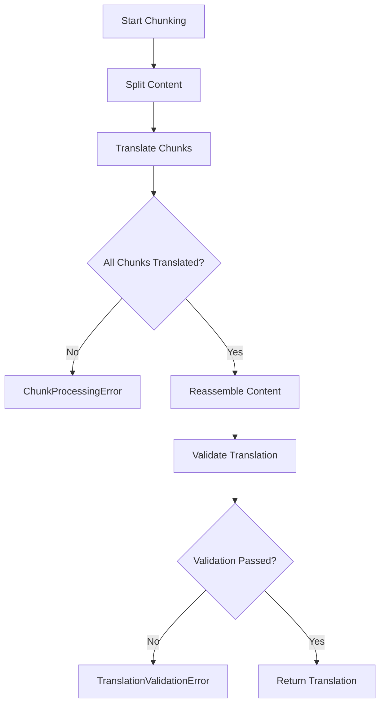

# Error Handling Architecture

## Overview

The translation workflow uses a simplified error handling system with typed error classes that extend the base `TranslationError` class. Each error provides context through optional `operation` and `metadata` properties for debugging.

## Error Class Hierarchy

```
Error (Native)
└── TranslationError (Base)
    ├── InitializationError
    ├── ResourceLoadError
    ├── EmptyContentError
    ├── TranslationValidationError
    └── ChunkProcessingError
```

## Error Codes

### Content-Related Codes

| Code                     | Description                                |
| ------------------------ | ------------------------------------------ |
| `NoContent`              | File content is empty or missing           |
| `InvalidContent`         | Content format or structure is invalid     |
| `ContentTooLong`         | Content exceeds maximum allowed length     |
| `FormatValidationFailed` | Translation format validation failed       |
| `ChunkProcessingFailed`  | Chunk processing failed during translation |

### Process-Related Codes

| Code                  | Description                   |
| --------------------- | ----------------------------- |
| `TranslationFailed`   | Translation process failed    |
| `InitializationError` | Service initialization failed |

### API-Related Codes

| Code                 | Description                  |
| -------------------- | ---------------------------- |
| `LLMApiError`        | LLM API request failed       |
| `GithubApiError`     | GitHub API request failed    |
| `RateLimitExceeded`  | API rate limit exceeded      |
| `GithubNotFound`     | GitHub resource not found    |
| `GithubUnauthorized` | GitHub authentication failed |
| `GithubForbidden`    | GitHub access forbidden      |
| `GithubServerError`  | GitHub server error          |

## Error Classes

### EmptyContentError

**Purpose**: Thrown when file content is empty or missing before processing.

**Usage**:

```typescript
throw new EmptyContentError(filename, {
  operation: "TranslatorService.translateContent",
  metadata: { filename, path },
});
```

**When Thrown**:

- `TranslatorService.translateContent()`: Before attempting translation
- `TranslatorService.getLanguageAnalysis()`: Before language detection

**Error Code**: `NoContent`

### TranslationValidationError

**Purpose**: Thrown when translated output fails validation checks.

**Usage**:

```typescript
throw new TranslationValidationError(
  "Translation produced empty content",
  filename,
  {
    operation: "TranslatorService.validateTranslation",
    metadata: {
      filename,
      path,
      originalLength,
      translatedLength,
    },
  }
);
```

**When Thrown**:

- Empty translation output
- Complete loss of markdown headings

**Error Code**: `FormatValidationFailed`

### ChunkProcessingError

**Purpose**: Thrown when chunk processing fails during translation (critical workflow error).

**Usage**:

```typescript
throw new ChunkProcessingError(
  `Chunk count mismatch: expected ${expected} chunks, but only ${actual} were translated`,
  {
    operation: "TranslatorService.translateWithChunking",
    metadata: {
      expectedChunks,
      actualChunks,
      missingChunks,
      contentLength,
      chunkSizes,
    },
  }
);
```

**When Thrown**:

- Chunk count mismatch after translation
- Missing chunks before reassembly
- Chunk array corruption

**Error Code**: `ChunkProcessingFailed`

## TranslationError Structure

All errors include standardized properties:

```typescript
interface TranslationErrorContext<T extends Record<string, unknown>> {
  operation?: string;  // Operation that failed (e.g., "TranslatorService.translateContent")
  metadata?: T;        // Additional context (file info, metrics, etc.)
}

class TranslationError<T extends Record<string, unknown>> extends Error {
  readonly code: ErrorCode;           // Standardized error code
  readonly operation?: string;        // Operation that failed
  readonly metadata?: T;              // Additional context
  readonly timestamp: Date;           // When error occurred
}
```

## Error Mapping Functions

### mapGithubError

Maps GitHub/Octokit errors to `TranslationError`:

```typescript
import { mapGithubError } from "@/errors/helpers/github-error.helper";

try {
  await octokit.rest.repos.getContent({ ... });
} catch (error) {
  throw mapGithubError(error, {
    operation: "ContentService.getFileContent",
    metadata: { path, owner, repo },
  });
}
```

### mapLLMError

Maps OpenAI/LLM errors to `TranslationError`:

```typescript
import { mapLLMError } from "@/errors/helpers/llm-error.helper";

try {
  await openai.chat.completions.create({ ... });
} catch (error) {
  throw mapLLMError(error, {
    operation: "TranslatorService.callLanguageModel",
    metadata: { model, chunkIndex, chunkSize },
  });
}
```

## Error Handling Patterns

### Service-Level Error Handling

Services throw typed errors with context:

```typescript
// Typed error with context
if (!file.content?.length) {
  throw new EmptyContentError(file.filename, {
    operation: "TranslatorService.translateContent",
    metadata: { filename: file.filename, path: file.path },
  });
}
```

### Error Mapping

LLM and GitHub errors are mapped using pure functions:

```typescript
try {
  const translatedChunk = await this.callLanguageModel(chunk);
} catch (error) {
  throw mapLLMError(error, {
    operation: "TranslatorService.translateWithChunking",
    metadata: {
      chunkIndex: i,
      totalChunks: chunks.length,
      chunkSize: chunk.length,
    },
  });
}
```

### Validation Error Flow



### Chunk Processing Error Flow



## Best Practices

### 1. Always Provide Operation Context

```typescript
throw new EmptyContentError(filename, {
  operation: "ServiceName.methodName", // Always include calling context
  metadata: relevantData,
});
```

### 2. Include Relevant Metadata

```typescript
metadata: {
  filename,              // File being processed
  path,                  // File path
  originalLength,        // Original content size
  translatedLength,      // Translated content size
  chunkIndex,            // Current chunk (if chunking)
  estimatedTokens,       // Token estimates (if relevant)
}
```

### 3. Use Appropriate Error Classes

- **EmptyContentError**: Content validation before processing
- **TranslationValidationError**: Translation output validation
- **ChunkProcessingError**: Chunk workflow issues (critical)
- **InitializationError**: Service initialization failures
- **ResourceLoadError**: Resource loading failures

### 4. Use Pure Function Error Mappers

```typescript
import { mapGithubError } from "@/errors/helpers/github-error.helper";
import { mapLLMError } from "@/errors/helpers/llm-error.helper";

// In catch blocks
catch (error) {
  throw mapGithubError(error, { operation, metadata });
}
```

## Testing Error Handling

### Unit Tests

```typescript
import { expect, test } from "bun:test";
import { EmptyContentError } from "@/errors/";

test("throws EmptyContentError for empty content", () => {
  const file = new TranslationFile("", "test.md", "path/test.md", "sha123");
  
  expect(() => translator.translateContent(file))
    .toThrow(EmptyContentError);
});
```

### Integration Tests

```typescript
test("handles chunk count mismatch", async () => {
  const largeContent = generateLargeContent();
  
  try {
    await translator.translateContent(file);
  } catch (error) {
    expect(error).toBeInstanceOf(ChunkProcessingError);
    expect(error.code).toBe(ErrorCode.ChunkProcessingFailed);
    expect(error.metadata).toHaveProperty("expectedChunks");
  }
});
```

## Related Files

- `/src/errors/base-error.ts`: Base error class and error codes
- `/src/errors/errors.ts`: Concrete error class implementations
- `/src/errors/helpers/github-error.helper.ts`: GitHub error mapping function
- `/src/errors/helpers/llm-error.helper.ts`: LLM error mapping function
- `/src/services/translator.service.ts`: Primary error usage
- `/src/services/runner/base.service.ts`: Error handling in workflow
