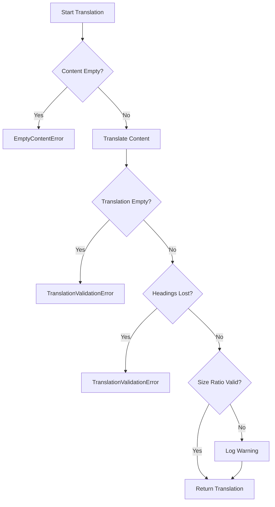
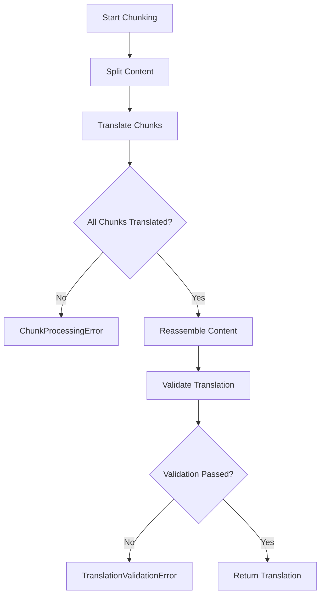

# Error Handling Architecture

## Overview

The translation workflow uses a structured error handling system with typed error classes that extend the base `TranslationError` class. Each error provides rich context including operation details, file information, and metadata for debugging.

## Error Class Hierarchy

```
Error (Native)
└── TranslationError (Base)
    ├── InitializationError
    ├── MissingKeyError
    ├── UnsupportedLanguageError
    ├── ResourceLoadError
    ├── APIError
    ├── ValidationError
    ├── EmptyContentError [NEW]
    ├── TranslationValidationError [NEW]
    └── ChunkProcessingError [NEW]
```

## Error Codes

### Content-Related Codes

| Code                     | Description                                      | Severity |
| ------------------------ | ------------------------------------------------ | -------- |
| `NoContent`              | File content is empty or missing                 | ERROR    |
| `InvalidContent`         | Content format or structure is invalid           | ERROR    |
| `ContentTooLong`         | Content exceeds maximum allowed length           | ERROR    |
| `FormatValidationFailed` | Translation format validation failed             | ERROR    |
| `ChunkProcessingFailed`  | Chunk processing failed during translation [NEW] | FATAL    |

### Process-Related Codes

| Code                  | Description                   | Severity |
| --------------------- | ----------------------------- | -------- |
| `TranslationFailed`   | Translation process failed    | ERROR    |
| `ValidationError`     | General validation error      | ERROR    |
| `InitializationError` | Service initialization failed | FATAL    |

### API-Related Codes

| Code                | Description                    | Severity |
| ------------------- | ------------------------------ | -------- |
| `LLMApiError`       | LLM API request failed         | ERROR    |
| `GithubApiError`    | GitHub API request failed      | ERROR    |
| `GithubRateLimited` | GitHub API rate limit exceeded | WARN     |

## New Error Classes

### EmptyContentError

**Purpose**: Thrown when file content is empty or missing before processing.

**Usage**:

```typescript
throw new EmptyContentError(filename, {
  operation: "TranslatorService.translateContent",
  file: filePath,
  metadata: { filename, path },
});
```

**When Thrown**:

- `TranslatorService.translateContent()`: Before attempting translation
- `TranslatorService.getLanguageAnalysis()`: Before language detection

**Error Code**: `NoContent`

### TranslationValidationError

**Purpose**: Thrown when translated output fails validation checks.

**Usage**:

```typescript
throw new TranslationValidationError(
  "Translation produced empty content",
  filename,
  {
    operation: "TranslatorService.validateTranslation",
    file: filePath,
    metadata: {
      filename,
      originalLength,
      translatedLength,
    },
  }
);
```

**When Thrown**:

- Empty translation output
- Complete loss of markdown headings
- Critical structural corruption

**Error Code**: `FormatValidationFailed`

### ChunkProcessingError

**Purpose**: Thrown when chunk processing fails during translation (critical workflow error).

**Usage**:

```typescript
throw new ChunkProcessingError(
  `Chunk count mismatch: expected ${expected} chunks, but only ${actual} were translated`,
  {
    operation: "TranslatorService.translateWithChunking",
    metadata: {
      expectedChunks,
      actualChunks,
      missingChunks,
      contentLength,
      chunkSizes,
    },
  }
);
```

**When Thrown**:

- Chunk count mismatch after translation
- Missing chunks before reassembly
- Chunk array corruption

**Error Code**: `ChunkProcessingFailed`

**Severity**: FATAL (prevents incomplete translations from being committed)

## Error Context Structure

All errors include standardized context:

```typescript
interface ErrorContext {
  sanity: ErrorSeverity;              // DEBUG, INFO, WARN, ERROR, FATAL
  code: ErrorCode;                    // Standardized error code
  operation?: string;                 // Operation that failed (e.g., "TranslatorService.translateContent")
  file?: BunFile | string;            // File path or Bun file object
  metadata?: Record<string, unknown>; // Additional context (file info, metrics, etc.)
  timestamp?: Date;                   // When error occurred
}
```

## Error Handling Patterns

### Service-Level Error Handling

Services throw typed errors with rich context:

```typescript
// Before (generic Error)
if (!file.content?.length) {
  throw new Error(`File content is empty: ${file.filename}`);
}

// After (typed error with context)
if (!file.content?.length) {
  throw new EmptyContentError(file.filename, {
    operation: "TranslatorService.translateContent",
    file: file.path,
    metadata: { filename: file.filename, path: file.path },
  });
}
```

### Error Mapping

LLM and GitHub errors are mapped to standardized types:

```typescript
try {
  const translatedChunk = await this.callLanguageModel(chunk);
} catch (error) {
  throw this.helpers.llm.mapError(error, {
    operation: "TranslatorService.translateWithChunking",
    metadata: {
      chunkIndex: i,
      totalChunks: chunks.length,
      chunkSize: chunk.length,
    },
  });
}
```

### Validation Error Flow



### Chunk Processing Error Flow



## Error Logging

All errors are logged with appropriate context:

```typescript
logger.error(
  {
    error,
    filename: file.filename,
    operation: "translateContent",
    metadata: { contentLength: file.content.length },
  },
  "Translation failed for file"
);
```

### Log Levels by Error Type

| Error Type                   | Log Level | Context Included                                    |
| ---------------------------- | --------- | --------------------------------------------------- |
| `EmptyContentError`          | ERROR     | Filename, file path, operation                      |
| `TranslationValidationError` | ERROR     | Filename, validation details, content lengths       |
| `ChunkProcessingError`       | FATAL     | Chunk counts, sizes, content length, missing chunks |

## Best Practices

### 1. Always Provide Operation Context

```typescript
throw new EmptyContentError(filename, {
  operation: "ServiceName.methodName", // Always include calling context
  file: filePath,
  metadata: relevantData,
});
```

### 2. Include Relevant Metadata

```typescript
metadata: {
  filename,              // File being processed
  originalLength,        // Original content size
  translatedLength,      // Translated content size
  chunkIndex,            // Current chunk (if chunking)
  estimatedTokens,       // Token estimates (if relevant)
}
```

### 3. Use Appropriate Error Classes

- **EmptyContentError**: Content validation before processing
- **TranslationValidationError**: Translation output validation
- **ChunkProcessingError**: Chunk workflow issues (critical)
- **ValidationError**: General validation failures

### 4. Log Before Throwing

```typescript
logger.error({ context }, "Error description");
throw new SpecificError(message, context);
```

## Testing Error Handling

### Unit Tests

```typescript
import { expect, test } from "bun:test";
import { EmptyContentError } from "@/errors";

test("throws EmptyContentError for empty content", () => {
  const file = new TranslationFile("", "test.md", "path/test.md", "sha123");
  
  expect(() => translator.translateContent(file))
    .toThrow(EmptyContentError);
});
```

### Integration Tests

```typescript
test("handles chunk count mismatch", async () => {
  // Setup scenario where chunk processing fails
  const largeContent = generateLargeContent();
  
  try {
    await translator.translateContent(file);
  } catch (error) {
    expect(error).toBeInstanceOf(ChunkProcessingError);
    expect(error.code).toBe(ErrorCode.ChunkProcessingFailed);
    expect(error.context.metadata).toHaveProperty("expectedChunks");
  }
});
```

## Related Files

- `/src/errors/base-error.ts`: Base error class and error codes
- `/src/errors/errors.ts`: Concrete error class implementations
- `/src/errors/helpers/`: Error mapping helpers (LLM, GitHub)
- `/src/services/translator.service.ts`: Primary error usage
- `/src/services/runner/base.service.ts`: Error handling in workflow
