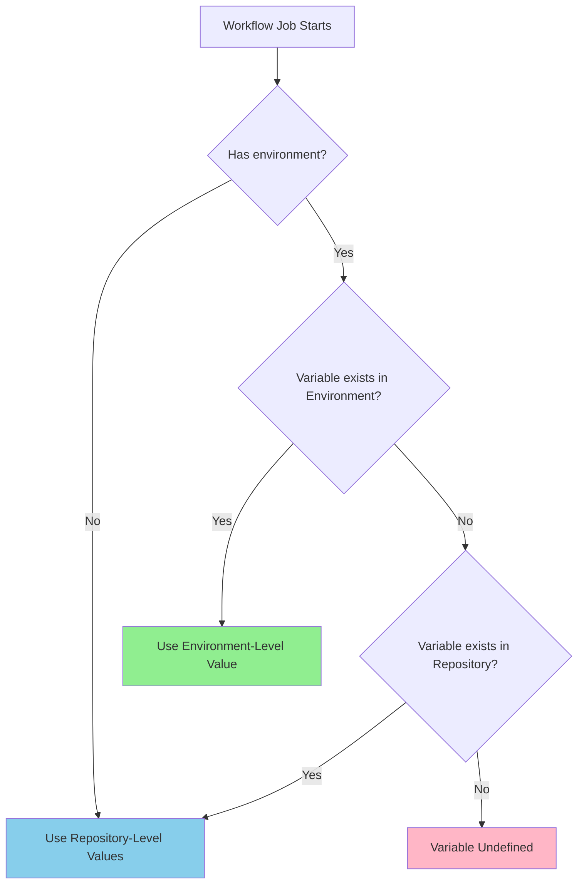

# GitHub Actions Setup Guide

Quick reference for configuring the GitHub Actions workflows for this project.

## Table of Contents

- [Prerequisites](#prerequisites)
- [Configuration Checklist](#configuration-checklist)
  - [Repository Secrets](#1-repository-secrets)
  - [Repository Variables](#2-repository-variables)
- [Using GitHub Environments (Recommended)](#using-github-environments-recommended)
  - [Why Use Environments](#why-use-environments-for-this-project)
  - [Setting Up Environments](#setting-up-environments)
  - [Environment Configuration Strategy](#environment-configuration-strategy)
- [Quick Setup Scripts](#quick-setup-script-with-environments)
- [Verify Configuration](#verify-configuration)
- [Testing](#testing)
- [How It Works](#how-it-works)
- [Troubleshooting](#troubleshooting)
- [Security Best Practices](#security-best-practices)
- [Frequently Asked Questions](#frequently-asked-questions-faq)
- [Next Steps](#next-steps)

## Prerequisites

- A GitHub fork of the upstream repository
- GitHub Personal Access Token with `repo` permissions
- API keys for translation services (OpenAI/OpenRouter)

## Configuration Checklist

### 1. Repository Secrets

Go to **Settings → Secrets and variables → Actions → Repository secrets** and add:

#### `WORKFLOW_GITHUB_TOKEN`

**Personal Access Token for GitHub API operations and PR creation.**

**Important**: PRs will be created **under your GitHub account** using this token (not as github-actions[bot]).

**How to create:**

1. Go to GitHub **Settings → Developer settings → Personal access tokens → Tokens (classic)**
2. Click **Generate new token (classic)**
3. Name it: `translate-react-workflow`
4. Select scopes:
   - ✅ `repo` (Full control of private repositories)
   - ✅ `workflow` (Update GitHub Action workflows)
5. Click **Generate token**
6. Copy the token (you won't see it again!)
7. Add it as `WORKFLOW_GITHUB_TOKEN` in your repository secrets

#### `OPENAI_API_KEY`

API key for OpenAI/OpenRouter or other LLM service.

**For OpenRouter:**

1. Go to [OpenRouter](https://openrouter.ai/)
2. Sign up/Login
3. Go to **Keys** section
4. Create a new API key
5. Add it as `OPENAI_API_KEY` in your repository secrets

### 2. Repository Variables

Go to **Settings → Secrets and variables → Actions → Variables** and add:

| Variable              | Example Value                      | Description                                          | Required |
| --------------------- | ---------------------------------- | ---------------------------------------------------- | -------- |
| `TRANSLATION_ENABLED` | `true`                             | Master switch to enable/disable translation workflow | ✅ Yes    |
| `NODE_ENV`            | `production`                       | Runtime environment (production/development)         | ✅ Yes    |
| `REPO_FORK_OWNER`     | `nivaldofarias`                    | Your GitHub username/org                             | ✅ Yes    |
| `REPO_FORK_NAME`      | `pt-br.react.dev`                  | Name of your fork                                    | ✅ Yes    |
| `REPO_UPSTREAM_OWNER` | `reactjs`                          | Upstream repository owner                            | ✅ Yes    |
| `REPO_UPSTREAM_NAME`  | `pt-br.react.dev`                  | Upstream repository name                             | ✅ Yes    |
| `TARGET_LANGUAGE`     | `pt-br`                            | Target language code                                 | ✅ Yes    |
| `LLM_MODEL`           | `google/gemini-2.0-flash-exp:free` | LLM model identifier                                 | ❌ No     |
| `OPENAI_BASE_URL`     | `https://api.openrouter.com/v1`    | API base URL                                         | ❌ No     |
| `LOG_LEVEL`           | `info`                             | Logging level (debug/info/warn/error)                | ❌ No     |
| `LOG_TO_CONSOLE`      | `true`                             | Enable console logging in workflows                  | ❌ No     |

> [!IMPORTANT]
> **Environment Configuration:**
> - PRs are created **under your GitHub account** (via `WORKFLOW_GITHUB_TOKEN`), not as github-actions[bot]

## Using GitHub Environments (Recommended)

For projects that need different configurations for **production** and **development** modes, GitHub Environments provide a more robust and secure approach than repository-level secrets/variables alone.

### Repository-Level vs Environment-Level Configuration

| Feature          | Repository-Level                          | Environment-Level                                                  |
| :--------------- | :---------------------------------------- | :----------------------------------------------------------------- |
| **Access Scope** | Available to *all* workflows and jobs     | Available *only* to jobs that explicitly reference the environment |
| **Purpose**      | Common values shared across all workflows | Stage-specific values (production, staging, development)           |
| **Precedence**   | Lower (overridden by environment values)  | Higher (overrides repository-level when names collide)             |
| **Protection**   | Basic repository permissions              | Enhanced: required reviewers, wait timers, deployment gates        |
| **Use Case**     | Default values, CI/CD common config       | Production secrets, stage-specific configuration                   |

#### Configuration Precedence Flow



**Example**: If `REPO_FORK_OWNER` is set to:
- **Repository-level**: `your-username`
- **Production environment**: `reactjs`
- **Development environment**: (not set)

Then:
- Job with `environment: production` → Uses `reactjs` ✅
- Job with `environment: development` → Uses `your-username` (fallback) ✅
- Job with no environment → Uses `your-username` ✅

### Why Use Environments for This Project?

This project operates in two distinct modes:

1. **Production Mode**: Creates PRs to the upstream original React docs repository
2. **Development Mode**: Creates PRs within your fork for testing

Using Environments allows you to:

- ✅ **Isolate sensitive production credentials** from development/testing
- ✅ **Override repository defaults** with environment-specific values
- ✅ **Add deployment protection** (e.g., require approval before production runs)
- ✅ **Maintain clear separation** between production and development configurations
- ✅ **Reduce risk** of accidentally running production operations during testing

### Setting Up Environments

#### Step 1: Create Environments

1. Go to **Settings → Environments**
2. Click **New environment**
3. Create two environments:
   - `production` - for creating PRs to upstream repository
   - `development` - for testing with PRs to your fork

#### Step 2: Configure Environment-Specific Secrets

For each environment, add the secrets that differ between production and development:

**Production Environment (`production`)**:

| Secret                  | Value               | Description                                    |
| :---------------------- | :------------------ | :--------------------------------------------- |
| `WORKFLOW_GITHUB_TOKEN` | Your production PAT | Token with write access to upstream repository |
| `OPENAI_API_KEY`        | Production API key  | May use different rate limits or account       |

**Development Environment (`development`)**:

| Secret                  | Value                    | Description                               |
| :---------------------- | :----------------------- | :---------------------------------------- |
| `WORKFLOW_GITHUB_TOKEN` | Your development PAT     | Token with write access to your fork only |
| `OPENAI_API_KEY`        | Development/test API key | May use free tier or test account         |

> [!TIP]
> **Token Scoping Best Practice**: Use separate GitHub PATs for production and development. The development token should only have access to your fork, while the production token needs access to the upstream repository.

#### Step 3: Configure Environment-Specific Variables

**Production Environment (`production`)**:

| Variable          | Value             | Description                  |
| :---------------- | :---------------- | :--------------------------- |
| `NODE_ENV`        | `production`      | Enables production mode      |
| `REPO_FORK_OWNER` | `reactjs`         | Upstream owner (PRs go here) |
| `REPO_FORK_NAME`  | `pt-br.react.dev` | Upstream repository name     |
| `LOG_LEVEL`       | `info`            | Less verbose logging         |

**Development Environment (`development`)**:

| Variable          | Value             | Description                   |
| :---------------- | :---------------- | :---------------------------- |
| `NODE_ENV`        | `development`     | Enables development mode      |
| `REPO_FORK_OWNER` | `your-username`   | Your fork owner (PRs go here) |
| `REPO_FORK_NAME`  | `pt-br.react.dev` | Your fork name                |
| `LOG_LEVEL`       | `debug`           | Verbose logging for debugging |

#### Complete Configuration Overview

This table shows all configuration values across repository and environment levels:

| Configuration            | Repository-Level                   | Production Env    | Development Env      |
| :----------------------- | :--------------------------------- | :---------------- | :------------------- |
| **Secrets**              |                                    |                   |                      |
| `WORKFLOW_GITHUB_TOKEN`  | Dev token (default)                | Production token  | Dev token (optional) |
| `OPENAI_API_KEY`         | Free tier key                      | Production key    | Test key (optional)  |
| **Common Variables**     |                                    |                   |                      |
| `TRANSLATION_ENABLED`    | `true`                             | (inherits)        | (inherits)           |
| `REPO_UPSTREAM_OWNER`    | `reactjs`                          | (inherits)        | (inherits)           |
| `REPO_UPSTREAM_NAME`     | `pt-br.react.dev`                  | (inherits)        | (inherits)           |
| `TARGET_LANGUAGE`        | `pt-br`                            | (inherits)        | (inherits)           |
| `LLM_MODEL`              | `google/gemini-2.0-flash-exp:free` | (inherits)        | (inherits)           |
| `OPENAI_BASE_URL`        | `https://api.openrouter.com/v1`    | (inherits)        | (inherits)           |
| `LOG_TO_CONSOLE`         | `true`                             | (inherits)        | (inherits)           |
| **Environment-Specific** |                                    |                   |                      |
| `NODE_ENV`               | (not set)                          | `production`      | `development`        |
| `REPO_FORK_OWNER`        | (not set)                          | `reactjs`         | `your-username`      |
| `REPO_FORK_NAME`         | (not set)                          | `pt-br.react.dev` | `pt-br.react.dev`    |
| `LOG_LEVEL`              | (not set)                          | `info`            | `debug`              |

> [!NOTE]
> "(inherits)" means the environment uses the repository-level value. Environment-specific values are only set where they need to differ from defaults.

#### Step 4: Add Deployment Protection (Optional but Recommended)

For the `production` environment, add protection rules:

1. Go to **Settings → Environments → production**
2. Check **Required reviewers** and add your GitHub username
3. Optionally set a **Wait timer** (e.g., 5 minutes) to allow last-minute cancellation
4. Click **Save protection rules**

Now any workflow job targeting `production` will require your manual approval before it can access production secrets and create PRs to the upstream repository.

### Environment Configuration Strategy

#### Recommended: Hybrid Approach

Use both repository-level and environment-level configuration for maximum flexibility:

**Repository-Level (Common/Default Values)**:

```yaml
# Secrets (available to all workflows)
- WORKFLOW_GITHUB_TOKEN (development token as default)
- OPENAI_API_KEY (free tier as default)

# Variables (available to all workflows)
- TRANSLATION_ENABLED: "true"
- REPO_UPSTREAM_OWNER: "reactjs"
- REPO_UPSTREAM_NAME: "pt-br.react.dev"
- TARGET_LANGUAGE: "pt-br"
- LLM_MODEL: "google/gemini-2.0-flash-exp:free"
- OPENAI_BASE_URL: "https://api.openrouter.com/v1"
- LOG_TO_CONSOLE: "true"
```

**Environment-Level (Override for Specific Stages)**:

- **Production**: Override `WORKFLOW_GITHUB_TOKEN`, `NODE_ENV`, `REPO_FORK_OWNER`, `LOG_LEVEL`

#### Precedence Example

If you set `REPO_FORK_OWNER` at repository level to `your-username` and override it in the `production` environment to `reactjs`, then:

- Jobs running with `environment: production` will use `reactjs`
- Jobs running with `environment: development` or no environment will use `your-username`

### Updating Your Workflow to Use Environments

The workflow has been updated to support **environment selection via inputs** for maximum flexibility.

#### How It Works

The workflow now includes:

1. **Manual Trigger (workflow_dispatch)**: Dropdown to select environment

#### Configuring Scheduled Environment


> [!WARNING]
> **Breaking Change**: The workflow now requires environments to be properly configured. Without environment setup, it will fall back to repository-level secrets/variables.

> [!TIP]
> **Safety First**: The workflow defaults to `development` for manual triggers to prevent accidentally creating PRs to upstream during testing.

### Quick Setup Script (with Environments)

Run this in your terminal (replace values with your own):

```bash
# Set repository (replace with your fork)
REPO="your-username/translate-react"

# ===== Repository-Level Setup (Common/Default Values) =====

# Add repository-level secrets (development defaults)
gh secret set WORKFLOW_GITHUB_TOKEN --repo $REPO --body "your-dev-token"
gh secret set OPENAI_API_KEY --repo $REPO --body "your-api-key"

# Add repository-level variables (common to all environments)
gh variable set TRANSLATION_ENABLED --body "true" --repo $REPO
gh variable set REPO_UPSTREAM_OWNER --body "reactjs" --repo $REPO
gh variable set REPO_UPSTREAM_NAME --body "pt-br.react.dev" --repo $REPO
gh variable set TARGET_LANGUAGE --body "pt-br" --repo $REPO
gh variable set LLM_MODEL --body "google/gemini-2.0-flash-exp:free" --repo $REPO
gh variable set OPENAI_BASE_URL --body "https://api.openrouter.com/v1" --repo $REPO
gh variable set LOG_TO_CONSOLE --body "true" --repo $REPO

# ===== Environment Setup =====

# Create environments (if not already created via UI)
# Note: Creating environments via CLI requires GitHub CLI v2.32.0+
# If you see errors, create environments manually via Settings → Environments

# Production Environment
gh api repos/$REPO/environments/production -X PUT

# Add production secrets
gh secret set WORKFLOW_GITHUB_TOKEN --repo $REPO --env production --body "your-prod-token"
gh secret set OPENAI_API_KEY --repo $REPO --env production --body "your-prod-api-key"

# Add production variables
gh variable set NODE_ENV --body "production" --repo $REPO --env production
gh variable set REPO_FORK_OWNER --body "reactjs" --repo $REPO --env production
gh variable set REPO_FORK_NAME --body "pt-br.react.dev" --repo $REPO --env production
gh variable set LOG_LEVEL --body "info" --repo $REPO --env production

# Development Environment
gh api repos/$REPO/environments/development -X PUT

# Add development secrets (optional if same as repository-level)
gh secret set WORKFLOW_GITHUB_TOKEN --repo $REPO --env development --body "your-dev-token"
gh secret set OPENAI_API_KEY --repo $REPO --env development --body "your-dev-api-key"

# Add development variables
gh variable set NODE_ENV --body "development" --repo $REPO --env development
gh variable set REPO_FORK_OWNER --body "your-username" --repo $REPO --env development
gh variable set REPO_FORK_NAME --body "pt-br.react.dev" --repo $REPO --env development
gh variable set LOG_LEVEL --body "debug" --repo $REPO --env development
```

> [!NOTE]
> **Prerequisites**:
> - [GitHub CLI](https://cli.github.com/) version 2.32.0+ installed
> - If environment creation fails, create them manually via **Settings → Environments**
> - Replace `your-username` with your GitHub username
> - Use separate tokens for production and development for better security

#### Alternative: Setup Without GitHub CLI

If you prefer to use the GitHub UI:

1. **Repository Secrets** (Settings → Secrets and variables → Actions → Secrets):
   - Add `WORKFLOW_GITHUB_TOKEN` and `OPENAI_API_KEY`

2. **Repository Variables** (Settings → Secrets and variables → Actions → Variables):
   - Add common variables listed above

3. **Environments** (Settings → Environments):
   - Create `production` and `development` environments
   - For each environment, add environment-specific secrets and variables
   - Configure deployment protection rules for `production`

## Verify Configuration

### 1. Check Repository-Level Secrets

```bash
gh secret list --repo your-username/translate-react
```

Expected output:

```
OPENAI_API_KEY          Updated 2025-01-10
WORKFLOW_GITHUB_TOKEN   Updated 2025-01-10
```

### 2. Check Repository-Level Variables

```bash
gh variable list --repo your-username/translate-react
```

Expected output (common/default values):

```
LLM_MODEL               google/gemini-2.0-flash-exp:free
LOG_TO_CONSOLE          true
OPENAI_BASE_URL         https://api.openrouter.com/v1
REPO_FORK_NAME          pt-br.react.dev
REPO_UPSTREAM_NAME      pt-br.react.dev
REPO_UPSTREAM_OWNER     reactjs
TARGET_LANGUAGE         pt-br
TRANSLATION_ENABLED     true
```

### 3. Check Environment-Specific Configuration

#### List Environments

```bash
gh api repos/your-username/translate-react/environments --jq '.environments[].name'
```

Expected output:

```
development
production
```

#### Check Production Environment Secrets

```bash
gh secret list --repo your-username/translate-react --env production
```

Expected output:

```
OPENAI_API_KEY          Updated 2025-01-10
WORKFLOW_GITHUB_TOKEN   Updated 2025-01-10
```

#### Check Production Environment Variables

```bash
gh variable list --repo your-username/translate-react --env production
```

Expected output:

```
LOG_LEVEL               info
NODE_ENV                production
REPO_FORK_NAME          pt-br.react.dev
REPO_FORK_OWNER         reactjs
```

#### Check Development Environment Variables

```bash
gh variable list --repo your-username/translate-react --env development
```

Expected output:

```
LOG_LEVEL               debug
NODE_ENV                development
REPO_FORK_NAME          pt-br.react.dev
REPO_FORK_OWNER         your-username
```

### 4. Verify Deployment Protection Rules

```bash
gh api repos/your-username/translate-react/environments/production --jq '.protection_rules'
```

Expected output (if protection is enabled):

```json
[
  {
    "type": "required_reviewers",
    "reviewers": [
      {
        "type": "User",
        "reviewer": {
          "login": "your-username",
          "id": 123456
        }
      }
    ]
  }
]
```

## Testing

### 1. Test CI Workflow

Push a commit to trigger the CI workflow:

```bash
git add .
git commit -m "chore: add github actions workflows"
git push origin dev
```

Go to **Actions** tab and verify the CI workflow runs successfully.

### 2. Test Development Environment (Recommended First Step)

Before testing production, always test with the development environment to avoid creating PRs in the upstream repository accidentally.

1. Go to **Actions** tab
2. Select **Sync and Translate** workflow
3. Click **Run workflow**
4. **Important**: Select `development` in the **"Deployment environment"** dropdown
5. Select the branch (usually `dev` or `main`)
6. Click **Run workflow**

Monitor the logs to ensure:
- ✅ Workflow uses `development` environment
- ✅ PRs are created in **your fork** (not upstream)
- ✅ `NODE_ENV` is set to `development`
- ✅ `REPO_FORK_OWNER` points to your username

### 3. Test Production Environment (After Development Testing)

Only after confirming the development environment works correctly:

1. Go to **Actions** tab
2. Select **Sync and Translate** workflow
3. Click **Run workflow**
4. **Important**: Select `production` in the **"Deployment environment"** dropdown
5. Select the branch (usually `main`)
6. Click **Run workflow**
7. If you configured **Required Reviewers**, you'll need to approve the deployment in the Actions tab

Monitor the logs to ensure:
- ✅ Deployment requires approval (if configured)
- ✅ Workflow uses `production` environment
- ✅ PRs are created in the **upstream repository**
- ✅ `NODE_ENV` is set to `production`
- ✅ `REPO_FORK_OWNER` points to upstream owner (e.g., `reactjs`)

### 4. Verify Environment Precedence

To verify that environment variables correctly override repository-level variables:

1. Check the workflow logs under the "Set up job" step
2. Look for environment variables and verify:
   - Development run: `NODE_ENV=development`, `REPO_FORK_OWNER=your-username`
   - Production run: `NODE_ENV=production`, `REPO_FORK_OWNER=reactjs`

Alternatively, add a debug step to your workflow:

```yaml
- name: Debug Environment Configuration
  run: |
    echo "NODE_ENV: ${{ vars.NODE_ENV }}"
    echo "REPO_FORK_OWNER: ${{ vars.REPO_FORK_OWNER }}"
    echo "LOG_LEVEL: ${{ vars.LOG_LEVEL }}"
```

## How It Works

### Workflow Triggers

The **Sync and Translate** workflow runs:
- ⏰ **Scheduled**: Every 6 hours (checks for upstream changes)
- 🖱️ **Manual**: Via workflow_dispatch (Actions → Run workflow button)
- 🔔 **Webhook**: When upstream repository pushes (requires webhook setup)

### PR Creation Flow

1. **Git Operations** (checkout, sync, push): Uses `secrets.GITHUB_TOKEN` (automatic GitHub Actions token)
2. **Commits**: Authored by `github-actions[bot]`
3. **Pull Requests**: Created via `secrets.WORKFLOW_GITHUB_TOKEN` (your personal token)

**Result**: PRs appear **under your GitHub account** (not github-actions[bot]), created from your fork to upstream.

### Caching Strategy

The workflow uses **environment-specific caching** for isolation and optimal performance:

#### Node Modules Cache
- ✅ **First run**: ~15-20s install time, creates cache
- ✅ **Cache hit**: ~1-2s (install completely skipped)
- ✅ **Lockfile change**: Full install, cache updates
- **Cache key**: `node-modules-{os}-{bun.lock-hash}` - automatically invalidates when dependencies change

## Troubleshooting

### Environment-Specific Issues

#### PRs Created in Wrong Repository

**Problem**: PRs are being created in your fork when they should go to upstream (or vice versa).

**Solution**: 
1. Verify the workflow is using the correct environment (`production` vs `development`)
2. Check that `REPO_FORK_OWNER` is correctly set in the environment variables
4. Review the workflow logs to confirm which environment variables are being used

```bash
# Check production environment
gh variable list --repo your-username/translate-react --env production | grep REPO_FORK_OWNER

# Check development environment
gh variable list --repo your-username/translate-react --env development | grep REPO_FORK_OWNER
```

#### Environment Variables Not Overriding

**Problem**: Environment-specific variables aren't taking effect; repository-level values are used instead.

**Solution**:
1. Verify the workflow job includes `environment: production` or `environment: development`
2. Check that the variable name is exactly the same in both repository and environment levels
3. Confirm the variable is set in the specific environment (not just repository-level)
4. Use the debug step in the Testing section to verify values at runtime

#### Deployment Stuck on "Waiting for approval"

**Problem**: Production workflow is waiting indefinitely for approval.

**Solution**: 
1. Go to **Actions** tab → Select the running workflow
2. Click **Review deployments** button
3. Check the `production` environment and click **Approve and deploy**
4. Alternatively, remove the **Required reviewers** protection rule if manual approval isn't needed

#### Cannot Access Environment Secrets

**Problem**: Workflow fails with "secret not found" error when using environment.

**Solution**:
1. Verify the secret is set in the **specific environment**, not just repository-level
2. Check the secret name matches exactly (case-sensitive)
3. Ensure the workflow job includes `environment: <environment-name>`
4. Verify the environment exists: `gh api repos/your-username/translate-react/environments`

### General Issues

#### "Resource not accessible by integration"

**Problem**: The workflow can't access the repository or create PRs.

**Solution**: 
- Check that `WORKFLOW_GITHUB_TOKEN` has the `repo` and `workflow` scopes
- For production: Verify the token has access to the upstream repository
- For development: Verify the token has access to your fork
- Consider using separate tokens for each environment for better security

#### "Invalid credentials"

**Problem**: API authentication fails.

**Solution**: 
- Verify secrets are set correctly in the appropriate environment
- Check that tokens haven't expired (GitHub PATs can be set with expiration dates)
- For OpenRouter: Verify your API key is active and has sufficient credits
- Test the token manually: `gh auth token` or by making a direct API call

#### "No upstream changes detected"

**Problem**: The workflow runs but doesn't sync/translate.

**Solution**: This is normal if upstream hasn't changed. Manually trigger with `workflow_dispatch` to test.

#### Wrong Token Being Used

**Problem**: Development token used in production (or vice versa).

**Solution**:
1. Verify that environment-specific secrets are properly configured
2. Check that the workflow explicitly references the correct environment
3. Review the workflow logs during the authentication step
4. Ensure environment precedence is working (environment secrets override repository secrets)

## Maintenance

### Update Dependencies

```bash
bun update
git add bun.lock
git commit -m "chore: update dependencies"
git push
```

### Clean Up Old Artifacts

Go to **Settings → Actions → Artifacts and logs** and delete old artifacts to save storage.

### Monitor API Usage

- **GitHub API**: Check rate limits with `gh api rate_limit`
- **OpenRouter**: Check usage dashboard
- **Actions Minutes**: Check **Settings → Billing**

## Security Best Practices

### General Security

1. **Never commit secrets**: Always use GitHub Secrets for sensitive data
2. **Rotate tokens**: Update `WORKFLOW_GITHUB_TOKEN` every 90 days minimum
3. **Limit permissions**: Use fine-grained tokens when possible instead of classic PATs
4. **Monitor logs**: Check for sensitive data leaks in workflow logs
5. **Enable branch protection**: Protect `main` branch from direct pushes

### Environment-Specific Security

6. **Separate tokens by environment**: Use different GitHub PATs for production and development
   - Development token: Access to your fork only
   - Production token: Access to upstream repository only
7. **Enable deployment protection for production**: 
   - Add **Required Reviewers** to manually approve production deployments
   - Set a **Wait Timer** to allow last-minute cancellation
8. **Limit environment access**: In organization repositories, restrict who can access production environment
9. **Use environment-level secrets for sensitive data**: Never store production credentials at repository level
10. **Audit environment changes**: Regularly review who has access to modify environment secrets/variables
11. **Test in development first**: ALWAYS test changes in development environment before running in production

### Token Scoping Best Practices

For **Fine-Grained Personal Access Tokens** (recommended over classic):

**Development Token**:
- Repository access: Only your fork
- Permissions:
  - Contents: Read and write
  - Pull requests: Read and write
  - Workflows: Read and write (if modifying workflow files)

**Production Token**:
- Repository access: Upstream repository
- Permissions:
  - Contents: Read only (if not pushing directly)
  - Pull requests: Read and write
  - Metadata: Read (automatic)

## Frequently Asked Questions (FAQ)

### When should I use Environments vs Repository-level configuration?

**Use Environments when:**
- ✅ You have multiple deployment stages (production, staging, development)
- ✅ You need different secrets/variables for different stages
- ✅ You want deployment protection (approvals, wait timers)
- ✅ You need to isolate production credentials from development/testing
- ✅ You're working on a project that deploys to different targets

**Use Repository-level only when:**
- ❌ You have a simple workflow with no deployment stages
- ❌ All workflows use exactly the same configuration
- ❌ You don't need deployment protection or approval gates

**For this project**: Use Environments (recommended) because it operates in two distinct modes with different targets.

### What happens if I set the same variable at both repository and environment levels?

The **environment-level value always takes precedence** over the repository-level value when a job runs in that environment. This allows you to:
1. Set default values at repository level
2. Override specific values for each environment
3. Keep common configuration DRY (Don't Repeat Yourself)

### Do I need to duplicate all variables in each environment?

**No!** Only override the variables that need to be different per environment. Variables not defined in the environment will fall back to repository-level values.

**Example Strategy:**
- **Repository-level**: Common values like `TARGET_LANGUAGE`, `LLM_MODEL`, `OPENAI_BASE_URL`
- **Environment-level**: Stage-specific values like `NODE_ENV`, `REPO_FORK_OWNER`, `LOG_LEVEL`

### Can I have more than two environments?

**Yes!** You can create as many environments as needed. Common setups include:
- `development` - For testing in your fork
- `staging` - For pre-production testing (optional)
- `production` - For creating PRs to upstream

### How do I know which environment my workflow is using?

Check the workflow logs under the "Set up job" step. It will show:
```
Environment: production
Environment URL: https://github.com/owner/repo/deployments/production
```

You can also add a debug step to your workflow:
```yaml
- name: Show Environment
  run: echo "Running in environment: ${{ github.environment }}"
```

### How do I select the environment when running the workflow?

**For Manual Triggers (workflow_dispatch)**:
1. Go to **Actions** tab → **Sync and Translate**
2. Click **Run workflow**
3. Select environment from the **"Deployment environment"** dropdown
4. Options: `development` (default) or `production`

**For Scheduled/Webhook Runs**:
- This controls which environment automated runs use

**Default Behavior**:
- Manual triggers: Default to `development` (safe for testing)

### Can I change environment variables without restarting the workflow?

**No.** Environment variables are set at the start of the workflow run. To use new values:
1. Update the variable in GitHub Settings
2. Re-run the workflow or trigger a new run
3. The new run will use the updated values

### What's the difference between Secrets and Variables in Environments?

| Feature                | Secrets                                  | Variables                                 |
| :--------------------- | :--------------------------------------- | :---------------------------------------- |
| **Encryption**         | Encrypted at rest and in transit         | Not encrypted (visible in logs)           |
| **Use Case**           | Sensitive data (tokens, keys, passwords) | Non-sensitive config (URLs, names, flags) |
| **Log Visibility**     | Automatically redacted in logs           | Visible in logs                           |
| **Access in Workflow** | `${{ secrets.SECRET_NAME }}`             | `${{ vars.VARIABLE_NAME }}`               |

### How do deployment protection rules work?

When you add **Required Reviewers** to an environment:
1. Workflow runs normally until it reaches a job with that environment
2. Job pauses and shows "Waiting for approval" status
3. Designated reviewers receive a notification
4. A reviewer must go to Actions → Select the workflow → Click "Review deployments" → Approve
5. Only after approval does the job continue

**Wait Timer**: Adds a delay (e.g., 5 minutes) before the job can proceed, even after approval. Useful for last-minute cancellations.

### Can I test my workflow without creating PRs?

**Yes!** You can:
1. Use the `development` environment configured to target your fork
2. Add a workflow input to enable "dry-run" mode
3. Modify the workflow to skip PR creation and only log what would be done
4. Use `workflow_dispatch` with custom inputs to control behavior

### Do environment secrets/variables cost extra?

**No.** There's no additional cost for using Environments, Secrets, or Variables. The only costs are:
- GitHub Actions minutes (usage-based)
- Storage for artifacts and logs
- API usage (LLM services, etc.)

### Can I see who changed environment configuration?

**Yes.** Go to **Settings → Environments → [Environment Name]** and check the **Deployment history** or **Audit log** (for organization repositories with audit log access).

### What if I accidentally run production with development credentials?

If using Environments properly, this shouldn't happen because:
1. Environment secrets are isolated (production job can't access development secrets)
2. Deployment protection rules require manual approval
3. Different tokens are scoped to different repositories

**Recovery**:
1. Cancel the running workflow immediately (click "Cancel workflow")
2. Review which secrets were used in the logs
3. If production was compromised, rotate the affected tokens
4. Verify environment configuration before rerunning

## Next Steps

### For Environment-Based Setup (Recommended)

1. ✅ Create `production` and `development` environments in **Settings → Environments**
2. ✅ Configure repository-level secrets and variables (common/default values)
3. ✅ Configure environment-specific secrets and variables
4. ✅ Add deployment protection rules to `production` environment
5. ✅ Test CI workflow
6. ✅ **Test with development environment first** (creates PRs in your fork)
7. ✅ Verify development PRs are created correctly
8. ✅ Test with production environment (creates PRs to upstream)
9. ⏳ Set up scheduled runs (already configured for every 6 hours)
10. ⏳ Monitor first automated production run
11. ⏳ Review and merge the first automated PR

### For Repository-Level Only Setup (Simple)

1. ✅ Configure repository-level secrets and variables
2. ✅ Test CI workflow
3. ✅ Test translation workflow manually
4. ⏳ Set up scheduled runs (already configured for every 6 hours)
5. ⏳ Monitor first automated run
6. ⏳ Review and merge the first automated PR

> [!TIP]
> **Recommended Path**: Use the environment-based setup for better security, isolation, and control. It takes a few more minutes to configure but provides significant benefits for production workloads.

## Support

- **Workflow Issues**: Check [Workflow README](.github/workflows/README.md)
- **Project Issues**: Check [Main README](../README.md)
- **GitHub Actions Docs**: https://docs.github.com/actions
