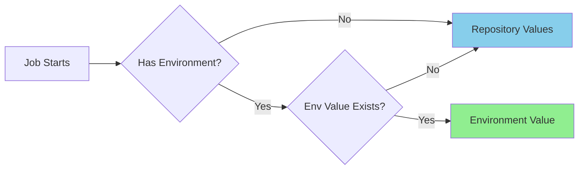

# GitHub Actions Setup Guide

Configuration guide for the translation workflow's GitHub Actions.

## Table of Contents

- [Table of Contents](#table-of-contents)
- [Prerequisites](#prerequisites)
- [Authentication: GitHub App Bot](#authentication-github-app-bot)
  - [Creating a GitHub App](#creating-a-github-app)
  - [Adding App Credentials to Repository](#adding-app-credentials-to-repository)
- [Configuration](#configuration)
  - [Repository Secrets](#repository-secrets)
  - [Repository Variables](#repository-variables)
- [Using Environments](#using-environments)
  - [Configuration Precedence](#configuration-precedence)
  - [Setting Up Environments](#setting-up-environments)
  - [Workflow Environment Selection](#workflow-environment-selection)
- [Quick Setup Script](#quick-setup-script)
- [Verify Configuration](#verify-configuration)
- [Testing](#testing)
  - [Development Environment (Test First)](#development-environment-test-first)
  - [Production Environment](#production-environment)
- [Troubleshooting](#troubleshooting)
  - [Common Issues](#common-issues)
  - [Debug Steps](#debug-steps)
- [Security Best Practices](#security-best-practices)
- [References](#references)

## Prerequisites

- A GitHub fork of the upstream repository
- A GitHub App configured for commit signing (see [Authentication](#authentication-github-app-bot))
- API key for translation services (OpenAI/OpenRouter)

## Authentication: GitHub App Bot

The workflow uses a **GitHub App** to generate tokens for authenticated operations (commits, PRs). This provides:

- ✅ **Verified commits** signed by the bot
- ✅ **Fine-grained permissions** without long-lived PATs
- ✅ **Clear attribution** — commits appear as `bot-name[bot]`

### Creating a GitHub App

1. Go to **Settings → Developer settings → GitHub Apps → New GitHub App**
2. Configure the app:
   - **Name**: `translate-react-bot` (or your preferred name)
   - **Homepage URL**: Your repository URL
   - **Webhook**: Uncheck "Active" (not needed)
3. Set **Repository permissions**:
   - `Contents`: Read and write
   - `Pull requests`: Read and write
   - `Metadata`: Read-only (automatically selected)
4. Click **Create GitHub App**
5. Note the **App ID** (displayed after creation)
6. Generate a **Private Key** (scroll down → Generate a private key)
7. Install the app on your repository:
   - Go to **Install App** (left sidebar)
   - Select your account → Choose "Only select repositories" → Select your fork

> [!NOTE]
> To read more about creating and maintaining GitHub Apps, see the official [GitHub Apps Documentation](https://docs.github.com/en/apps/creating-github-apps/about-creating-github-apps/about-creating-github-apps).

### Adding App Credentials to Repository

| Secret            | Value                       | Description           |
| :---------------- | :-------------------------- | :-------------------- |
| `BOT_APP_ID`      | Your App ID (numeric)       | GitHub App identifier |
| `BOT_PRIVATE_KEY` | Contents of the `.pem` file | App private key       |

> [!IMPORTANT]
> The workflow generates short-lived tokens using `actions/create-github-app-token@v1`. Tokens are scoped to the current repository and expire after the workflow completes.

## Configuration

### Repository Secrets

Go to **Settings → Secrets and variables → Actions → Secrets**:

| Secret            | Description                        | Required |
| :---------------- | :--------------------------------- | :------- |
| `BOT_APP_ID`      | GitHub App ID                      | ✅ Yes   |
| `BOT_PRIVATE_KEY` | GitHub App private key (.pem file) | ✅ Yes   |
| `LLM_API_KEY`     | OpenAI/OpenRouter API key          | ✅ Yes   |

### Repository Variables

Go to **Settings → Secrets and variables → Actions → Variables**:

| Variable           | Example Value                      | Description                | Required |
| :----------------- | :--------------------------------- | :------------------------- | :------- |
| `NODE_ENV`         | `production`                       | Runtime environment        | ✅ Yes   |
| `TARGET_LANGUAGE`  | `pt-br`                            | Target language code       | ✅ Yes   |
| `LLM_MODEL`        | `google/gemini-2.0-flash-exp:free` | LLM model identifier       | ❌ No    |
| `LLM_API_BASE_URL` | `https://openrouter.ai/api/v1`     | API base URL               | ❌ No    |
| `LOG_LEVEL`        | `info`                             | Logging level              | ❌ No    |
| `LOG_TO_CONSOLE`   | `true`                             | Enable console logging     | ❌ No    |
| `BATCH_SIZE`       | `5`                                | Files per batch            | ❌ No    |
| `MAX_TOKENS`       | `4000`                             | Max tokens per translation | ❌ No    |

## Using Environments

Environments provide stage-specific configuration with deployment protection.

### Configuration Precedence



### Setting Up Environments

1. Go to **Settings → Environments → New environment**
2. Create `production` and `development`

**Production** (PRs to upstream):

| Variable    | Value        |
| :---------- | :----------- |
| `NODE_ENV`  | `production` |
| `LOG_LEVEL` | `info`       |

**Development** (PRs to your fork):

| Variable    | Value         |
| :---------- | :------------ |
| `NODE_ENV`  | `development` |
| `LOG_LEVEL` | `debug`       |

> [!TIP]
> Add **Required reviewers** to `production` environment for manual approval before deployments.

### Workflow Environment Selection

The workflow supports environment selection via `workflow_dispatch`:

```yaml
on:
  workflow_dispatch:
    inputs:
      environment:
        type: choice
        options:
          - development
          - production
        default: development
```

## Quick Setup Script

```bash
REPO="your-username/translate-react"

# Secrets
gh secret set BOT_APP_ID --repo $REPO --body "123456"
gh secret set BOT_PRIVATE_KEY --repo $REPO < private-key.pem
gh secret set LLM_API_KEY --repo $REPO --body "sk-..."

# Variables
gh variable set NODE_ENV --body "production" --repo $REPO
gh variable set TARGET_LANGUAGE --body "pt-br" --repo $REPO
gh variable set LLM_MODEL --body "google/gemini-2.0-flash-exp:free" --repo $REPO
gh variable set LLM_API_BASE_URL --body "https://openrouter.ai/api/v1" --repo $REPO
gh variable set LOG_TO_CONSOLE --body "true" --repo $REPO

# Create environments
gh api repos/$REPO/environments/production -X PUT
gh api repos/$REPO/environments/development -X PUT

# Environment-specific variables
gh variable set NODE_ENV --body "production" --repo $REPO --env production
gh variable set LOG_LEVEL --body "info" --repo $REPO --env production
gh variable set NODE_ENV --body "development" --repo $REPO --env development
gh variable set LOG_LEVEL --body "debug" --repo $REPO --env development
```

## Verify Configuration

```bash
# Check secrets
gh secret list --repo your-username/translate-react

# Check variables
gh variable list --repo your-username/translate-react

# Check environments
gh api repos/your-username/translate-react/environments --jq '.environments[].name'
```

## Testing

### Development Environment (Test First)

1. Go to **Actions → Sync & Translate**
2. Click **Run workflow**
3. Select `development` environment
4. Verify PRs are created in your fork

### Production Environment

1. Same steps, but select `production`
2. If protection rules are configured, approve the deployment
3. Verify PRs are created in upstream repository

## Troubleshooting

### Common Issues

| Issue                     | Solution                                                                     |
| :------------------------ | :--------------------------------------------------------------------------- |
| "Resource not accessible" | Verify GitHub App is installed on the repository and has correct permissions |
| "Invalid credentials"     | Check `BOT_APP_ID` and `BOT_PRIVATE_KEY` are correct                         |
| PRs in wrong repository   | Check environment selection and `REPO_FORK_OWNER` variable                   |
| Waiting for approval      | Review deployment in Actions tab → Review deployments                        |

### Debug Steps

1. Check workflow logs under "Generate Bot Token" step
2. Verify environment is correctly selected in "Set up job"
3. Add debug step if needed:

```yaml
- name: Debug
  run: |
    echo "Environment: ${{ github.environment }}"
    echo "NODE_ENV: ${{ vars.NODE_ENV }}"
```

## Security Best Practices

1. **Use GitHub App** instead of PATs for better security and audit trails
2. **Enable deployment protection** for production environment
3. **Rotate secrets** — regenerate App private key periodically
4. **Limit App installation** to only required repositories
5. **Review audit logs** for environment changes in organization repositories

## References

- [GitHub Apps Documentation](https://docs.github.com/en/apps)
- [actions/create-github-app-token](https://github.com/actions/create-github-app-token)
- [Workflow Documentation](./WORKFLOW.md)
