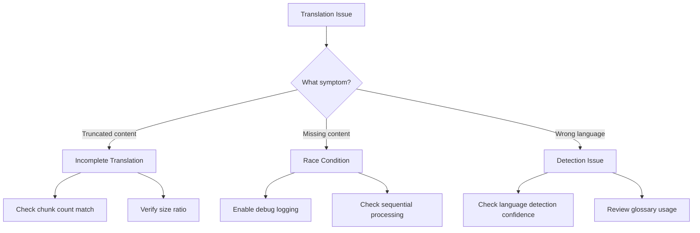

# Troubleshooting & Debugging Guide

This document provides comprehensive guidance for troubleshooting common issues, diagnosing problems, and debugging the translation workflow.

## Table of Contents

- [Table of Contents](#table-of-contents)
- [Common Issues](#common-issues)
  - [Environment \& Configuration](#environment--configuration)
  - [GitHub API Issues](#github-api-issues)
  - [LLM/Translation Issues](#llmtranslation-issues)
- [Debug Mode](#debug-mode)
  - [Enabling Debug Logging](#enabling-debug-logging)
  - [Log Levels](#log-levels)
- [Debug Log Output](#debug-log-output)
  - [Translation Workflow](#translation-workflow)
  - [Chunked Translation Details](#chunked-translation-details)
- [Analyzing Timing Issues](#analyzing-timing-issues)
  - [Expected Sequence](#expected-sequence)
  - [Key Indicators of Issues](#key-indicators-of-issues)
- [Troubleshooting Chunked Translations](#troubleshooting-chunked-translations)
  - [Issue: Incomplete Translation](#issue-incomplete-translation)
    - [Symptoms:](#symptoms)
    - [Debug Steps:](#debug-steps)
  - [Issue: Race Condition Suspected](#issue-race-condition-suspected)
    - [Symptoms:](#symptoms-1)
    - [Debug Steps:](#debug-steps-1)
- [Validation Checks](#validation-checks)
  - [1. Chunk Count Validation](#1-chunk-count-validation)
  - [2. Content Emptiness Check](#2-content-emptiness-check)
  - [3. Size Ratio Validation](#3-size-ratio-validation)
  - [4. Markdown Structure Preservation](#4-markdown-structure-preservation)
- [Log File Locations](#log-file-locations)
- [Diagnostic Procedures](#diagnostic-procedures)
  - [Quick Health Check](#quick-health-check)
  - [Single File Test](#single-file-test)
  - [Chunk Boundary Analysis](#chunk-boundary-analysis)
  - [Translation Content Inspection](#translation-content-inspection)
- [Getting Help](#getting-help)
- [Related Documentation](#related-documentation)

---

## Common Issues

### Environment & Configuration

| Error                                                      | Cause                             | Solution                                                                          |
| ---------------------------------------------------------- | --------------------------------- | --------------------------------------------------------------------------------- |
| `GH_TOKEN: String must contain at least 1 character(s)`    | Missing environment variable      | Set `GH_TOKEN` in your `.env` file                                                |
| `LLM_API_KEY: String must contain at least 1 character(s)` | Missing environment variable      | Set `LLM_API_KEY` in your `.env` file                                             |
| `Zod validation failed`                                    | Invalid environment configuration | Check [`src/utils/env.util.ts`](../src/utils/env.util.ts) for schema requirements |

### GitHub API Issues

GitHub API errors are logged with status code and request ID. Common cases:

| Symptom / Log context     | Cause                                   | Solution                                                                              |
| ------------------------- | --------------------------------------- | ------------------------------------------------------------------------------------- |
| 404 / Not Found           | Repository or resource not found        | Verify repository exists and token has `repo` scope                                   |
| 403 + rate limit message  | API rate limit exceeded                 | Tool auto-retries with backoff; consider GitHub App token for heavy usage             |
| 403 / Forbidden           | Insufficient permissions                | Verify token has write access to fork repository                                      |
| 422 / Conflict            | Branch already exists or merge conflict | Delete existing branch or resolve conflict manually                                   |

### LLM/Translation Issues

LLM API errors are logged with status and type. Common cases:

| Symptom / Log context              | Cause                                | Solution                                                   |
| --------------------------------- | ------------------------------------ | ---------------------------------------------------------- |
| `insufficient_quota` / 402        | API credits exhausted                | Check API credits; switch providers via `LLM_API_BASE_URL`   |
| 429 / rate limit                  | Too many requests to LLM API         | Reduce `BATCH_SIZE` or wait for rate limit reset          |
| Timeout / long-running request    | Request took too long                | Increase timeout or reduce content size                    |
| `Translation validation failed`   | Output doesn't match expected format | Check LLM model compatibility; review prompt template     |

---

## Debug Mode

### Enabling Debug Logging

The application uses `pino` logger with configurable log levels. To enable detailed debug logging:

**Development Mode**:

```bash
LOG_LEVEL="debug" bun run dev
```

**Production Mode**:

```bash
LOG_LEVEL="debug" bun run start
```

**Via Environment File** — add to your `.env` file:

```ini
LOG_LEVEL="debug"
```

Then run normally with `bun run dev`.

### Log Levels

| Level   | Description                                      |
| ------- | ------------------------------------------------ |
| `trace` | Most verbose; includes internal state details    |
| `debug` | Detailed operational information for diagnostics |
| `info`  | Standard operational messages (default)          |
| `warn`  | Warning conditions that may need attention       |
| `error` | Error conditions that affect operation           |
| `fatal` | Critical errors causing application termination  |

---

## Debug Log Output

With `LOG_LEVEL="debug"`, you'll see comprehensive logging including:

### Translation Workflow

- **File Processing Start**: Initial file metadata and content length
- **Branch Creation**: Branch ref and creation duration
- **Translation Initiation**: Content size, estimated tokens, chunking decision
- **Chunk Processing** (if applicable):
  - Individual chunk sizes and token estimates
  - Translation duration per chunk
  - Size ratios and translation metrics
  - Chunk reassembly details
- **Post-Translation Validation**: Validation checks and results
- **Commit Operation**: Commit duration and status
- **PR Creation**: PR number and total workflow timing

### Chunked Translation Details

For files requiring chunking, debug logs include:

```json
{
	"totalChunks": 4,
	"originalContentLength": 30500,
	"chunkSizes": [13796, 3106, 15498, 4529]
}
```

Each chunk shows:

```json
{
	"chunkIndex": 1,
	"totalChunks": 4,
	"chunkSize": 13796,
	"estimatedTokens": 8686,
	"translatedLength": 13796,
	"sizeRatio": "1.05",
	"durationMs": 4200
}
```

## Analyzing Timing Issues

### Expected Sequence

For chunked translations, the logs should follow this order:


### Key Indicators of Issues

**Chunk Count Mismatch**:

```json
{
	"level": 50,
	"expectedChunks": 4,
	"actualChunks": 3,
	"msg": "Critical: Chunk count mismatch detected"
}
```

**Validation Failure**:

```json
{
	"level": 50,
	"originalHeadings": 45,
	"translatedHeadings": 0,
	"msg": "Translation lost all markdown headings"
}
```

**Size Ratio Warning**:

```json
{
	"level": 40,
	"sizeRatio": "0.35",
	"msg": "Translation size ratio outside expected range (0.5-2.0)"
}
```

## Troubleshooting Chunked Translations



### Issue: Incomplete Translation

#### Symptoms:

- Final PR contains truncated content
- Chunk count mismatch errors
- Size ratio significantly below 0.5

#### Debug Steps:

1. Enable debug logging
2. Run translation for single file
3. Check logs for:

- Total chunks vs. translated chunks
- Individual chunk completion times
- Commit timestamp vs. last chunk completion

### Issue: Race Condition Suspected

#### Symptoms:

- Commit occurs before all chunks finish
- Missing content in final translation
- Inconsistent results between runs

#### Debug Steps:

##### 1. Review timing logs with millisecond precision:

```bash
LOG_LEVEL="debug" bun run dev 2>&1 | grep -E "(Chunk.*translated|Commit completed|reassembly)"
```

##### 2. Verify sequential processing:

- Each chunk should complete before next starts
- Reassembly should complete before commit
- All timings should be additive

##### 3. Check for concurrent file processing:

```bash
grep "Starting file processing" logs/*.log | sort
```

## Validation Checks

The workflow includes multiple validation checkpoints:


### 1. Chunk Count Validation

Ensures `translatedChunks.length === originalChunks.length`

**Location**: `TranslatorService.translateWithChunking()`

### 2. Content Emptiness Check

Verifies translated content is not empty or whitespace-only

**Location**: `TranslatorService.validateTranslation()`

### 3. Size Ratio Validation

Warns if translation size ratio is outside 0.5-2.0x range

**Location**: `TranslatorService.validateTranslation()`

### 4. Markdown Structure Preservation

Checks that headings are preserved in translation

**Location**: `TranslatorService.validateTranslation()`

## Log File Locations

Logs are stored in the `logs/` directory with timestamped filenames with the pattern `logs/YYYY-MM-DDTHH:MM:SS.sssZ.pino.log`

Use standard UNIX tools to analyze logs:

```bash
# View recent errors
grep '"level":50' logs/*.log | tail -20

# Search for specific file processing
grep "react-19-upgrade-guide" logs/*.log

# Count warnings by type
grep '"level":40' logs/*.log | jq -r '.msg' | sort | uniq -c
```

---

## Diagnostic Procedures

### Quick Health Check

Run these commands to verify your setup:

```bash
# Verify environment variables are loaded
bun run dev 2>&1 | head -20

# Test GitHub API connectivity
curl -H "Authorization: token $GH_TOKEN" https://api.github.com/user

# Check rate limit status
curl -H "Authorization: token $GH_TOKEN" https://api.github.com/rate_limit
```

### Single File Test

To debug a specific problematic file:

1. Modify the filter in runner to process only that file
2. Enable debug logging
3. Run and analyze complete workflow

### Chunk Boundary Analysis

To understand where chunks are split, add temporarily to `chunkContent()`:

```typescript
logger.debug(
	{
		chunkIndex: i,
		chunkStart: chunk.substring(0, 100),
		chunkEnd: chunk.substring(chunk.length - 100),
	},
	"Chunk boundary preview",
);
```

### Translation Content Inspection

To inspect translated content before commit, add to `processFile()` after translation:

```typescript
logger.debug(
	{
		filename: file.filename,
		translationPreview: metadata.translation.substring(0, 500),
		translationLength: metadata.translation.length,
	},
	"Translation content preview",
);
```

---

## Getting Help

If you're unable to resolve an issue:

1. **Search existing issues**: [GitHub Issues](https://github.com/NivaldoFarias/translate-react/issues)
2. **Review documentation**: Check the [docs/](../docs/) directory for relevant guides
3. **Open a new issue**: Include:
   - Error message and stack trace
   - Environment configuration (redact sensitive values)
   - Steps to reproduce
   - Debug logs (with `LOG_LEVEL="debug"`)

---

## Related Documentation

| Document                                       | Description                             |
| ---------------------------------------------- | --------------------------------------- |
| [WORKFLOW.md](./WORKFLOW.md)                   | Execution workflow with timing analysis |
| [ARCHITECTURE.md](./ARCHITECTURE.md)           | System architecture and service design  |
| [PROJECT_STRUCTURE.md](./PROJECT_STRUCTURE.md) | Directory structure and file navigation |
