# Workflow Execution Documentation

This document provides a detailed breakdown of the translation workflow execution, including timing analysis, data flow, and stage-specific operations.

## Table of Contents

- [Table of Contents](#table-of-contents)
- [Overview](#overview)
- [Execution Stages](#execution-stages)
  - [Stage 1: Initialization](#stage-1-initialization)
    - [Description](#description)
    - [Workflow](#workflow)
    - [Key Operations](#key-operations)
  - [Stage 2: Repository Setup](#stage-2-repository-setup)
    - [Description](#description-1)
    - [Workflow](#workflow-1)
    - [Key Operations](#key-operations-1)
  - [Stage 3: Content Discovery](#stage-3-content-discovery)
    - [Description](#description-2)
    - [Workflow](#workflow-2)
    - [Key Operations](#key-operations-2)
  - [Stage 4: File Filtering](#stage-4-file-filtering)
    - [Description](#description-3)
    - [Workflow](#workflow-3)
  - [Stage 5: Batch Translation](#stage-5-batch-translation)
    - [Description](#description-4)
    - [Workflow](#workflow-4)
    - [Key Operations](#key-operations-3)
  - [Stage 6: Progress Reporting](#stage-6-progress-reporting)
    - [Description](#description-5)
    - [Workflow](#workflow-5)
    - [Key Operations](#key-operations-4)
- [Detailed Stage Workflows](#detailed-stage-workflows)
  - [Content Discovery Workflow](#content-discovery-workflow)
  - [Translation Workflow](#translation-workflow)
  - [GitHub Integration Workflow](#github-integration-workflow)
- [Data Structures](#data-structures)
  - [`TranslationFile`](#translationfile)
  - [`ProcessedFileResult`](#processedfileresult)
  - [`RunnerState`](#runnerstate)
- [Error Recovery Flow](#error-recovery-flow)
- [References](#references)

## Overview

The translation workflow executes in **six primary stages**, each with specific responsibilities and performance characteristics.

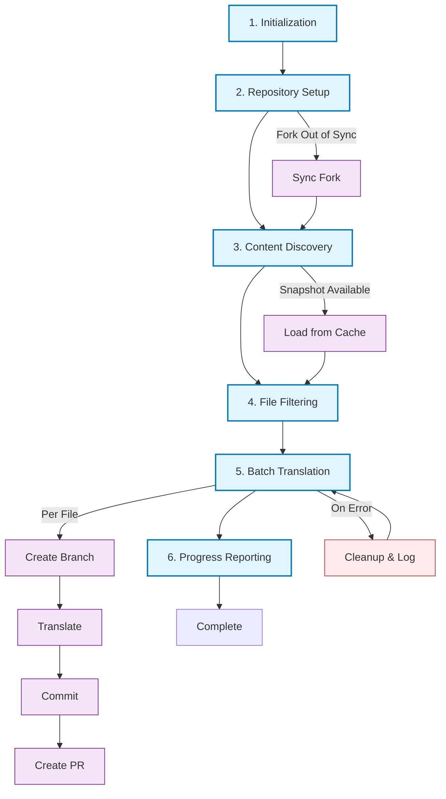

## Execution Stages

### Stage 1: Initialization

#### Description

This stage validates runtime configuration, instantiates core services, and registers process signal handlers. The implementation corresponds to environment validation in [`utils/env.util.ts`](../src/utils/env.util.ts), runner initialization in [`services/runner/runner.service.ts`](../src/services/runner/runner.service.ts), and signal setup in [`services/runner/base.service.ts`](../src/services/runner/base.service.ts) _(see JSDoc on the runner classes for details)_.

#### Workflow

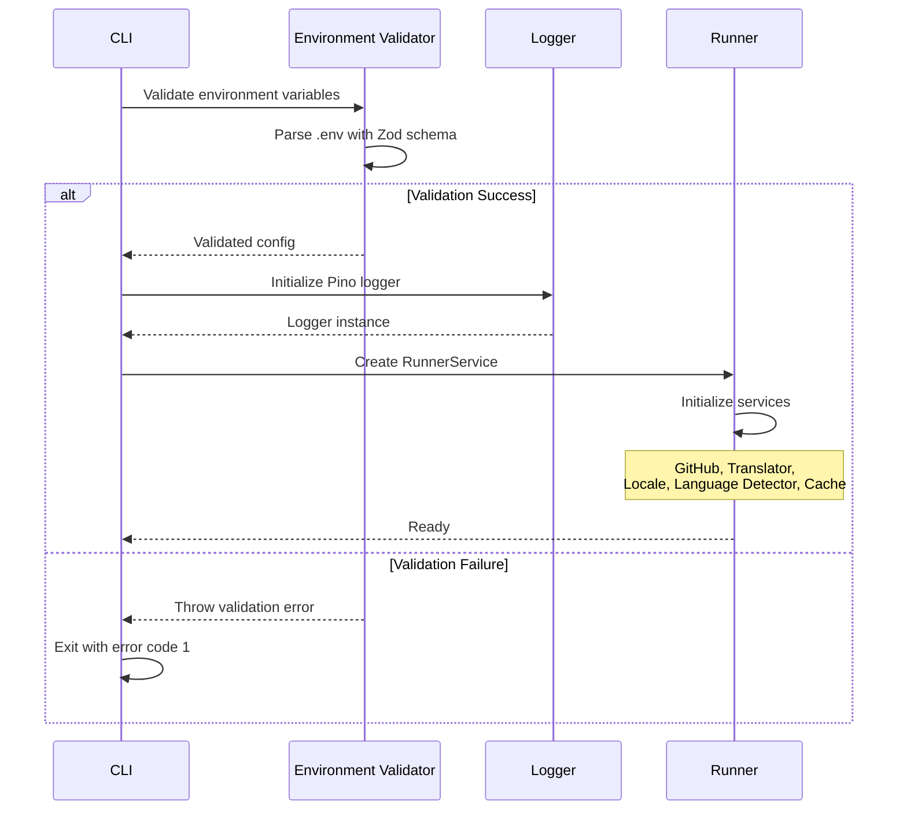

#### Key Operations

- Environment variable validation via Zod schema
- Logger initialization (Pino with JSON output)
- Service instantiation (GitHub, Translator, Locale, Language Detector, Cache)
- Signal handler setup (SIGINT, SIGTERM, uncaught exceptions)

### Stage 2: Repository Setup

#### Description

This stage ensures the runner can read from the upstream repository and write to the fork. It verifies the GitHub token permissions and checks/synchronizes the fork state. See [`services/github/github.service.ts`](../src/services/github/github.service.ts) and [`services/github/github.repository.ts`](../src/services/github/github.repository.ts) for repository and fork-related implementations, and [`services/runner/base.service.ts`](../src/services/runner/base.service.ts) for how the runner invokes `verifyPermissions()` and `syncFork()` during startup.

#### Workflow

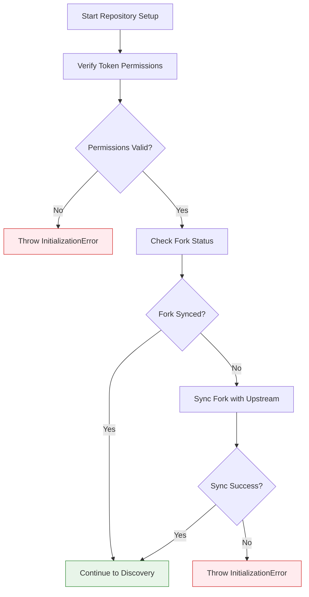

#### Key Operations

- **Token verification** (`GitHubService.verifyTokenPermissions`): validates access to fork and upstream repositories via GitHub API.
- **Fork synchronization** (`GitHubService.syncFork`, `GitHubService.isForkSynced`, `GitHubService.forkExists`): ensures the fork matches upstream and performs a merge when necessary.
- **GitHub API Calls** (representative):

```plaintext
// Token verification
GET / user;
GET / repos / { owner } / { repo };

// Fork sync check
GET / repos / { fork } / commits;
GET / repos / { upstream } / commits;

// Sync execution (if needed)
POST / repos / { fork } / merge - upstream;
```

### Stage 3: Content Discovery

#### Description

This stage collects candidate files for translation by retrieving the upstream repository tree and applying repository-level filters and a glossary fetch. The implementation lives primarily in [`services/github/github.repository.ts`](../src/services/github/github.repository.ts) _(`getRepositoryTree`, `fetchGlossary`)_ and the file discovery pipeline in [`services/runner/file-discovery.manager.ts`](../src/services/runner/file-discovery.manager.ts) _(`discoverFiles`, `checkCache`, `filterByPRs`, `fetchContent`, `detectAndCacheLanguages`)_. Refer to those JSDoc comments for detailed behavior and pipeline stages.

#### Workflow

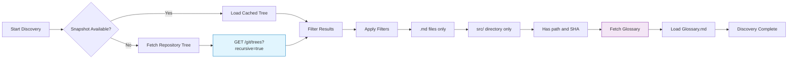

#### Key Operations

- **Filter Criteria**:

```typescript
function filterRepositoryTree(tree: GitHubTreeItem[]) {
	return tree.filter(
		(item) =>
			item.path && // Has path
			item.path.endsWith(".md") && // Markdown file
			item.path.includes("/") && // Not root-level
			item.path.includes("src/"), // In src/ directory
	);
}
```

### Stage 4: File Filtering

#### Description

This stage applies a multi-step filtering pipeline to repository tree items to minimize unnecessary translations. It performs cache lookups, checks open PRs, fetches file content in controlled batches, and runs language detection to determine whether translation is required. See `services/runner/file-discovery.manager.ts` for the pipeline (`checkCache`, `filterByPRs`, `fetchContent`, `detectAndCacheLanguages`) and `services/language-detector.service.ts` for language analysis logic.

#### Workflow

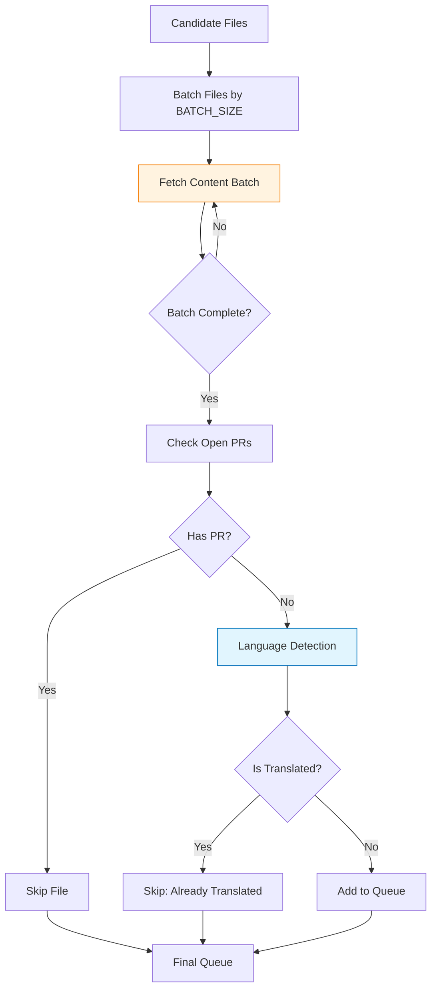

### Stage 5: Batch Translation

#### Description

This stage processes queued files through branch creation, translation, commit, and pull request lifecycle. The implementation is rooted in [`services/runner/translation-batch.manager.ts`](../src/services/runner/translation-batch.manager.ts) (file-level lifecycle and error handling) and [`services/translator.service.ts`](../src/services/translator.service.ts) (token-based chunking and LLM interaction). Commit and PR operations are performed by [`services/github/github.content.ts`](../src/services/github/github.content.ts).

#### Workflow

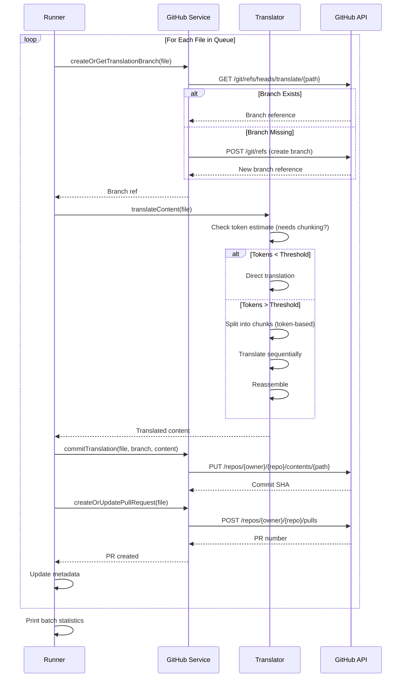

#### Key Operations

- Branch creation and reuse logic (`TranslationBatchManager.createOrGetTranslationBranch`) — handles existing PRs and branch recreation on conflicts.
- Token-based chunking and LLM calls (`TranslatorService.needsChunking`, `TranslatorService.translateWithChunking`, `TranslatorService.callLanguageModel`).
- Commit and PR operations (`GitHubService.commitTranslation`, `GitHubService.createPullRequest`, `TranslationBatchManager.createOrUpdatePullRequest`).
- Error handling and cleanup (`TranslationBatchManager.cleanupFailedTranslation`, circuit-breaker using `MAX_CONSECUTIVE_FAILURES`).

### Stage 6: Progress Reporting

#### Description

This stage compiles processing results and attempts to post a summary to a configured translation progress issue. The behavior is implemented in [`services/runner/pr.manager.ts`](../src/services/runner/pr.manager.ts) (`PRManager.updateIssue`, `PRManager.printFinalStatistics`) which delegates comment creation to [`services/github/github.content.ts`](../src/services/github/github.content.ts) (`commentCompiledResultsOnIssue`). If no progress issue is found or creation fails, the runner logs final statistics and continues; updating the issue is non-blocking.

#### Workflow

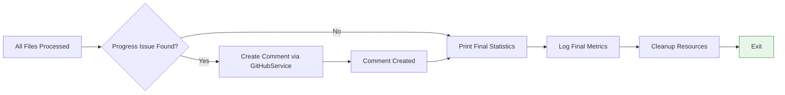

#### Key Operations

- Compile results and format a comment (`PRManager.updateIssue` -> `GitHubService.commentCompiledResultsOnIssue`).
- Find the translation progress issue and post or update a comment (`GitHubService.commentCompiledResultsOnIssue`).
- Always print final statistics and elapsed time (`PRManager.printFinalStatistics`) even when commenting fails.

## Detailed Stage Workflows

### Content Discovery Workflow

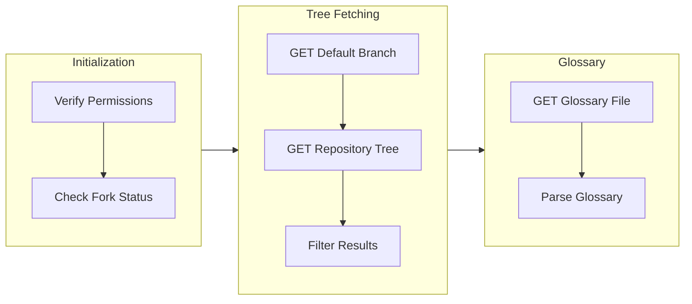

### Translation Workflow

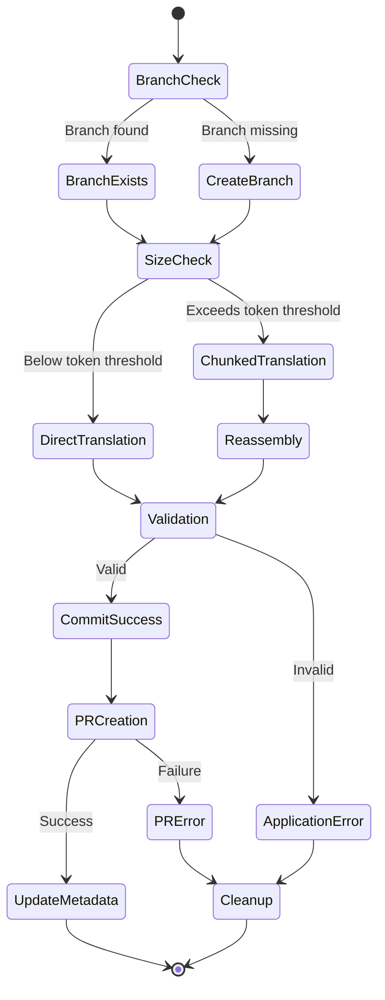

### GitHub Integration Workflow

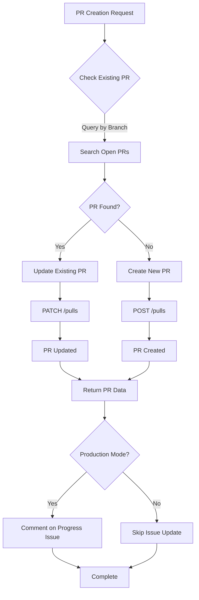

## Data Structures

### `TranslationFile`

Represents a file candidate for translation:

```typescript
class TranslationFile {
	constructor(
		public readonly content: string, // File content (UTF-8)
		public readonly filename: string, // e.g., "homepage.md"
		public readonly path: string, // e.g., "src/content/homepage.md"
		public readonly sha: string, // Git blob SHA
	) {}
}
```

###### Source: [`services/translator.service.ts`](../src/services/translator.service.ts)

### `ProcessedFileResult`

Tracks processing outcome for each file:

```typescript
interface ProcessedFileResult {
	filename: string;
	branch: GitHubBranchRef | null;
	translation: string | null;
	pullRequest: GitHubPR | null;
	error: Error | null;
}
```

###### Source: [`services/runner/runner.types.ts`](../src/services/runner/runner.types.ts)

### `RunnerState`

Persistent workflow state:

```typescript
interface RunnerState {
	repositoryTree: GitHubTreeItem[];
	filesToTranslate: TranslationFile[];
	processedResults: ProcessedFileResult[];
	timestamp: number;
}
```

###### Source: [`services/runner/runner.types.ts`](../src/services/runner/runner.types.ts)

## Error Recovery Flow

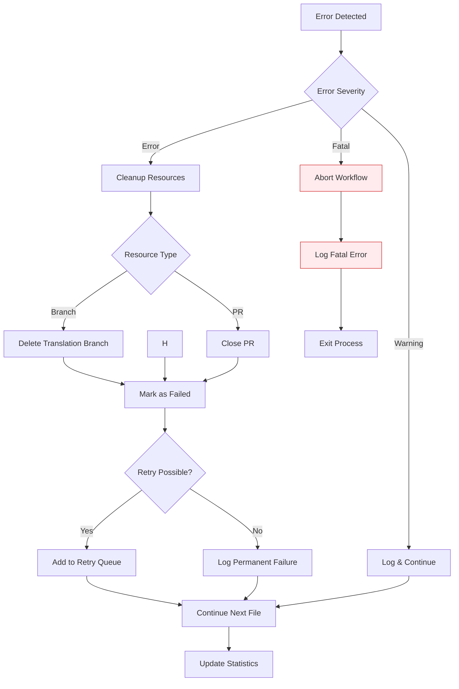

## References

- [Architecture Documentation](./ARCHITECTURE.md): Service design details
- [Project README](../README.md): High-level overview
