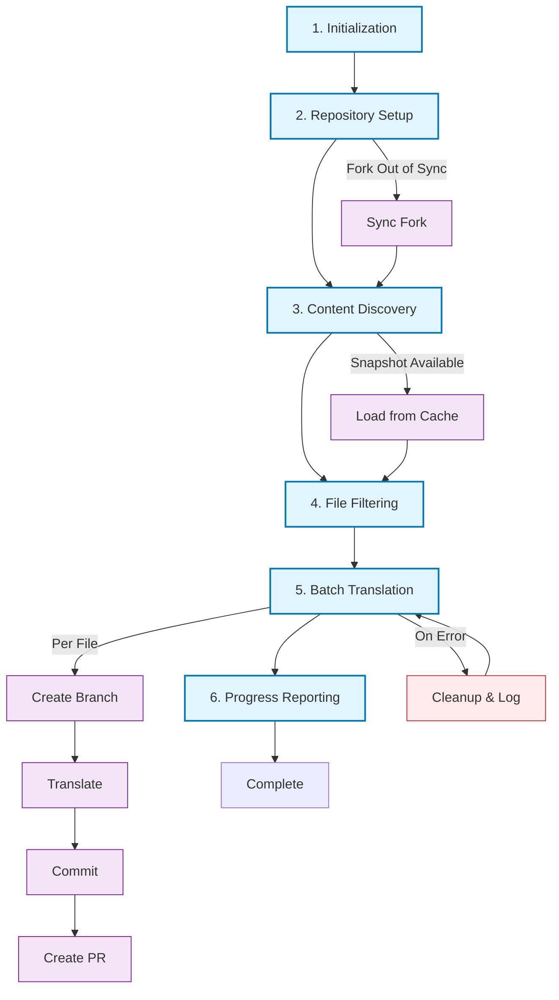
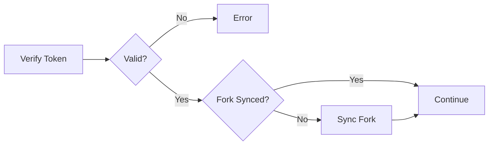
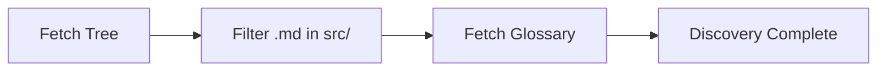
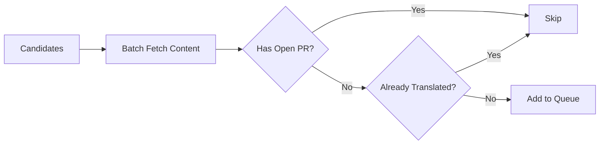
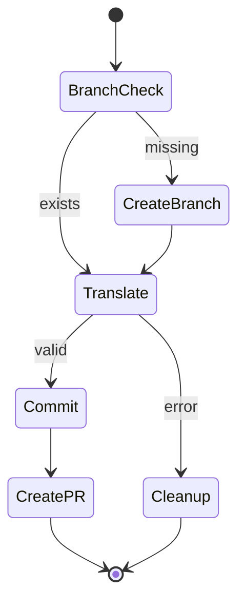
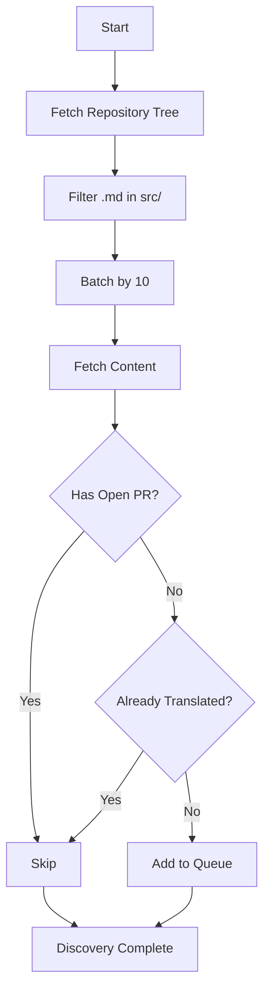
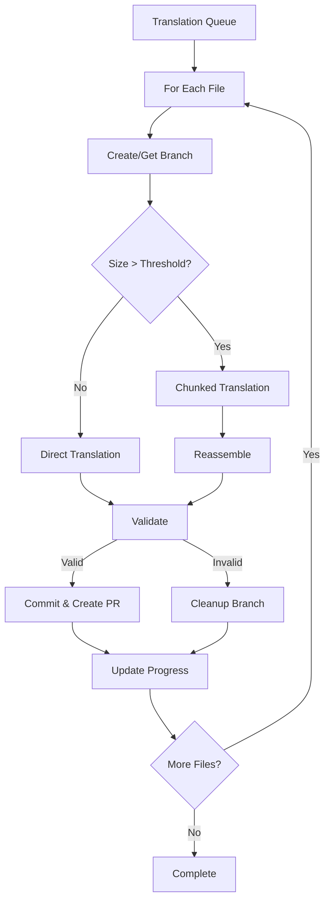
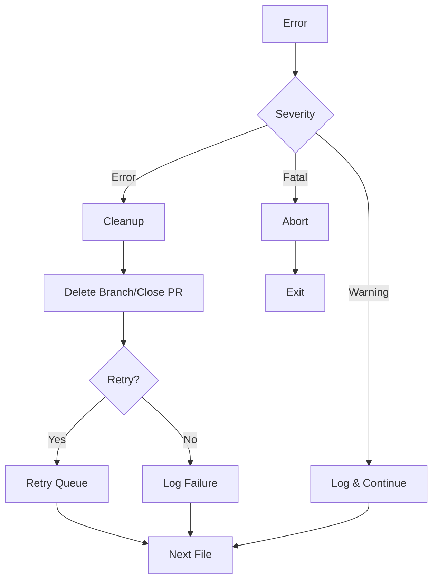

# Workflow Execution Documentation

Detailed breakdown of the translation workflow: execution stages, data flow, and error recovery.

## Table of Contents

- [Overview](#overview)
- [Execution Stages](#execution-stages)
- [Data Flow Diagrams](#data-flow-diagrams)
- [Data Structures](#data-structures)
- [Error Recovery](#error-recovery)
- [References](#references)

## Overview

The translation workflow executes in **six primary stages**, each with specific responsibilities and performance characteristics.

## Execution Stages

The workflow executes in six stages. Each stage has specific responsibilities and failure modes.

### Stage 1: Initialization

Validates environment, instantiates services, registers signal handlers.

**Operations:** Zod schema validation → Pino logger init → Service instantiation (GitHub, Translator, Locale, Language Detector, Cache) → Signal handlers (SIGINT, SIGTERM)

### Stage 2: Repository Setup

Verifies GitHub token permissions and synchronizes fork with upstream.

**Operations:** `verifyTokenPermissions` → `isForkSynced` → `syncFork` (if needed)

### Stage 3: Content Discovery

Fetches repository tree and glossary, filters for markdown files in `src/`.

**Filter criteria:** `.md` extension + `src/` directory + has path and SHA

### Stage 4: File Filtering

Multi-step pipeline to minimize unnecessary translations.

**Pipeline:** Cache check → Open PR filter → Content fetch (batched) → Language detection

### Stage 5: Batch Translation

Processes queued files: branch creation → translation → commit → PR.

**Operations:**

- Branch: `createOrGetTranslationBranch` (reuses existing or creates new)
- Translate: Direct or chunked based on token threshold (`MAX_CHUNK_TOKENS`)
- Commit: `commitTranslation` → `createOrUpdatePullRequest`
- Error: `cleanupFailedTranslation`, circuit-breaker at `MAX_CONSECUTIVE_FAILURES`

### Stage 6: Progress Reporting

Posts summary to progress issue (non-blocking), prints final statistics.

**Operations:** `commentCompiledResultsOnIssue` (if issue found) → `printFinalStatistics` → cleanup → exit

## Data Flow Diagrams

### Discovery Phase

### Translation Phase

## Data Structures

| Structure             | Purpose                        | Key Fields                                                            |
| --------------------- | ------------------------------ | --------------------------------------------------------------------- |
| `TranslationFile`     | File candidate for translation | `content`, `filename`, `path`, `sha`                                  |
| `ProcessedFileResult` | Processing outcome per file    | `filename`, `branch`, `translation`, `pullRequest`, `error`           |
| `RunnerState`         | Workflow state (in-memory)     | `repositoryTree`, `filesToTranslate`, `processedResults`, `timestamp` |

See [`services/runner/runner.types.ts`](../src/services/runner/runner.types.ts) for type definitions.

## Error Recovery

**Error handling strategy:**

- **Warning**: Log and continue to next file
- **Error**: Cleanup resources (branch/PR), mark failed, continue
- **Fatal**: Log error, abort workflow, exit process
- **Circuit breaker**: After `MAX_CONSECUTIVE_FAILURES`, workflow terminates early

## References

- [Architecture Documentation](./ARCHITECTURE.md) — Service design and patterns
- [Project README](../README.md) — High-level overview
