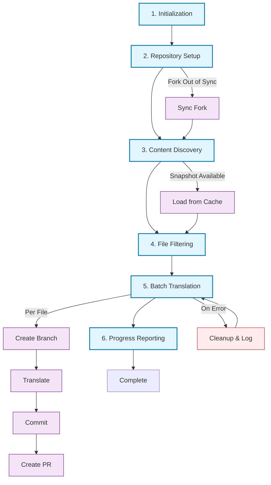
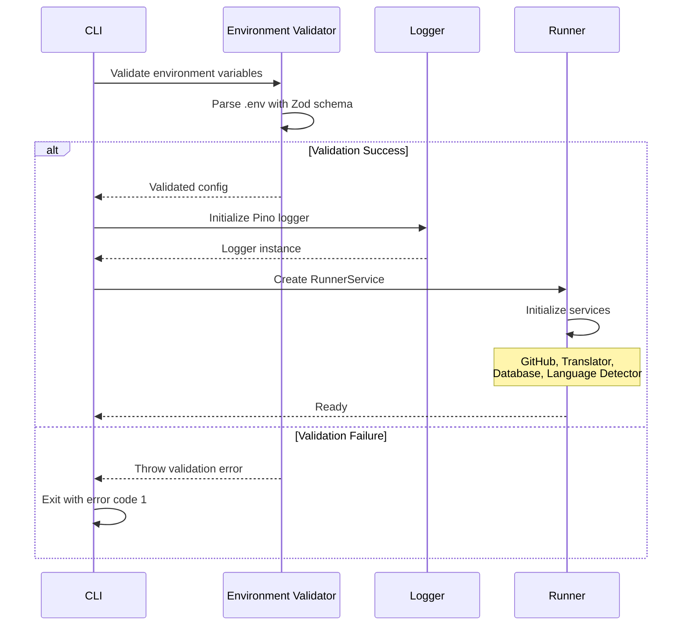
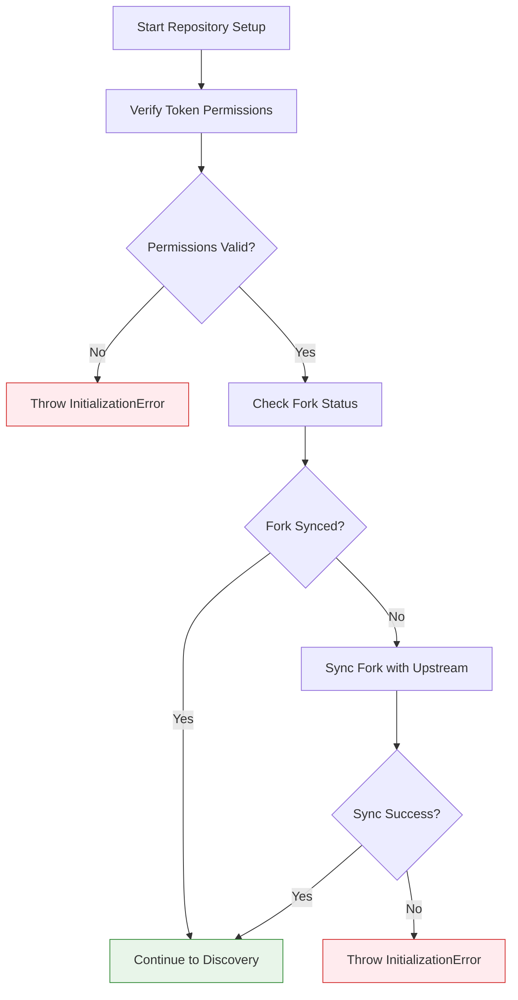
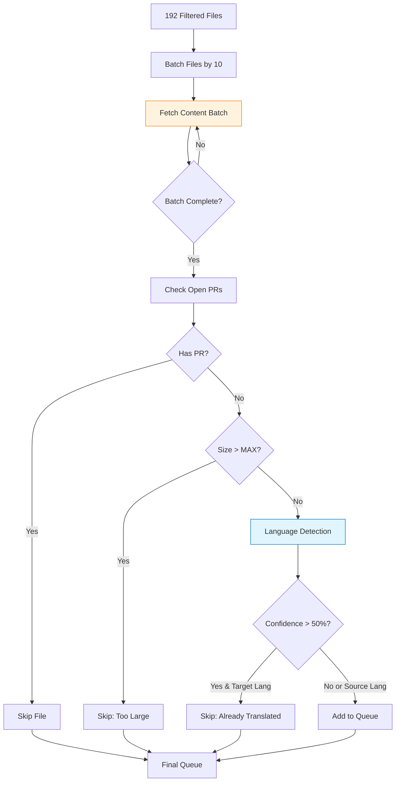
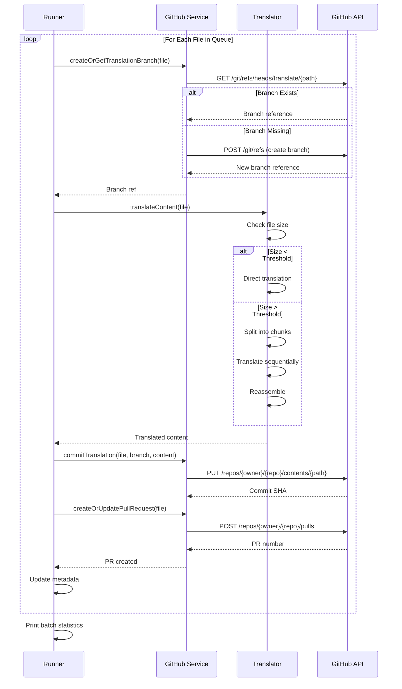
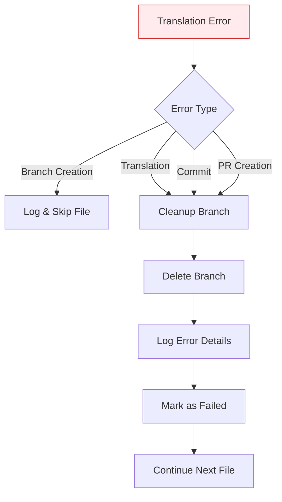
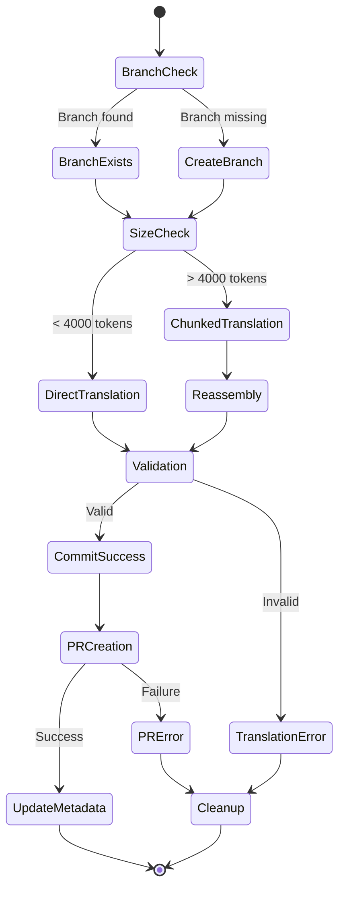
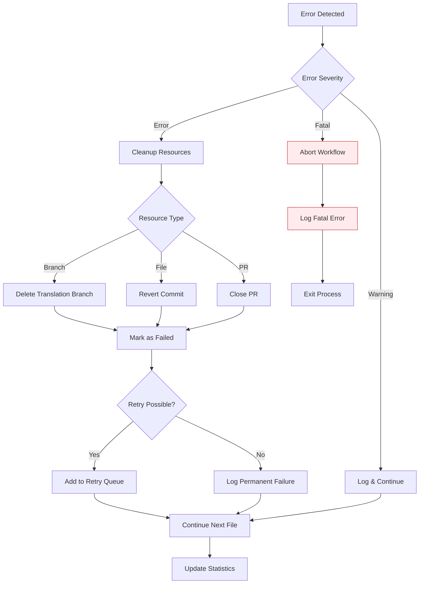
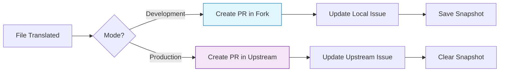

# Workflow Execution Documentation

This document provides a detailed breakdown of the translation workflow execution, including timing analysis, data flow, and stage-specific operations.

> [!NOTE]
> **Automated Execution**: This workflow can run automatically via GitHub Actions. See [GitHub Actions Setup Guide](GITHUB_ACTIONS_SETUP.md) for configuration details.

## Table of Contents

- [Workflow Execution Documentation](#workflow-execution-documentation)
  - [Table of Contents](#table-of-contents)
  - [Overview](#overview)
  - [Execution Stages](#execution-stages)
    - [Stage 1: Initialization](#stage-1-initialization)
    - [Stage 2: Repository Setup](#stage-2-repository-setup)
    - [Stage 3: Content Discovery](#stage-3-content-discovery)
    - [Stage 4: File Filtering](#stage-4-file-filtering)
    - [Stage 5: Batch Translation](#stage-5-batch-translation)
    - [Stage 6: Progress Reporting](#stage-6-progress-reporting)
  - [Detailed Stage Workflows](#detailed-stage-workflows)
    - [Content Discovery Workflow](#content-discovery-workflow)
    - [Translation Workflow](#translation-workflow)
    - [GitHub Integration Workflow](#github-integration-workflow)
  - [Timing Analysis](#timing-analysis)
    - [Current Performance Baseline](#current-performance-baseline)
    - [Performance Bottlenecks](#performance-bottlenecks)
  - [Data Structures](#data-structures)
    - [TranslationFile](#translationfile)
    - [ProcessedFileResult](#processedfileresult)
    - [RunnerState](#runnerstate)
  - [Error Recovery Flow](#error-recovery-flow)
  - [Development vs Production Mode](#development-vs-production-mode)
    - [Development Mode (`DEV_MODE_FORK_PR=true`)](#development-mode-dev_mode_fork_prtrue)
    - [Production Mode (`DEV_MODE_FORK_PR=false`)](#production-mode-dev_mode_fork_prfalse)
  - [References](#references)

## Overview

The translation workflow executes in **six primary stages**, each with specific responsibilities and performance characteristics.



## Execution Stages

### Stage 1: Initialization

**Duration**: < 0.1s  
**Criticality**: High  
**Failure Impact**: Complete workflow abort



**Key Operations**:

1. Environment variable validation via Zod schema
2. Logger initialization (Pino with JSON output)
3. Service instantiation (GitHub, Translator, Database, Language Detector)
4. Signal handler setup (SIGINT, SIGTERM, uncaught exceptions)

**Environment Requirements**:

- `GH_TOKEN`: Valid GitHub PAT with `repo` scope
- `OPENAI_API_KEY`: Valid API key for translation service
- All other variables validated per `envSchema` in `env.util.ts`

### Stage 2: Repository Setup

**Duration**: 0.9s - 2.0s  
**Criticality**: High  
**Failure Impact**: Workflow abort or stale data



**Operations**:

1. **Token Verification** (`verifyTokenPermissions`)
   - Authenticates with GitHub API
   - Verifies `repo` scope access
   - Tests upstream repository access

2. **Fork Synchronization** (`syncFork`)
   - Compares latest commit SHAs (fork vs upstream)
   - Executes merge if out of sync

**GitHub API Calls**:

```typescript
// Token verification
GET /user                           // ~480ms
GET /repos/{owner}/{repo}           // ~390ms

// Fork sync check
GET /repos/{fork}/commits (1 commit)     // ~300ms
GET /repos/{upstream}/commits (1 commit) // ~320ms

// Sync execution (if needed)
POST /repos/{fork}/merge-upstream   // ~500ms
```

### Stage 3: Content Discovery

**Duration**: 1.5s - 3.0s  
**Criticality**: High  
**Failure Impact**: No files to process

```mermaid
flowchart LR
    A[Start Discovery] --> B{Snapshot Available?}
    B -->|Yes| C[Load Cached Tree]
    B -->|No| D[Fetch Repository Tree]
    
    D --> E[GET /git/trees/{sha}?recursive=true]
    E --> F[Receive 700+ items]
    C --> G[Filter Results]
    F --> G
    
    G --> H[Apply Filters]
    H --> I[.md files only]
    I --> J[src/ directory only]
    J --> K[Has path & SHA]
    
    K --> L[192 files remain]
    L --> M[Fetch Glossary]
    M --> N[Load Glossary.md]
    N --> O[Discovery Complete]
    
    style E fill:#e1f5fe,stroke:#0277bd
    style M fill:#f3e5f5,stroke:#7b1fa2
```

**Filter Criteria**:

```typescript
function filterRepositoryTree(tree: GitHubTreeItem[]) {
  return tree.filter(item =>
    item.path &&                    // Has path
    item.path.endsWith('.md') &&    // Markdown file
    item.path.includes('/') &&      // Not root-level
    item.path.includes('src/')      // In src/ directory
  );
}
```

**Snapshot Integration**:

- Cached tree loaded if available and fork is synced
- Saves ~1.5s on repeat runs
- Invalidated on fork sync

### Stage 4: File Filtering

**Duration**: 10s - 15s (current implementation)  
**Criticality**: Medium  
**Failure Impact**: Unnecessary translations

> [!WARNING]
> This stage is the **primary performance bottleneck**. See [Timing Analysis](#timing-analysis) for optimization opportunities.



**File Content Fetching**:

```typescript
// Batch configuration
const FILE_FETCH_BATCH_SIZE = 10;

// Parallel batch execution
for (let i = 0; i < files.length; i += FILE_FETCH_BATCH_SIZE) {
  const batch = files.slice(i, i + FILE_FETCH_BATCH_SIZE);
  
  await Promise.all(
    batch.map(file => octokit.git.getBlob({ file_sha: file.sha }))
  );
}
```

**Timing Breakdown** (per 10-file batch):

- API Requests: 10 × ~400ms = **4.0s** (parallelized)
- Actual batch time: **300ms - 700ms** (network bound)

**Filter Statistics** (typical run):

| Stage                    | Files   | Reason                 |
| ------------------------ | ------- | ---------------------- |
| Initial Tree             | 192     | All .md in src/        |
| After PR Check           | ~40     | 80% have open PRs      |
| After Size Filter        | ~38     | 2 exceed MAX_FILE_SIZE |
| After Language Detection | ~20     | 18 already translated  |
| **Final Queue**          | **~20** | Need translation       |

### Stage 5: Batch Translation

**Duration**: Varies by file count and size  
**Criticality**: High  
**Failure Impact**: Translation failure, orphaned branches



**Translation Pipeline**:

1. **Branch Management**
   - Naming: `translate/src/content/{filename}.md`
   - Idempotent creation (reuses if exists)

2. **Content Translation**
   - Direct: Files < 4000 tokens
   - Chunked: Files > 4000 tokens
   - Glossary-aware: Technical term preservation

3. **Commit Operation**
   - Message: `Translate \`{filename}\` to {language}`
   - Author: GitHub PAT owner
   - Branch: Translation branch

4. **Pull Request Creation**
   - Title: `Translate \`{filename}\` to {language}`
   - Body: Detailed metadata (size, model, timing)
   - Base: Default branch (dynamically detected)
   - Head: Translation branch

**Error Handling**:



### Stage 6: Progress Reporting

**Duration**: 0.5s - 1.0s  
**Criticality**: Low  
**Failure Impact**: Missing progress update (non-blocking)

```mermaid
flowchart LR
    A[All Files Processed] --> B{Production Mode?}
    B -->|Yes| C{Progress Issue Set?}
    B -->|No| E[Print Statistics]
    
    C -->|Yes| D[Generate Comment]
    C -->|No| E
    
    D --> F[Format Results Table]
    F --> G[POST /repos/{owner}/{repo}/issues/{number}/comments]
    G --> H[Comment Created]
    H --> E
    
    E --> I[Log Final Metrics]
    I --> J[Cleanup Resources]
    J --> K[Exit]
    
    style K fill:#e8f5e9,stroke:#388e3c
```

**Comment Format**:

```markdown
## Translation Progress Update

| Metric          | Value |
| --------------- | ----- |
| Files Processed | 20    |
| Successful      | 18    |
| Failed          | 2     |
| Skipped         | 0     |
| Total Time      | 45s   |

### Successfully Translated
- [x] `homepage.md` → #123
- [x] `getting-started.md` → #124
...

### Failed Translations
- [ ] `large-file.md` - Error: File too large
...
```

## Detailed Stage Workflows

### Content Discovery Workflow

**Detailed timing and operations**:

```mermaid
gantt
    title Content Discovery Stage (Typical Run)
    dateFormat ss
    axisFormat %S
    
    section Initialization
    Verify Permissions   :a1, 00, 1s
    Check Fork Status    :a2, after a1, 1s
    
    section Tree Fetching
    GET Default Branch   :b1, after a2, 1s
    GET Repository Tree  :b2, after b1, 1s
    Filter Tree Results  :b3, after b2, 1s
    
    section Glossary
    GET Glossary File    :c1, after b3, 1s
    Parse Glossary       :c2, after c1, 1s
```



### Translation Workflow

**File-level translation process**:



### GitHub Integration Workflow

**PR creation and management**:

```mermaid
flowchart TD
    A[PR Creation Request] --> B{Check Existing PR}
    B -->|Query by Branch| C[Search Open PRs]
    
    C --> D{PR Found?}
    D -->|Yes| E[Update Existing PR]
    D -->|No| F[Create New PR]
    
    E --> G[PATCH /pulls/{number}]
    F --> H[POST /pulls]
    
    G --> I[PR Updated]
    H --> J[PR Created]
    
    I --> K[Return PR Data]
    J --> K
    
    K --> L{Production Mode?}
    L -->|Yes| M[Comment on Progress Issue]
    L -->|No| N[Skip Issue Update]
    
    M --> O[Complete]
    N --> O
```

## Timing Analysis

### Current Performance Baseline

Based on production log analysis (`2025-10-14T15:06:09.071Z`):

| Phase                  | Duration  | % of Total | Bottleneck? |
| ---------------------- | --------- | ---------- | ----------- |
| Initialization         | 0.1s      | 0.5%       | ❌           |
| Repository Setup       | 1.8s      | 9.6%       | ❌           |
| Content Discovery      | 3.0s      | 16.0%      | ⚠️           |
| **File Filtering**     | **14.0s** | **74.5%**  | ✅           |
| Translation (per file) | ~5s       | Variable   | ❌           |
| Progress Reporting     | 0.5s      | 2.7%       | ❌           |

**Total Discovery Time**: ~18.8s for 192 files

### Performance Bottlenecks

#### Primary Bottleneck: File Content Fetching

**Problem**: Sequential batch fetching of all files before filtering

```typescript
// Current approach (inefficient)
for (const file of allFiles) {
  const content = await fetchContent(file);  // ~400ms each
  
  if (hasOpenPR(file)) continue;             // Check AFTER fetch
  if (isTranslated(content)) continue;       // Check AFTER fetch
  
  queue.push(file);
}
```

**Impact**:
- Fetches content for ~150 files that will be skipped
- ~60s wasted on unnecessary API calls
- 80% of files filtered out post-fetch

**Optimization Opportunity**:

```typescript
// Optimized approach (proposed)
const prs = await fetchOpenPRs();            // 1 call, ~0.5s
const translated = await getTranslatedFromHistory();  // 1 call, ~0.5s

const candidates = allFiles.filter(f =>
  !prs.has(f.name) && !translated.has(f.name)
);

// Only fetch content for candidates (~20 files)
for (const file of candidates) {
  const content = await fetchContent(file);  // ~400ms × 20 = 8s
  queue.push(file);
}
```

**Expected Improvement**: 60s → 9s (85% reduction)

#### Secondary Bottleneck: Language Detection

**Problem**: Full CLD analysis on every file

```typescript
// Current: ~25ms per file × 192 files = 4.8s
await cld.detect(fullContent);
```

**Optimization**: Fast heuristics + sampling

```typescript
// Proposed: ~1ms per file × 192 files = 0.2s
if (containsKeywords(content, targetLanguage)) return true;
if (cld.detect(content.slice(0, 1000)).reliable) return true;
// Full CLD only if ambiguous
```

**Expected Improvement**: 4.8s → 0.2s (96% reduction)

## Data Structures

### TranslationFile

Represents a file candidate for translation:

```typescript
class TranslationFile {
  constructor(
    public readonly content: string,    // File content (UTF-8)
    public readonly filename: string,   // e.g., "homepage.md"
    public readonly path: string,       // e.g., "src/content/homepage.md"
    public readonly sha: string         // Git blob SHA
  ) {}
}
```

### ProcessedFileResult

Tracks processing outcome for each file:

```typescript
interface ProcessedFileResult {
  filename: string;
  branch: GitHubBranchRef | null;
  translation: string | null;
  pullRequest: GitHubPR | null;
  error: Error | null;
}
```

### RunnerState

Persistent workflow state:

```typescript
interface RunnerState {
  repositoryTree: GitHubTreeItem[];
  filesToTranslate: TranslationFile[];
  processedResults: ProcessedFileResult[];
  timestamp: number;
}
```

## Error Recovery Flow



## Development vs Production Mode

### Development Mode (`DEV_MODE_FORK_PR=true`)

**Characteristics**:
- PRs created against fork (not upstream)
- Snapshot persistence enabled
- More verbose logging
- Faster iteration (resume from snapshots)

**Workflow Differences**:



### Production Mode (`DEV_MODE_FORK_PR=false`)

**Characteristics**:
- PRs created against upstream (official contributions)
- Snapshot cleared on completion
- Production-level error handling
- Progress updates to upstream issue

**Additional Checks**:

```typescript
if (NODE_ENV === 'production') {
  // Stricter validation
  validateGlossaryAdherence(translation);
  validateFormattingPreservation(translation);
  
  // Cleanup after completion
  await snapshot.clear();
}
```

## References

- [Architecture Documentation](./ARCHITECTURE.md) - Service design details
- [Error Handling Documentation](./ERROR_HANDLING.md) - Error taxonomy
- [Project README](../README.md) - High-level overview
