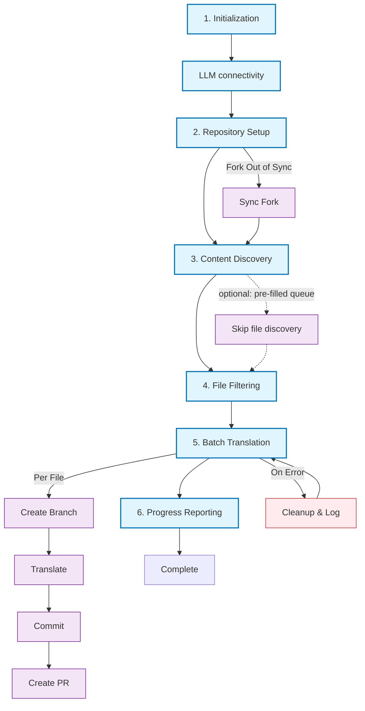
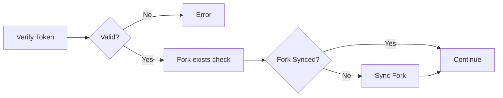
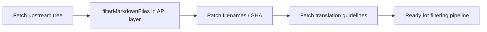
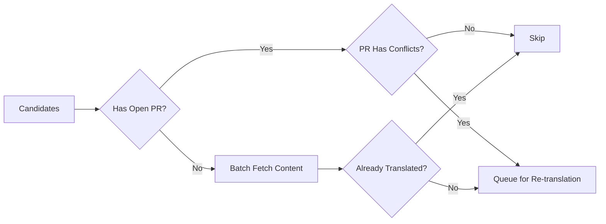
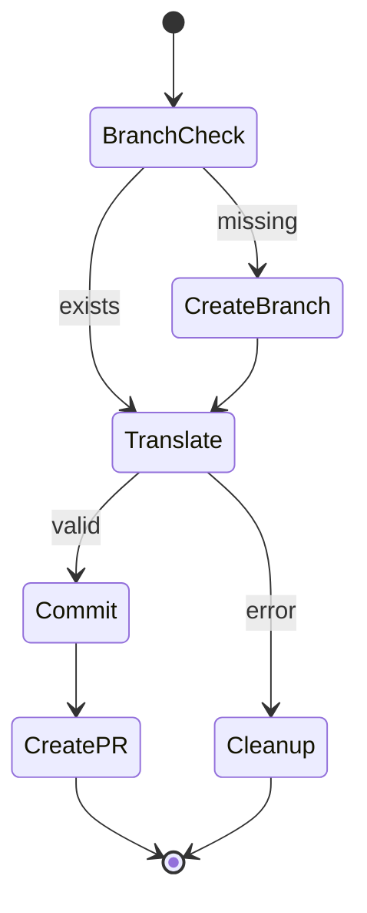
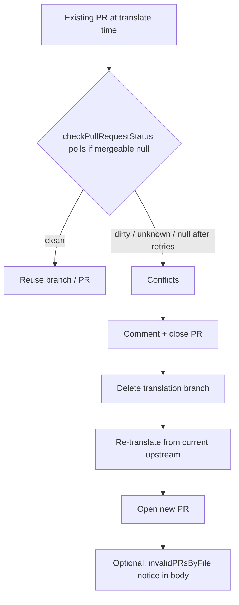
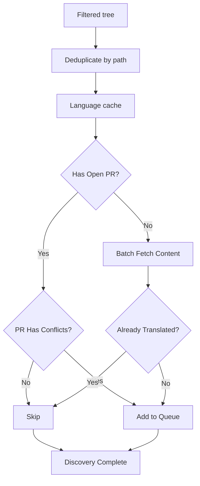
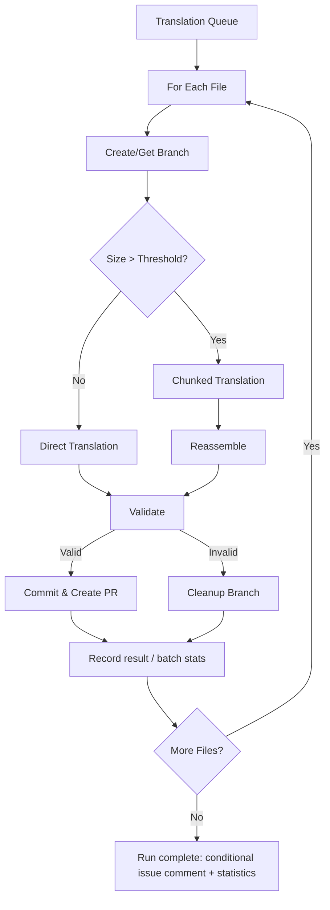
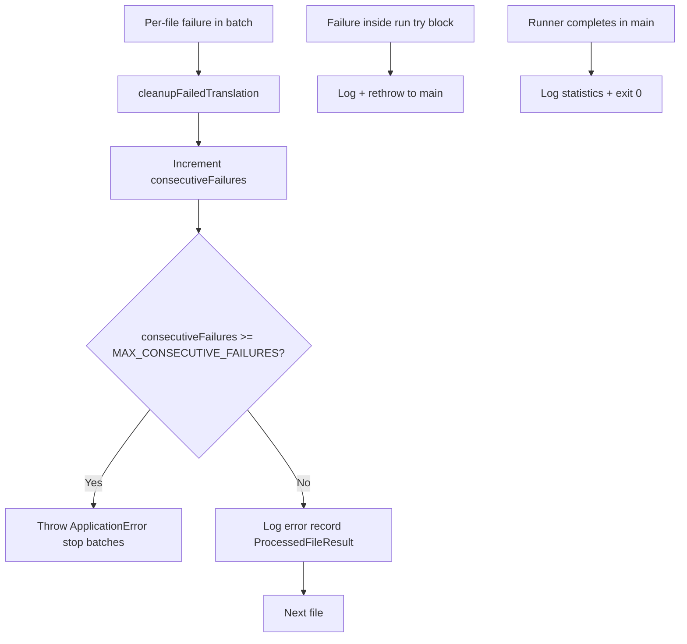

# Workflow Execution Documentation

Detailed breakdown of the translation workflow: execution stages, data flow, and error recovery.

## Table of Contents

- [Table of Contents](#table-of-contents)
- [Overview](#overview)
  - [Actual `run()` order](#actual-run-order)
- [Execution Stages](#execution-stages)
  - [Stage 1: Initialization](#stage-1-initialization)
  - [Stage 2: Repository Setup](#stage-2-repository-setup)
  - [Stage 3: Content Discovery](#stage-3-content-discovery)
  - [Stage 4: File Filtering](#stage-4-file-filtering)
  - [Stage 5: Batch Translation](#stage-5-batch-translation)
    - [Branch-tip SHA before commit](#branch-tip-sha-before-commit)
  - [Stage 6: Progress Reporting](#stage-6-progress-reporting)
- [Data Flow Diagrams](#data-flow-diagrams)
  - [Discovery Phase](#discovery-phase)
  - [Translation Phase](#translation-phase)
- [Data Structures](#data-structures)
- [Error Recovery](#error-recovery)

## Overview

The sections below group behavior into **six conceptual stages**. The exact call order in code is listed under [Actual `run()` order](#actual-run-order).

```mermaid
flowchart TD
    A[1. Initialization] --> A1[LLM connectivity]
    A1 --> B[2. Repository Setup]
    B --> C[3. Content Discovery]
    C --> D[4. File Filtering]
    D --> E[5. Batch Translation]
    E --> F[6. Progress Reporting]

    B -->|Fork Out of Sync| B1[Sync Fork]
    B1 --> C

    C -.->|optional: pre-filled queue| C1[Skip file discovery]
    C1 -.-> D

    E -->|Per File| E1[Create Branch]
    E1 --> E2[Translate]
    E2 --> E3[Commit]
    E3 --> E4[Create PR]

    E -->|On Error| E5[Cleanup & Log]
    E5 --> E

    F --> G[Complete]

    classDef stage fill:#e1f5fe,stroke:#0277bd,stroke-width:2px
    classDef subprocess fill:#f3e5f5,stroke:#7b1fa2,stroke-width:1px
    classDef error fill:#ffebee,stroke:#d32f2f,stroke-width:1px

    class A,A1,B,C,D,E,F stage
    class B1,C1,E1,E2,E3,E4 subprocess
    class E5 error
```

### Actual `run()` order

Order in [`RunnerService.run()`](../src/services/runner/runner.service.ts), then [`main()`](../src/main.ts):

1. `verifyLLMConnectivity()`: translator API reachability
2. `verifyPermissions()`: wraps `verifyTokenPermissions` on fork and upstream
3. `syncFork()`: `forkExists()`, then `isForkSynced()` / `syncFork` if behind
4. `fetchRepositoryTree()`: upstream tree (markdown + `src/` filter applied in GitHub layer) and translation guidelines
5. `fetchFilesToTranslate()`: unless `state.filesToTranslate` is already populated (unusual outside tests), runs `FileDiscoveryManager.discoverFiles`
6. `processInBatches()`: per-file branch, translate, commit, PR
7. `updateIssueWithResults()`: `PRManager.updateIssue` → `GitHubService.commentCompiledResultsOnIssue` (see [Stage 6: Progress Reporting](#stage-6-progress-reporting))
8. `printFinalStatistics()`: returns counts to the caller; `main` logs them and exits successfully when no exception was thrown

## Execution Stages

The workflow is described below in six stages. Each has specific responsibilities and failure modes.

### Stage 1: Initialization

**At import / process startup:** Zod validates environment when the `env` module loads; the root logger and service singletons are initialized; `BaseRunnerService` registers a signal-driven cleanup handler (`registerCleanup`).

**At `run()` start:** `verifyLLMConnectivity()` runs before any GitHub setup.

**Operations (combined):** Zod env validation → Pino logger → service wiring (GitHub, Translator, Locale, Language Detector, Cache) → signal cleanup registration → **then** LLM connectivity check

### Stage 2: Repository Setup

Verifies GitHub token permissions and synchronizes fork with upstream.

```mermaid
flowchart LR
    A[Verify Token] --> B{Valid?}
    B -->|No| C[Error]
    B -->|Yes| D[Fork exists check]
    D --> E{Fork Synced?}
    E -->|Yes| F[Continue]
    E -->|No| G[Sync Fork] --> F
```

**Operations:** `verifyPermissions` (uses `verifyTokenPermissions` on fork and upstream); then `syncFork`: `forkExists` → `isForkSynced` → `syncFork` when behind

### Stage 3: Content Discovery

Fetches the **upstream** Git tree via `getRepositoryTree`, which applies `filterMarkdownFiles` before the runner sees items: `.md` paths under `src/` (with a `/` in the path). The runner then patches filenames, loads translation guidelines (optional), and stores `repositoryTree`.

```mermaid
flowchart LR
    A[Fetch upstream tree] --> B[filterMarkdownFiles in API layer]
    B --> C[Patch filenames / SHA]
    C --> D[Fetch translation guidelines]
    D --> E[Ready for filtering pipeline]
```

**Filter criteria (in `filterMarkdownFiles`):** `.md` suffix, path contains `src/`, path contains `/`, and non-empty `path` (SHA enforced when building `PatchedRepositoryTreeItem` in the runner)

### Stage 4: File Filtering

Multi-step pipeline to minimize unnecessary translations. **Conflicted open PRs are not closed here:** they are recorded in `invalidPRsByFile`, the file stays in the queue, and close/delete/recreate happens during batch translation when branches or PRs are handled.

```mermaid
flowchart LR
    A[Candidates] --> B{Has Open PR?}
    B -->|Yes| C{PR Has Conflicts?}
    C -->|No| D[Skip]
    C -->|Yes| E[Queue for Re-translation]
    B -->|No| F[Batch Fetch Content]
    F --> G{Already Translated?}
    G -->|Yes| D
    G -->|No| E
```

**Pipeline:** Deduplicate by `path` → Language cache lookup → Open PR filter (conflict-aware; queues conflicted paths) → Content fetch (batched) → Language detection

### Stage 5: Batch Translation

Processes queued files: branch creation → translation → commit → PR.

```mermaid
stateDiagram-v2
    [*] --> BranchCheck
    BranchCheck --> CreateBranch : missing
    BranchCheck --> Translate : exists
    CreateBranch --> Translate
    Translate --> Commit : valid
    Translate --> Cleanup : error
    Commit --> CreatePR
    CreatePR --> [*]
    Cleanup --> [*]
```

**Operations:**

- Branch: `createOrGetTranslationBranch` (reuses existing or creates new)
- Translate: Direct or chunked using the `CHUNKS` budget in translator managers (`maxTokens`, `tokenBuffer`, `overlap` in [`managers.constants.ts`](../src/services/translator/managers/managers.constants.ts)). Optional cost control: when `MASK_VERBATIM_LARGE_FENCES` is enabled, fences at or above `MASK_VERBATIM_LARGE_FENCES_MIN_TOKENS` (tiktoken estimate) are replaced with HTML comment placeholders before the LLM and merged back after translation ([`markdown-verbatim-fences.util.ts`](../src/utils/markdown-verbatim-fences.util.ts)); natural language **inside** those large fences is not translated while they stay masked.
- Commit: `commitTranslation` → `createOrUpdatePullRequest` (see [Branch-tip SHA before commit](#branch-tip-sha-before-commit))
- Error: `cleanupFailedTranslation`, circuit-breaker at `MAX_CONSECUTIVE_FAILURES`

#### Branch-tip SHA before commit

> [!NOTE]
> GitHub [`createOrUpdateFileContents`](https://docs.github.com/rest/repos/contents#create-or-update-file-contents)
> needs the **current** blob `sha` when replacing a file. Discovery stores a `sha` from the
> upstream tree for reading source bytes; a **reused** `translate/...` branch may already point
> that path at a **different** blob. `commitTranslation` therefore calls `repos.getContent` on the
> **fork** for `path` at `branch.ref`, uses that `sha` on update, and **omits** `sha` when the path
> is missing on the branch (create). Sending a stale `sha` yields **HTTP 409 Conflict** (body text
> indicates the `sha` does not match).

#### Stale PR conflict handling

**Discovery (`filterByPRs`):** Open PRs are listed; files touched by a PR get `checkPullRequestStatus`. Valid (mergeable) PRs cause the file to be skipped. Conflicted or indeterminate PRs are **kept in the work queue** and summarized in `invalidPRsByFile` for messaging in a **new** PR body (`> [!IMPORTANT]` via [`pr-body.builder.ts`](../src/locales/pr-body.builder.ts)) — the old PR is **not** closed during discovery.

**Translation (`createOrGetTranslationBranch` / `createOrUpdatePullRequest`):** When an existing branch or upstream PR is conflicted, the workflow closes the PR with a comment, deletes the translation branch, and creates a fresh branch/commit/PR — regardless of who opened the original PR.

```mermaid
flowchart TD
    A[Existing PR at translate time] --> B{"checkPullRequestStatus polls if mergeable null"}
    B -->|clean| C[Reuse branch / PR]
    B -->|"dirty / unknown / null after retries"| D[Conflicts]
    D --> E[Comment + close PR]
    E --> F[Delete translation branch]
    F --> G[Re-translate from current upstream]
    G --> H[Open new PR]
    H --> I[Optional: invalidPRsByFile notice in body]
```

**Conflict detection:** The workflow fetches `mergeable` and `mergeable_state` for each existing PR. GitHub computes `mergeable` asynchronously, so when the value is `null` the workflow polls up to 3 times (2 s apart). A PR is treated as conflicted when:

- `mergeable === false` and `mergeable_state === "dirty"`
- `mergeable === false` and `mergeable_state === "unknown"`
- `mergeable` remains `null` after all polling attempts (conservative fallback)

**Complete rewrite approach (during translation, not during discovery filtering):** Instead of diff-based conflict resolution, the workflow:

1. Closes the conflicted PR with an explanatory comment
2. Deletes the stale translation branch
3. Uses freshly fetched source content for the new translation
4. Commits on a new or recreated branch
5. Opens a new PR; the body may include context from `invalidPRsByFile` when that metadata was captured earlier

**Rationale:** Complete rewrite is preferred over diff-based resolution because:

- **Translation consistency**: Partial merges can create inconsistent translations where some sections use old terminology/style
- **Context preservation**: LLM translations benefit from processing the full document context, not isolated conflict regions
- **Quality assurance**: A fresh translation ensures the entire document follows current translation guidelines
- **Simplicity**: Avoids complex three-way merge logic that may produce semantically incorrect results

When `invalidPRsByFile` is set from discovery, the PR template adds an `> [!IMPORTANT]` conflict
notice; every PR body also includes a separate `> [!IMPORTANT]` human-review block from the locale
template.

### Stage 6: Progress Reporting

After batches finish, the runner may add a **new** comment on the upstream **Translation Progress**
issue with a compiled summary. Commenting is **skipped** when any of the following is true:

- There are zero `ProcessedFileResult` rows
- There are zero candidate `filesToTranslate`
- **No result has a non-null `pullRequest`** (nothing opened or updated on GitHub — typical for
  failure-only runs)
- Issue search finds no matching open issue (warn and continue)

Otherwise `issues.createComment` runs on the upstream repo. Final counts are always logged via
`printFinalStatistics`. **Process cleanup** on success path is normal exit; `registerCleanup` runs
on termination signals.

**Operations:** `PRManager.updateIssue` → `GitHubService.commentCompiledResultsOnIssue` (early
return when skipped as above) → `printFinalStatistics` → `main` logs statistics and exits `0`

## Data Flow Diagrams

### Discovery Phase

Input tree is **already** markdown/`src/`-filtered from Stage 3.

```mermaid
flowchart TD
    A[Filtered tree] --> A1[Deduplicate by path]
    A1 --> B[Language cache]
    B --> C{Has Open PR?}
    C -->|Yes| D1{PR Has Conflicts?}
    D1 -->|No| G[Skip]
    D1 -->|Yes| I[Add to Queue]
    C -->|No| E[Batch Fetch Content]
    E --> H{Already Translated?}
    H -->|Yes| G
    H -->|No| I
    G --> J[Discovery Complete]
    I --> J
```

### Translation Phase

```mermaid
flowchart TD
    A[Translation Queue] --> B[For Each File]
    B --> C[Create/Get Branch]
    C --> D{Size > Threshold?}
    D -->|Yes| E[Chunked Translation]
    D -->|No| F[Direct Translation]
    E --> G[Reassemble]
    F --> H[Validate]
    G --> H
    H -->|Valid| I[Commit & Create PR]
    H -->|Invalid| J[Cleanup Branch]
    I --> K[Record result / batch stats]
    J --> K
    K --> L{More Files?}
    L -->|Yes| B
    L -->|No| M[Run complete: conditional issue comment + statistics]
```

## Data Structures

| Structure             | Purpose                        | Key Fields                                                                                                                                                      |
| --------------------- | ------------------------------ | --------------------------------------------------------------------------------------------------------------------------------------------------------------- |
| `TranslationFile`     | File candidate for translation | `content`, `filename`, `path`, `sha`, plus `title`, `logger`, `correlationId` (see [`translator.service.ts`](../src/services/translator/translator.service.ts)) |
| `ProcessedFileResult` | Processing outcome per file    | `filename`, `branch`, `translation`, `pullRequest`, `error`                                                                                                     |
| `RunnerState`         | Workflow state (in-memory)     | `repositoryTree`, `filesToTranslate`, `processedResults`, `timestamp`, optional `invalidPRsByFile`                                                              |

See [`runner.types.ts`](../src/services/runner/runner.types.ts) for runner-side type definitions.

## Error Recovery

```mermaid
flowchart TD
    A[Per-file failure in batch] --> B[cleanupFailedTranslation]
    B --> C[Increment consecutiveFailures]
    C --> D{consecutiveFailures >= MAX_CONSECUTIVE_FAILURES?}
    D -->|Yes| E[Throw ApplicationError stop batches]
    D -->|No| F[Log error record ProcessedFileResult]
    F --> G[Next file]

    H[Failure inside run try block] --> I[Log + rethrow to main]

    P[Runner completes in main] --> Q[Log statistics + exit 0]
```

**Error handling strategy:**

- **Per file:** On failure after branch work, `cleanupFailedTranslation` deletes the translation branch when possible; the result is stored with `error` set; processing continues with the next file unless the circuit breaker trips.
- **Circuit breaker:** After `MAX_CONSECUTIVE_FAILURES` consecutive failures, `processFile` throws before starting the next file’s work. That rejection propagates through `Promise.all` in the current batch, so `processBatches` stops and **`run()` fails**; later batches are not processed.
- **Workflow-level:** `RunnerService.run()` wraps the body in `try`/`catch`, logs `Translation workflow failed`, then **rethrows** so `main` can exit with code `1`.
